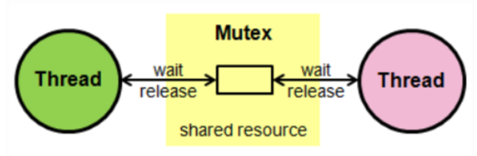
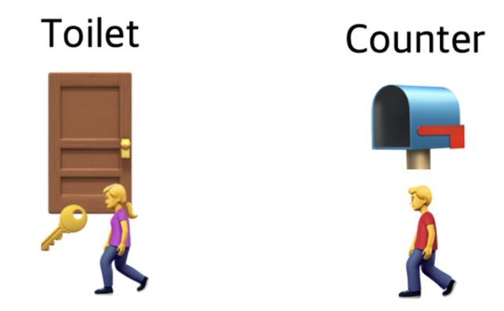
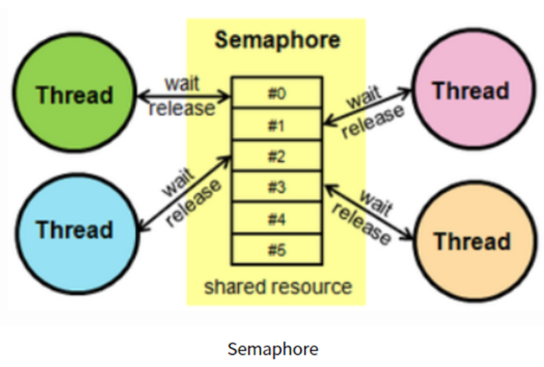
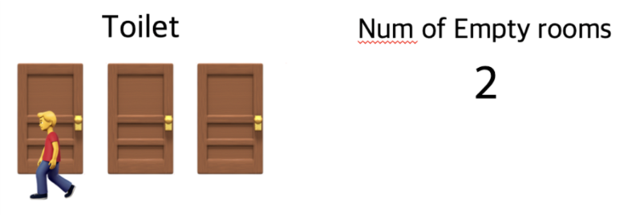
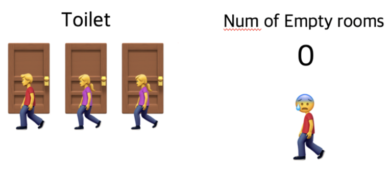

🔅 짚어가야 할 개념, **동기화**란

- 여러 프로세스나 스레드가 공유하는 자원의 일관성을 유지하는 것
- 여러 프로세스나 스레드가 동시에 하나의 자원에 접근할 때 접근 순서를 정해 일관성을 유지해준다.


🔅 짚어가야 할 개념, **경쟁상태(Race condition)**이란

- 두 개 이상의 동시성이 있는 프로세스나 스레드들이 동기화없이 공유된 자원에 접근하려는 현상
- 즉, 두 개 이상의 스레드가 하나의 자원을 놓고 서로 사용하려고 경쟁(race)하는 상황


🔅 짚어가야 할 개념, **임계구역(critical section)**이란

- 여러 프로세스 혹은 스레드가 작업을 수행하면서 공유된 자원을 건드리게 될 수 있는데, 이때 프로그램 코드 상에서 `공유 자원`에 접근하는 부분을 임계 구역이라 한다.
- 즉, 여러 개의 프로세스 혹은 스레드가 수행되는 시스템에서 각 스레드, 프로세스들이 공유하는 데이터를 변경하는 코드 영역
- 이 임계구역을 통해서 경쟁 상태(race condition)을 막을 수 있다.
- 3가지 조건을 충족해야 한다.
  - *상호 배제(Mutual exclusion)* : 하나의 프로세스가 임계 구역에 들어가 있다면 다른 프로세스는 들어갈 수 없어야 한다.
  - *진행(Progress)* : 임계 구역에 들어간 프로세스가 없는 상태에서 들어가려 하는 프로세스가 여러 개라면 어느 것이 들어갈지 결정해줘야 한다.
  - *한정 대기(Bounded waiting)* : 다른 프로세스의 기아(starvation) 현상을 방지하기 위해, 한 번 임계 구역에 들어간 프로세스는 다음번 임계 구역에 들어갈 때 제한을 두어야 한다.


❗임계 구역에 여러 프로세스 및 스레드가 함부로 접근할 수 없도록 관리를 잘 해줘야 하는데, 이를 위해 사용하는 방식에 대표적으로 세마포어와 뮤텍스가 있다.


----


### 뮤텍스(Mutex)



✅ 공유된 자원의 데이터 혹은 임계영역 등에 하나의 프로세스 혹은 스레드가 접근하는 것을 막아줌(= 동기화 대상이 하나)

-> *임계구역을 가진 스레드들의 실행시간이 서로 겹치지 않고 각각 단독으로 실행되도록 하는 기술*



- 뮤텍스는 *화장실이 하나밖에 없는 식당*과 같다!
  - 화장실을 가기 위해서 카운터에 있는 하나밖에 없는 열쇠를 들고 들어간다.
  - 카운터에 열쇠가 없으면 화장실에 사람이 있는 것으로 간주, 뒷사람은 화장실이 비어질때까지 기다린다.
  - 화장실을 이용하는 사람은 프로세스 혹은 스레드이며, 화장실은 공유자원, 화장실 키는 공유자원에 접근하기 위해 필요한 어떤 오브젝트이다.
  - 즉, 뮤텍스는 key에 해당하는 어떤 오브젝트가 있으며 이 오브젝트를 소유한 스레드 or 프로세스만이 공유자원에 접근할 수 있다.

- 특징
  - 자원에 대한 접근을 동기화하기 위해 사용되는 상호배제 기술이다.
  - 뮤텍스는 Locking 메커니즘으로 오직 하나의 쓰레드만이 동일한 시점에 뮤텍스를 얻어 임계 영역에 접근할 수 있다.
  - 그리고 오직 이 스레드만이 임계 영역에서 나갈 때 뮤텍스를 해제할 수 있다.

```c
acquire(){
    /* Critical Section */
	while(!available)
       /*busyWaitting*/
       available = false;
 }
 
 release(){
	available
 }
```


### 세마포어(Semaphore)



✅ 공유된 자원의 데이터 혹은 임계영역 등에 여러 프로세스 혹은 스레드가 접근하는 것을 막아줌(= 동기화 대상이 하나 이상)






- 세마포어는 *손님이 화장실을 좀 더 순환적으로 이용할 수 있는 레스토랑*이다!
  - 화장실에 가고 싶다면 입구에서 빈 칸의 개수를 확인하고 빈 칸이 1개 이상이라면 빈 칸의 개수를 하나 뺀 다음 화장실로 입장한다.
  - 화장실을 다 이용하고 나올 때는 빈 칸의 개수를 하나 더해준다(다 이용하고 나왔다는 의미)
  - 모든 사람이 화장실에 다 들어가면 빈 칸의 개수는 0이 되며, 이때 화장실에 들어가고자 하는 사람이 있다면 빈 칸의 개수가 1 이상의 숫자가 될 때까지 기다려야 한다.
  - 화장실이 공유자원이며 사람들이 스레드, 프로세스를 의미하고 화장실 빈 칸의 개수는 현재 공유자원에 접근할 수 있는 스레드, 프로세스의 개수를 의미한다.

- 특징
  - 사용하고 있는 스레드/프로세스의 수를 공통으로 관리하는 하나의 값을 이용해 상호배제를 달성한다.
  - 공유 자원에 접근할 수 있는 프로세스의 최대 허용치만큼 동시에 사용자가 접근할 수 있으며, 각 프로세스는 세마포어의 값을 확인하고 변경할 수 있다.
  - 자원을 사용하지 않는 상태가 될 때, 대기하던 프로세스가 즉시 자원을 사용하고, 이미 다른 프로세스에 의해 사용중이라는 사실을 알게 되면, 재시도 전에 일정 시간 대기해야 한다.
  - 일반적으로 비교적 긴 시간을 확보하는 리소스에 대해 사용하게 된다.
- 종류
  - 이진형 세마포어 : 0과 1 값, 한 개의 공유자원을 상호배제(이게 뮤텍스!)
  - 계수형 세마포어 : 0과 양의 정수, 여러 개의 공유자원을 상호배제

```c
do {
    P(mutex);
    critical section
	V(mutex);
} while(1)
```


### 세마포어와 뮤텍스의 차이점

❗가장 큰 차이점은 화장실의 개수, 즉 ***동기화 대상의 개수***이다!

- 뮤텍스는 동기화 대상이 오직 1개일 때 사용하며, 세마포어는 동기화 대상이 1개 이상일 때 사용한다.
- 뮤텍스는 자원을 소유할 수 있지만 세마포어는 자원 소유가 불가하다.
  - 뮤텍스는 자원을 점유한 프로세스나 스레드가 잠시 자원을 소유하였다가 작업이 끝나면 반환하는 개념이고, 세마포어는 자원의 상태를 나타내는 일종의 '변수'로서 소유 개념이 아니다.
- 뮤텍스는 상태가 0,1뿐이므로 Lock을 가질 수 있고 소유하고 있는 스레드만이 이 뮤틱스를 해제할 수 있는 반면, 세마포어는 세마포어를 소유하지 않은 스레드가 세마포어를 해제할 수 있다.
- 뮤텍스는 세마포어가 될 수 없지만, 세마포어는 뮤텍스가 될 수 있다.
- 세마포어는 파일 형태로 존재하며 전 시스템 범위, 뮤텍스는 프로세스 범위이며 프로세스 종료 시 초기화된다.

