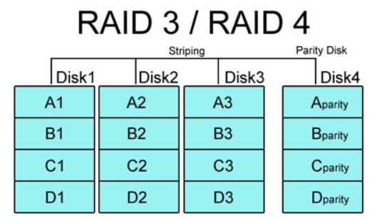

### RAID(Redundant Arrays of Inexpensive Disks)

✅ 개별 디스크드라이브를 묶어서 고가의 대용량 고성능 디스크 드라이브의 성능과 기술을 구현하기 위해 만들어진 기술

- 디스크 어레이라고도 한다.

- 장점
  - 운용 가용성, 데이터 안정성 증대
  - 디스크 용량 증설의 용이성
  - 디스크 I/O 성능 향상

- 먼저, **패리티(Parity)**란?
  - 정수의 홀수 또는 짝수 특성
  - 정보 블록과 연결된 중복 정보, 패리티는 오류 후 데이터를 재구축하는데 사용되는 계산된 값

- 종류

  - **RAID 0**

    - 1) Concatenate 방식

      

      - *두 개 이상의 디스크에 데이터를 순차적으로 쓰는 방법*
      - 🙆‍♂️ 장점 : 디스크 기본 공간이 부족할 때 데이터는 보존하며 여분의 디스크를 볼륨에 포함하여 용량 증설이 가능하다
      - 🙅 단점 : RAID 0 특성상 디스크 중 하나의 디스크라도 장애가 발생하면 복구가 어렵고, 패리티(오류검출기능)을 지원하지 않는다.

    - 2) Stripe 방식

      

      - *두 개 이상의 디스크에 데이터를 랜덤하게 쓰는 방법*
      - 🙆‍♂️ 장점 : 데이터를 사용할 때 I/O를 디스크 수만큼 분할하여 쓰기 때문에 I/O 속도가 향상되고 I/O controller나 I/O board 등 I/O를 담당하는 장치가 별도로 장착된 경우 더 큰 I/O 속도 향상 효과를 볼 수 있다.
      - 🙅 단점 : Stripe를 구성할 시 기존 데이터는 모두 삭제되어야 한다. 또한 Concat 방식과 같이 장애가 발생하면 복구가 어렵고, 패리티 지원하지 않는다.

  - **RAID 1(Mirror)**

    

    - *Mirror 볼륨 내의 패리티를 사용하지 않고 디스크에 같은 데이터를 중복 기록하여 데이터를 보존하게 되며, 적어도 동일한 용량의 디스크 두 개가 필요한 방식.*
    - 🙆‍♂️ 장점 : 볼륨 내 디스크 중 하나의 디스크만 정상이어도 데이터는 보존되어 운영이 가능하기 때문에 가용성이 높고, 복원이 비교적 매우 간단하다.
    - 🙅 단점 : 용량이 절반으로 줄어들고, 쓰기 속도가 조금 느려진다.

  - **RAID 2**

    

    - *RAID 0처럼 striping 방식이지만 에러 체크와 수정을 할 수 있도록 Hamming code를 사용하는 방식*
      - Hamming code : 데이터비트에 몇 개의 체크비트가 추가된 코드
    - 하드 디스크에서 ECC(Error Correction Code)를 지원하지 않기 때문에 ECC를 별도의 드라이브에 저장
  - RAID4 이후 거의 사용되지 않고 있다.
  
- **RAID 3, RAID 4**
  
  
  
    - RAID 0, RAID 1의 문제점을 보완하기 위한 방식으로 3,4로 나뉘긴 하지만 구성은 거의 동일
    - RAID 0과 같은 striping 구성으로 성능을 보안하고 디스크 용량을 온전히 사용할 수 있게 하고, 에러 체크 및 수정을 위해 패리티 정보를 별도의 디스크에 따로 저장한다.
    - RAID 3
      - 데이터를 바이트 단위로 나누어 디스크에 동등하게 분산 기록
      - 드라이브 동기화가 필수적이라 많이 사용되지 않는다
    - RAID 4
      - 데이터를 블록 단위로 나누어 기록하므로 완벽하게 동일하진 않다.
    - RAID 3보다 훨씬 더 많이 사용된다
  
- **RAID 5**
  
  
  
    - RAID 3,4에서 별도의 패리티 정보 디스크를 사용함으로써 발생하는 문제점을 보완하는 방식 => 패리티 정보를 stripe으로 구성된 디스크 내에서 처리하도록 함
  - 1개의 하드가 고장나도 남은 하드들을 통해 데이터 복구 가능
  
- **RAID 6**
  
  
  
    - RAID 5와 같은 개념이지만 다른 드라이브들 간에 분포되어 있는 2차 패리티 정보를 넣어 2개의 하드에 문제가 생겨도 복구할 수 있게 설계되었음
    - RAID 5보다 더욱 데이터의 안전성을 고려하는 시스템에서 사용된다

