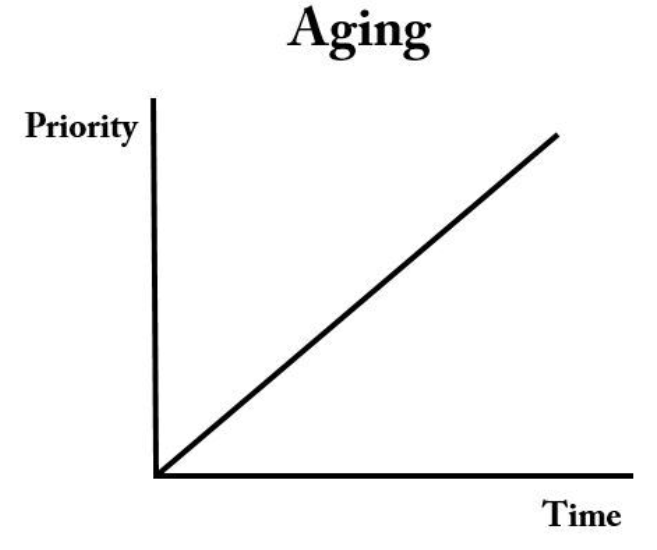

# Q6. 운영체제에서 기아(starvation)이란 무엇인지 설명해주세요.

: 특정 프로세스의 우선 순위가 낮아서 원하는 자원을 계속 할당받지 못하는 상태를 말함. 주로 Priority Scheduling에서 일어남

**해결 방법**

- 🗝️Aging

  : 기아상태를 회피하기 위해 낮은 우선순위를 가진 프로세스들을 기다린 만큼 우선순위를 높여주는 방법

  

### **교착 상태와의 차이**

**교착상태**

: 프로세스가 자원을 얻지 못해 다음 처리를 하지 못하는 상태

교착 상태는 여러 프로세스가 동일한 자원 점유를 원할 때 발생하고 기아 상태는 여러 프로세스가 자원을 점유하기 위해 경쟁 할 때 특정 프로세스는 영원히 자원 할당을 받지 못하는 것이다. 

**참고 자료**

https://techvu.dev/101

