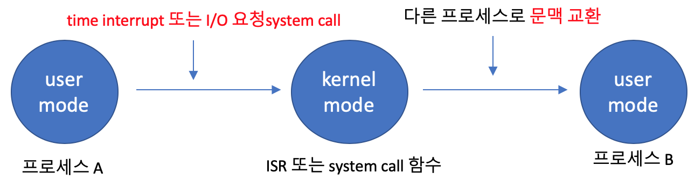

## Q8. 문맥 전환 (Context Switch)에 대해 설명해주세요

### 문맥 교환

: 현재 CPU를 사용중인 프로세스의 CPU 제어권이 다른 프로세스로 이양되는 과정

=> 새로운 프로세스를 실행하기 위해 인터럽트가 발생할 때, 진행 중인 프로그램을 레지스터의 문맥(context)을 PCB에 저장하고 앞으로 실행될 프로세스의 상태 정보를 설정한 다음에 CPU를 할당하여 실행되도록 하는 작업

> **context**
>
> 프로세스가 현재 어떤 상태에서 수행되고 있는지 정확히 규명하기 위해 필요한 정보
>
> **PCB**
>
> : 운영체제가 프로세스를 제어하기 위해 정보를 저장해 놓은 곳으로, 프로세스의 상태 정보를 저장하는 구조체이다. 프로세스 생성 시 만들어지며 주기억장치에 유지된다. 커널 주소공간 중 data에 위치해있다.
>
> 

문맥 교환 과정 예시

1. Process P1이 실행되고 있을 때, 인터럽트 또는 시스템 콜 발생 
2. PCB1에 P1 프로세스 정보를 저장하고, PCB2의 상태를 불러옴
3. Process P2를 실행
4. 인터럽트 또는 시스템 콜이 발생하게 되면, PCB2에 상태를 저장
5. PCB1의 상태를 불러와서 프로세스를 실행

### 문맥 교환이 아닌 경우

- 프로세스가 실행 상태일 때 시스템 콜이나 인터럽트가 발생하면 CPU의 제어권이 운영체제에게로 넘어와 원래 실행중이던 프로세스의 업무를 잠시 멈추고 운영 체제 커널의 코드가 실행
- 이 경우에 CPU의 실행 위치 등 프로세스의 문맥 중 일부를 PCB에 저장하게 되지만 이러한 과정을 문맥 교환이라고 하지 않음

- 하나의 프로세스가 사용자 모드에서 실행되다가 커널모드로 실행 모드만 바뀌는 것일 뿐 CPU를 점유하는 프로세스가 다른 사용자 프로세스로 변경되는 과정이 아니기 때문임
- 이와 같은 모드 변경에 비해 문맥 교환에는 훨씬 많은 오버헤드가 발생

- 타이머 인터럽트가 발생하거나 프로세스가 I/O 요청 시스템을 하여 봉쇄 상태에 들어가는 경우에는 문맥 교환이 일어나지만, 그 밖의 인터럽트나 시스템 콜 발생시에는 문맥 교환이 일어나지 않고 모드만 변경됨

- 사용자 모드에서 커널 모드로 바뀌어 시스템 콜이나 인터럽트 처리를 하고 다시 동일한 프로세스의 사용자 모드로 되돌아와 이전에 수행하던 작업을 계속 수행할 뿐이기 때

참고자료

https://wan-blog.tistory.com/32

https://overcome-the-limits.tistory.com/275

https://kosaf04pyh.tistory.com/195

