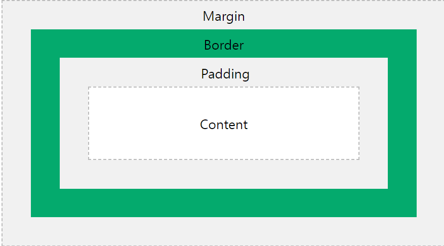
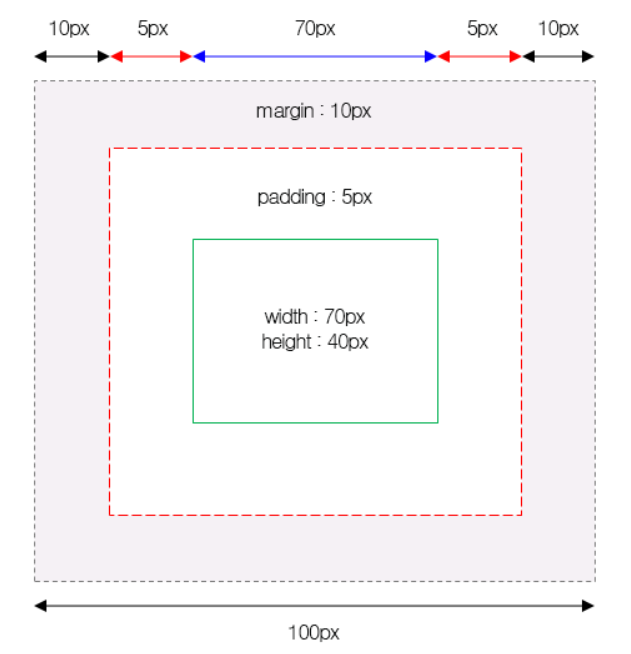

###  Box Model



✅ CSS box는 모든 HTML 요소를 감싸는 하나의 박스이다. Margin, Border, Padding과 실제적인 Content로 이루어져 있다.

- Content : 텍스트나 이미지가 들어있는 박스의 실질적인 내용 부분
- Padding : Content과 Border 사이의 간격. Padding은 투명 공간이다.
- Border : Padding과 Content 주변을 둘러싸는 경계선
- Margin : Border와 이웃하는 요소 사이의 간격. Margin은 투명 공간이다.

위의 코드는 다음과 같이 나타낼 수 있다.

```css
div {
  width: 300px;
  padding: 50px;
  border: 15px solid green;
  margin: 20px;
}
```


#### Height와 Width 속성의 이해

💡 모든 웹 브라우저에서 정확하게 HTML 요소들을 표현하려면 이러한 박스 모델이 어떻게 동작하는지 정확히 알아야만 한다. CSS에서 height와 width 속성을 설정할 때 그 크기가 가리키는 부분은 내용(content) 부분만을 대상으로 한다.



**너비(Width) 구하는 공식** : width + left padding + right padding + left border + right border + left margin + right margin

**높이(Height) 구하는 공식** : height + top padding + bottom padding + top border + bottom border + top margin + bottom margin


#### Box-sizing

❗ 반응형 레이아웃에서 `px`와 같은 절대 단위 대신 `%` 같은 상대 단위를 사용하기 때문에 원하지 않은 규격의 레이아웃이 보일 수 있다!!!

box-sizing 속성을 구하면, width와 height이 컨텐츠 영역 기준인지, 테두리 영역 기준인지 정할 수 있다. 이를 통해 좀 더 편하게 레이아웃을 조절할 수 있다.

- `box-sizing: content-box` : 기본값이며 컨텐츠 영역 기준이다. `width` 속성값은 순수하게 content 영역의 너비만을 포함한다.
- `box-sizing: border-box` : 테두리 영역 기준이며 바깥여백 영역부터 포함하지 않는다. `width` 속성값은 content 영역 뿐만 아니라 padding과 border까지 포함하게 된다.

