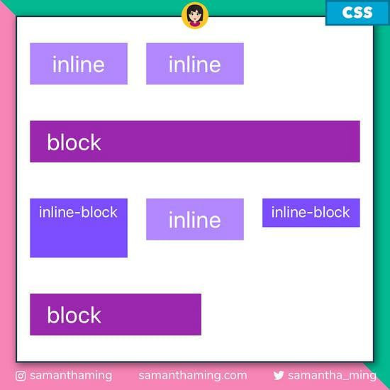

# block vs inline vs inline-block

`block`, `inline`, `inline-block`은 `display`의 속성이다. 조금 더 자세히 말하면 `display-outside`, 즉 플로우 레이아웃에 요소가 참여하는 방법을 의미한다. (좀 더 자세한 내용을 알고자 한다면 [MDN - display](https://developer.mozilla.org/ko/docs/Web/CSS/display)을 참고하자)

### block

- 전후 줄바꿈이 들어가 다른 엘리먼트들을 다른 줄로 밀어내고 혼자 한 줄을 차지한다.
-  `width`, `height`, `margin`, `padding` 속성이 모두 반영된다.
- ex) `
`, `
`, `<h1>`

### inline

- 전후 줄바꿈 없이 한 줄에 다른 엘리먼트들과 나란히 배치된다.
- ❗`width`와 `height` 속성을 지정해도 무시된다
- ❗`margin`과 `padding` 속성은 좌우 간격만 반영이 되고, 상하 간격은 반영이 되지 않는다.
- ex) ``, `<a>`, `<em>` 

### inline-block

- `inline` 엘리먼트처럼 전후 줄바꿈 없이 한 줄에 다른 엘리먼트들과 나란히 배치된다.
- `block` 엘리먼트처럼 `width`와 `height` 속성 지정 및 `margin`과 `padding` 속성의 상하 간격 지정을 할 수 있다.
- ex) `<button>` `<input>`, `<select>`

| 특징                         | block | inline | inline-block |
| ---------------------------- | ----- | ------ | ------------ |
| 상하 마진/패딩               | ✅     | ❌      | ✅            |
| 좌우 마진/패딩               | ✅     | ✅      | ✅            |
| 요소 사이 줄바꿈             | ✅     | ❌      | ❌            |
| 기본너비가 부모너비          | ✅     | ❌      | ❌            |
| 요소 사이 공백               | ❌     | ✅      | ✅            |
| 너비와 높이 명시했을 때 적용 | ✅     | ❌      | ✅            |

**참고 자료**

https://developer.mozilla.org/ko/docs/Web/CSS/display

https://www.daleseo.com/css-display-inline-block/

https://www.samanthaming.com/pictorials/css-inline-vs-inlineblock-vs-block/

https://github.com/baeharam/Must-Know-About-Frontend/blob/main/Notes/css/block-inline-inline-block.md