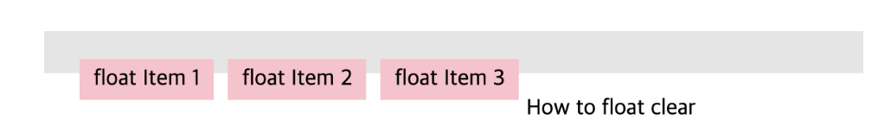
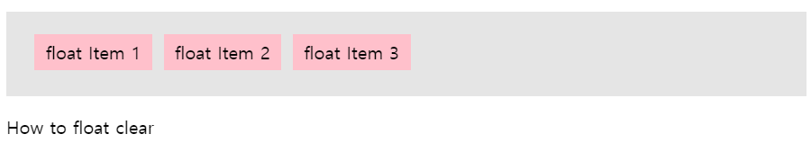
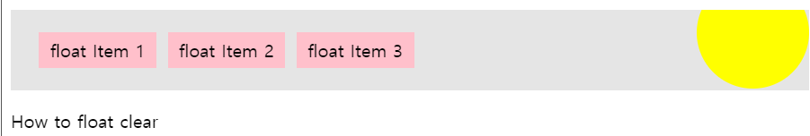
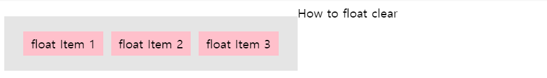
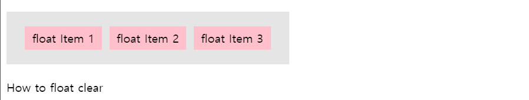
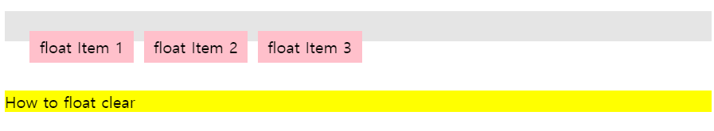
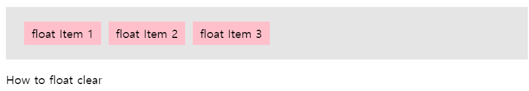
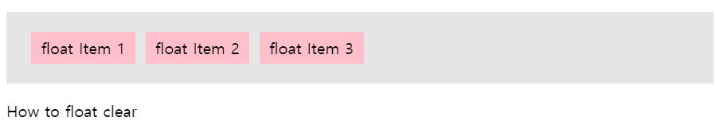

💡`float`을 해제하는 이유?

`float`은 본래 이미지와 텍스트를 자연스러운 흐름으로 배치하기 위해 고안된 속성이나, 실무에서는 주로 어떠한 요소들을 강제로 좌우 배치할 때 사용한다. 하지만 `float` 을 사용하면 브라우저가 높이를 인지하지 못하게 되기 때문에 clear 하는 과정이 필요하다.

```html
<ul>
    <li>float Item 1</li>
    <li>float Item 2</li>
    <li>float Item 3</li>
</ul>
<div class="nextBox">How to float clear</div>
```




#### 1. 부모에 height 적용



```css
ul{
  padding:15px 20px;
  height:45px;
  background:#e5e5e5;
}
ul > li{
  float:left;
  margin:5px;
  padding:5px 10px;
  background:pink;
  list-style:none;
}
```

- float된 요소들의 부모 태그에 height를 적용하면 clear된다.
- 높이가 바뀔 때마다 수정이 되어야하며, 반응형 대응 불가


#### 2. 부모에 overflow:hidden 적용



```css
ul{
  position:relative;
  padding:15px 20px;
  background:#e5e5e5;
  overflow:hidden;
}
ul:before{
  content:'';
  position:absolute;
  top:-30px;
  right:0;
  width:100px;
  height:100px;
  background:yellow;
  border-radius:50%;
}
ul > li{
  float:left;
  margin:5px;
  padding:5px 10px;
  background:pink;
  list-style:none;
}
```

- float된 요소들의 부모태그에 overflow:hidden을 적용한다.
- 예시처럼 부모 바깥으로 표현되어야 하는 요소가 있을 때 표현이 불가하다.


#### 3. 부모에 float 적용



```css
ul{
  float:left;
  padding:15px 20px;
  background:#e5e5e5;
}
ul > li{
  float:left;
  margin:5px;
  padding:5px 10px;
  background:pink;
  list-style:none;
}
```

- float된 요소들의 부모태그에도 float 속성을 적용한다.

- float이 적용되면서 inline-block 아이템이 되고, 다음 요소가 옆으로 배치된다.
- 해당 박스요소를 중앙이나 원하는 위치로 배치하기 어려워지고, 다음에 오는 요소 또한 원하는대로 배치되지 않을 가능성이 높다.


#### 4. 부모에 display:inline-block 적용



```css
ul{
  display:inline-block;
  padding:15px 20px;
  background:#e5e5e5;
}
ul > li{
  float:left;
  margin:5px;
  padding:5px 10px;
  background:pink;
  list-style:none;
}
```

- float된 요소들의 부모 태그의 display 속성을 inline-block으로 적용한다.
  - inline-block : `inline` 엘리먼트처럼 전후 줄바꿈 없이 한 줄에 다른 엘리먼트들과 나란히 배치되지만, `block` 엘리먼트처럼 width와 height 속성 지정 및 margin과 padding 속성의 상하 간격 배치 가능 => 내부적으로는 `block` 엘리먼트 규칙을 따르며 외부적으로 `inline` 엘리먼트 규칙을 따르는 것
- float은 클리어되지만 부모태그가 inline-block이 되면서 의도하지 않은 레이아웃이 될 수 있다.


#### 5. 부모 다음 요소/임의의 요소에 clear:both 적용



```css
ul{
  padding:15px 20px;
  background:#e5e5e5;
}
ul > li{
  float:left;
  margin:5px;
  padding:5px 10px;
  background:pink;
  list-style:none;
}
.nextBox{
  clear:both;
  margin-top:50px;
  background:yellow;
}
```

- float된 요소들의 부모태그 다음에 오는 요소 또는 임의의 요소를 만들어 clear:both를 한다.
- 줄바꿈은 적용되지만 부모태그의 높이는 여전히 인지되지 않으며,
- 다음 요소가 어떤 클래스를 사용하는지에 따라 매번 수정될 가능성이 있으며, margin-top이 정확하게 적용되지 않는다.
- 또한 임의의 요소에 clear:both를 적용하는 것은 굳이 불필요한 요소를 추가하는 것이기에 가장 비추천하는 방법이다.


#### 6. 부모에 가상 요소 after에 clear:both



```css
ul{
  padding:15px 20px;
  background:#e5e5e5;
}
ul:after{
  content:'';
  display:block;
  clear:both;
}
ul > li{
  float:left;
  margin:5px;
  padding:5px 10px;
  background:pink;
  list-style:none;
}
```

- float된 요소들의 부모태그에 가상요소 after를 사용해서 clear:both를 적용한다.
  - :after : 요소의 콘텐츠 끝부분에 생성된 콘텐츠를 추가한다.
- 가장 보편적으로 사용되는 방법이다.
- 부모태그가 의도치 않게 inline-block 요소로 바뀌지 않으며, 높이가 정확하게 잡히고, 불필요한 요소가 추가되지 않는다.


#### 7. 부모에 display:flow-root 적용



```css
ul{
  display:flow-root;
  padding:15px 20px;
  background:#e5e5e5;
}
ul > li{
  float:left;
  margin:5px;
  padding:5px 10px;
  background:pink;
  list-style:none;
}
```

- float된 요소들의 부모태그의 display 속성을 flow-root로 적용한다.
  - flow-root : 서식 루트가 있는 위치를 정의하는 새 블록 서식 컨텍스트를 설정하는 블록 요소 상자 생성
- 부모가 의도치않게 inline-block 요소가 되지도 않으며, 높이가 정확하게 잡히면서 float이 해제되고, 불필요한 태그도 필요없으며, 가상요소가 필요없이 가장 적은 스타일링으로 float이 clear된다!
- 하위 브라우저 지원이 안된다는 단점이 있다.

