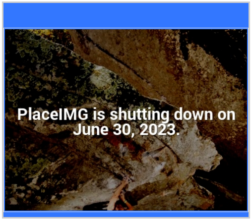

# img 아래쪽 공백 제거

## 🔎 img의 공백

HTML로 레이아웃을 설정하다보면 `DIV`태그 안 이나 `P`태그 안에 **이미지**가 있는 경우 이미지 하단에 약 **1~3px정도의 공백**이 생기는 경우를 볼 수 있다.

## 🔎 원인

`Image`를 `DIV`나 `Table`에 넣을 경우 하단에 원치않는 공백이 생긴다.

### Why?

*`Image`가 **인라인 요소**이기 때문.*

**인라인 요소**의 경우 블록 요소와 달리 보이지 않는 **가상의 기준선이 존재**를 하는데 기본값으로 `vertical-align`의 `baseline`에 위치를 한다.. `baseline`은 영문 소문자로 치자면 아래 삐침이 없는 글자(a, b, c 등등..)의 아랫쪽에 위치한다. 그렇기 때문에 아래 삐침이 있는 글자(y, g 등등..)을 고려하면 *하단에 1~3px정도의 공백을 유지*한다.

## 🔎 해결방안

1. 이미지의 `vertical-align`을 `bottom`으로 하기

    `vertical-align : bottom`은 아래삐침이 있는 글자까지 고려하여 하단으로 정렬한다.

   

2. 이미지를 인라인 요소에서 블록 요소로 속성을 변경시키기

   블록 요소인 경우는 가상의 기준선이 없기 때문에 하단의 공백을 무시합니다. `display : block`로 변경을 하면 된다.

   

참고

https://ux.stories.pe.kr/45