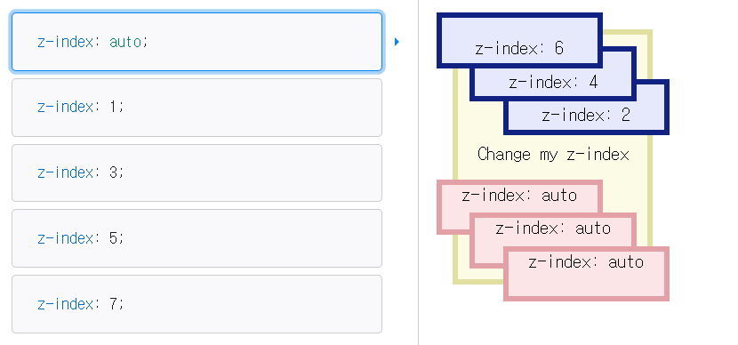
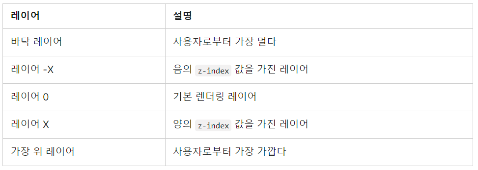
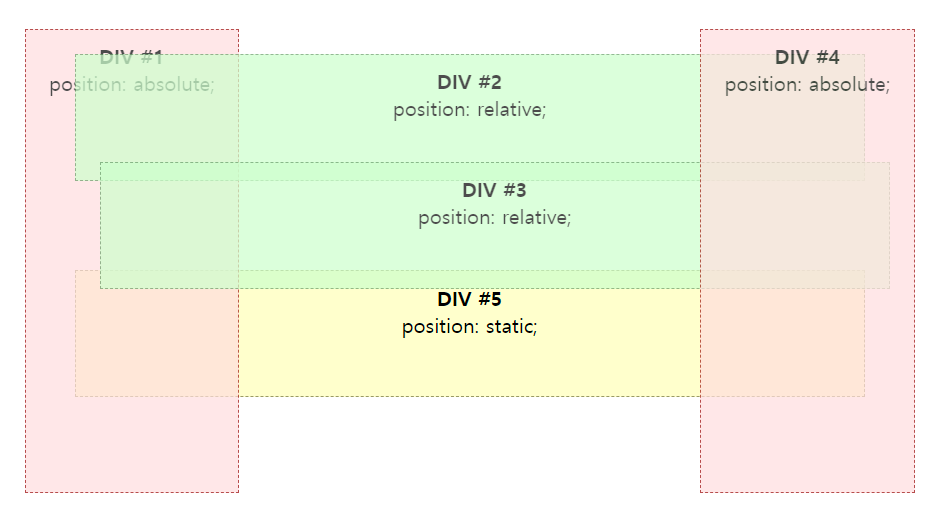
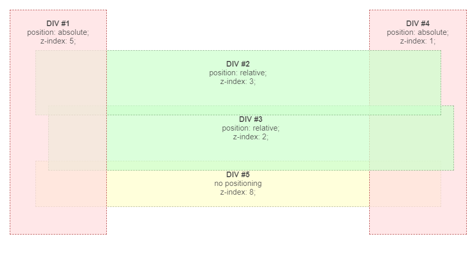

# z-index

위치 지정 요소(`position`이 `static` 외의 다른 값인 요소)의 박스와, 그 자손 또는 하위 플렉스 아이템의 **Z축 순서를 지정한다**. 

`z-index` 속성은 다음 항목을 지정한다.

1. 자신만의 쌓임 **맥락 생성 여부**.
2. 현재 [쌓임 맥락](https://developer.mozilla.org/ko/docs/Web/CSS/CSS_Positioning/Understanding_z_index/The_stacking_context)에서 **자신의 위치**.

### Value

1. `auto`: 박스가 새로운 쌓임 맥락을 생성하지 않는다. 현재 쌓임 맥락에서의 위치는 부모 요소와 동일하다.

2. `<integer>`: 현재 쌓임 맥락에서의 위치를 의미한다. 자신만의 쌓임 맥락을 생성하고, 해당 맥락에서 자신의 위치를 `0`으로 설정한다. 

   >  자손의 `z-index`가 설정되지 않는다면 부모 요소와 동일할 것이고, 부모 요소 외의 바깥 요소와 비교하지 않는다.

## 💡**쌓임 맥락**(stacking context)

: HTML 요소들에 사용자를 바라보는 기준으로 *가상의 z축을 생성하여 3차원 개념으로 보는 것*

위의 그림을 보면 사용자가 뷰포트 또는 웹페이지를 바라보고 있을 때 각각의 요소들이 z-index에 따라 쌓이는 것을 확인할 수 있다. z-index는 쌓임맥락에서의 쌓임순서(z축에서의 우선순위)를 결정한다고 볼 수 있다. 

이러한 쌓임 맥락은 다음 조건을 만족하는 요소가 생성할 수 있다.(이외에도 예시가 많다. [MDN](https://developer.mozilla.org/ko/docs/Web/CSS/CSS_Positioning/Understanding_z_index/The_stacking_context)참고)

- position이 `relative`/`absolute`이면서 z-index가 auto가 아닌 요소
- position이 `fixed`/`sticky`인 요소
- `opacity`가 1보다 작은 요소
- `transform`이 none이 아닌 요소

이러한 요소들은 z-index가 있을때 쌓임 맥락을 생성하게 되는데, 

쌓임 맥락에 좀 더 자세히 이해하기 위해 z-index가 없을 때와 있을 때의 예시를 살펴보자.

### z-index가 없는 경우의 쌓임

만약 모든 엘리먼트들에 z-index가 지정되지 않았을 경우에는 엘리먼트들이 다음 순서로 아래에서부터 위로 쌓인다.

1. 뿌리 엘리먼트의 배경과 테두리
2. 자식 엘리먼트들은 HTML에서 등장하는 순서대로
3. position이 지정된 자식 엘리먼트들은 HTML에서 등장하는 순서대로

**예시**

다음과 같이 [코드](https://developer.mozilla.org/ko/docs/Web/CSS/CSS_Positioning/Understanding_z_index/Stacking_without_z-index)가 작성되어 있다.

> 1. 각각의 div 태그는 DIV #1, DIV #2, DIV #3, DIV #4, DIV #5 순서대로 코드가 작성되어 있다.
> 2. 모두 z-index가 설정되지 않았다.
> 3. DIV #1 부터 DIV #4 까지는 position 속성이 설정되었다. 

이러한 예시를 통해 다음과 같은 사실을 확인할 수 있다.

1. ✅position이 지정되지 않은(static) 블록 DIV #5가 제일 아래에 있다.

   > **static** 블록(DIV #5)은 *항상 position이 지정된 엘리먼트(DIV #1~4) 이전에 렌더링 된다*. 따라서 position이 지정된 엘리먼트 아래에 보인다. 설령 HTML 문서상에서 먼저 나오더라도 position이 지정되지 않은 엘리먼트는 지정된 엘리먼트보다 아래에 보인다.

2. ✅엘리먼트의 position속성 값과는 상관 없이 HTML 계층 구조대로 쌓임을 알 수 있다.(DIV #1~4)

### z-index가 있는 경우의 쌓임

💡`z-index`

​	:  [위치 지정 요소](https://developer.mozilla.org/ko/docs/Web/CSS/position)와, 그 자손 또는 하위 플렉스 아이템의 **Z축 순서를 지정**한다.

- ❗엘리먼트에 [`position`](https://developer.mozilla.org/ko/docs/Web/CSS/position) 속성을 지정해야 한다. (static은 불가능)

- z-index 속성은 하나의 **정수 값**을 가질 수 있다(양수, 음수, 0 모두 가능하다). 
  - 이 값은 해당 엘리먼트의 z축 상의 위치를 나타내며 높을 수록 위쪽에 쌓인다.
  - z-index 속성을 지정하지 않으면 엘리먼트는 기본 렌더링 레이어(레이어 0)에 렌더링된다.
  - ❗만약 몇 개의 엘리먼트들이 같은 z-index 속성 값을 가지면 (엘리먼트들이 같은 레이어에 위치한다) [z-index가 없는 경우의 쌓임](https://developer.mozilla.org/ko/docs/Web/CSS/CSS_Positioning/Understanding_z_index/Stacking_without_z-index) 쌓임 규칙을 적용한다.

**예시**

다음과 같은 예시를 통해 다시 한 번 이해해보자. [코드](https://developer.mozilla.org/ko/docs/Web/CSS/CSS_Positioning/Understanding_z_index/Adding_z-index)

> 1. 각각의 div 태그는 DIV #1, DIV #2, DIV #3, DIV #4, DIV #5 순서대로 코드가 작성되어 있다.
> 2. **모두 z-index가 설정되어 있다**.
> 3. DIV #1 부터 DIV #4 까지는 position 속성이 설정되었다. 

이러한 예시를 통해 다음과 같은 사실을 확인할 수 있다.

1. ✅레이어들의 쌓임 순서가 z-index가 높은 순서대로 쌓이게 된다.

2. ✅position 속성이 지정되지 않은 DIV#5는 여전히 제일 아래에 위치해 있다.

   > ❗position 속성이 지정되지 않으면 z-index 속성 값은 쌓임 순서를 결정하는데에 아무 영향을 미치지 못한다.

**참고자료**

https://developer.mozilla.org/ko/docs/Web/CSS/z-index

https://tympanus.net/codrops/css_reference/z-index/

https://developer.mozilla.org/ko/docs/Web/CSS/CSS_Positioning/Understanding_z_index/Stacking_without_z-index

https://developer.mozilla.org/ko/docs/Web/CSS/CSS_Positioning/Understanding_z_index/Adding_z-index

https://developer.mozilla.org/ko/docs/Web/CSS/position

https://developer.mozilla.org/ko/docs/Web/CSS/CSS_Positioning/Understanding_z_index/The_stacking_context

https://developer.mozilla.org/ko/docs/Web/CSS/CSS_Positioning/Understanding_z_index/Adding_z-index