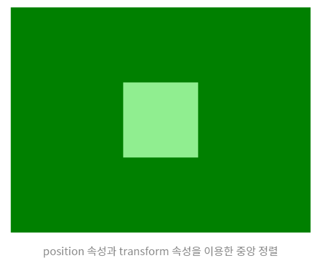
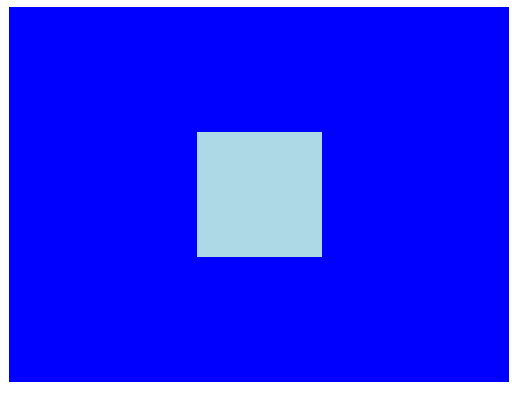
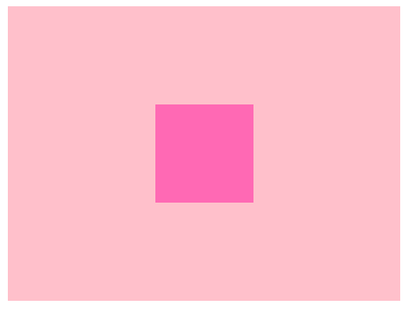

### 가로/세로 가운데 정렬하기

***💡먼저 알고 가면 좋을 정보***

`position`  : HTML 문서에서 각 요소를 배치하는 방법에 대해 정의하는 속성

- `static` : 기본값, 일반적인 문서 흐름에 따라 요소를 배치
- `relative` : 일반적 흐름에 따라 배치하되, 상하좌우 offset을 적용할 수 있다.
- `absolute` : 일반적 문서 흐름에서 배제되고, 가장 가까운 position 요소에 대해 상대적 offset을 적용하는 옵션
- `fixed` : 일반 문서 흐름에서 배제되고, 지정하는 위치에 고정
- `sticky` : 일반적 문서 흐름에서 배제되고, 스크롤되는 가장 가까운 요소에 offset 적용


#### 1. `position`과 `transform` 속성 사용

```html
<div class="position-center">
    <div></div>
</div>
```

```css
.position-center {
    width: 400px;
    height: 300px;
    background-color: green;
    /* 속성 */
    position: relative;
}
.position-center > div {
    width: 100px;
    height: 100px;
    background-color: lightgreen;
    /* 속성 */
    position: absolute;
    top: 50%;
    left: 50%;
    transform: translate(-50%, -50%);
}
```



1. 부모 < div > 의 `position` 속성을 `relative`로 설정한다.
2. 자식 < div > 의 `position` 속성을 `absolute`로 설정한다.
3. `top: 50%`, `left:50%`로 지정하면 좌측 상단의 꼭짓점을 기준으로 중앙 정렬이 된다.

4. `transform: translate(-50%, -50%);` 로 설정하면 자식 `<div>` 크기의 수직, 수평 -50% 만큼 이동하여 중앙 정렬된다.


만약 `transform`으로 자리를 이동해주지 않으면 자신의 너비/높이만큼 위치 조정이 되지 않아 위와 같이 중앙 정렬이 되지 않는다.


#### 2. `flex` 속성

```html
<div class="flex-center">
    <div></div>
</div>
```

```css
.flex-center {
    width: 400px;
    height: 300px;
    background-color: blue;
    display: flex;
    justify-content: center;
    align-items: center;
}
.flex-center > div {
    width: 100px;
    height: 100px;
    background-color: lightblue;
}
```



1. 부모 < div >의 `display` 속성을 flex로 설정한다.
2. 이어서 `justify-content: center;`, `align-items: center;` 로 설정한다.

❗참조하면 좋을 CSS display 속성 게임 사이트

https://flexboxfroggy.com/#ko


#### 3. `position`과 `margin` 속성 사용

```html
<div class="position-margin">
    <div></div>
</div>
```

```css
.position-margin {
    width: 400px;
    height: 300px;
    background-color: pink;
    /* 속성 */
    position: relative;
}

.position-margin > div {
    width: 100px;
    height: 100px;
    background-color: hotpink;
    /* 속성 */
    position: absolute;
    left: 0;
    right: 0;
    top: 0;
    bottom: 0;
    margin: auto;
}
```



1. 부모 < div > 의 `position` 속성을 `relative`로 설정한다.
2. 자식 < div > 의 `position` 속성을 `absolute`로 설정한다.

3. 해당 공간을 전체로 확장하기 위해서 `left` , `right` , `top` , `bottom` 을 각각 0으로 설정한다.
4. `margin: auto` 를 준다.


#### 4. `table` 속성 사용

```html
<div class="table-center">
    <div class="table-inner">
        <div class="table-content"></div>
    </div>
</div>
```

```css
.table-center {
    width: 400px;
    height: 300px;
    background-color: purple;
    display: table;
}
.table-inner {
    display: table-cell;
    vertical-align: middle;
    text-align: center;
}
.table-content {
    width: 100px;
    height: 100px;
    background-color: darkorchid;
    display: inline-block;
```


1. 위의 방법과는 다르게 HTML 구조를 `table-center` 안에 `table-inner` 안에 `table-content` 로 설정한다.
2. 가장 상위 `<div>` 요소인 `table-center` 의 `display` 를 table 로 설정한다.
3. 중간 `<div>` 요소인 `table-inner` 의 `display` 를 table-cell 로 설정하고, `vertical-align: middle;`, `text-align: center;` 로 설정한다.
4. 가장 안쪽 `<div>` 요소인 `table-content` 의 `display` 를 inline-block 으로 설정한다.


----


#### 다른 요소의 가운데 정렬

##### 이미지

```html
<div>
  
  <span>텍스트</span>
</div>
```

```css
img {
  vertical-align: middle;
}
```

폰트의 baseline 기준으로 배치가 되기 때문에 이를 middle로 맞춰야 제대로된 정렬이 이루어진다.


##### 텍스트 - padding

```html
<div>
  <span>텍스트</span>
</div>
```

```css
div { 
  text-align: center; 
  padding: 3em 0;
}
```

부모인 < div >에 `text-align: center` 를 줘서 자식 요소들의 텍스트를 가로 가운데 정렬 했고 높이를 주지 않고 패딩을 상/하로 줘서 세로 가운데 정렬을 했다. 이 때 패딩의 단위로 `em` 을 사용했는데 이는 현재 엘리먼트의 폰트 크기의 3배를 의미한다. 즉, 폰트 크기가 바뀔 때마다 패딩도 변하기 때문에 유동적으로 세로 가운데 정렬이 이루어지는 방법이다.


##### 텍스트 - line-height

```css
div { height: 100px; }
span { line-height: 100px; }
```

만약 높이를 명시적으로 준다면, 텍스트 요소에게 동일한 크기의 `line-height` 를 주어서 해결할 수 있다.