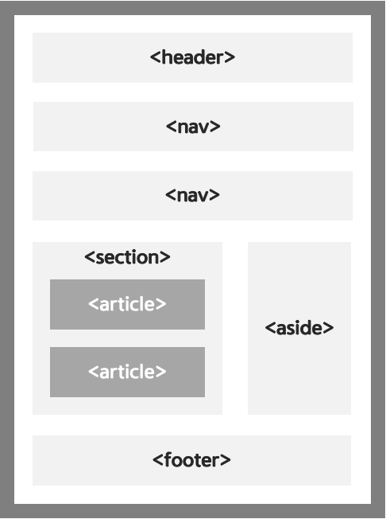

# 시맨틱 마크업(Symantic Markup)

시멘틱 마크업은 글자 그대로 해석하면, ‘의미론적인 HTML 태그 문서 작성’을 뜻한다.
**즉, 의미를 잘 전달 할 수 있도록 HTML 태그 문서를 작성하는 것을 말한다.**

❓왜 시맨틱 마크업을 사용하는 걸까❓

시맨틱 마크업을 사용함에 따라 얻을 수 있는 효과는 다음과 같다.

1. **웹 접근성**에 효율적

   시각 장애가 있는 사용자가 화면 판독기로 페이지를 탐색할 때 **의미론적 마크업을 푯말로 사용할 수 있기 때문이다.**

2. **코드 가독성**에 따른 유지 보수의 용이

   끊임없는 div 들을 탐색하는 것보다, 의미 있는 코드 블록을 찾는 것이 훨씬 쉽기 때문이다.

3. **검색엔진 최적화(SEO)**에 유리

   검색 엔진은 의미론적 마크업을 페이지의 검색 랭킹에 영향을 줄 수 있는 중요한 키워드로 간주하기 때문이다.

❓시맨틱 마크업에는 어떤게 있을까❓

- `<header>` : **소개 및 탐색에 도움을 주는 콘텐츠**를 나타냄.. 제목, 로고, 검색 폼 등의 요소가 포함될 수 있음.
- `<nav>` : 문서의 부분 중 현재 페이지 내, 또는 다른 페이지로의 링크를 보여주는 **내비게이션을** 의미. 메뉴, 목차, 색인 등에 사용됨
- `<main>` : 문서 `<body>`의 **주요 콘텐츠**를 나타냄
- `<article>` : 문서, 페이지, 애플리케이션, 또는 사이트 안에서 **독립적으로 구분되는 요소**에 사용됨
- `<section>`: 일반적인 **문서나 애플리케이션 영역**을 표시
- `<footer>` : 바닥글, 문서 하단에 들어가는 정보로, **사이트의 제작자나 저작권 정보** 등을 주로 표시
- `<aside>` : 좌측과 우측 사이드 위치의 공간을 의미하며, **주요 콘텐츠 이외의 참고가 될 수 있는 컨텐츠** 표시

**참고 자료**

https://aosjehdgus.tistory.com/144

https://developer.mozilla.org/ko/docs/Glossary/Semantics