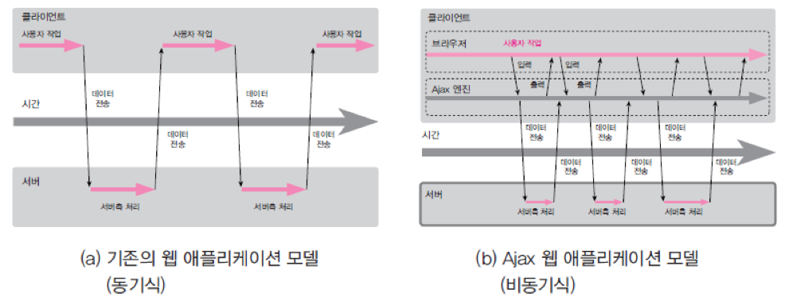
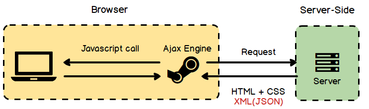

### AJAX (Asynchronous Javascript And XML)

✅ 비동기적인 웹 애플리케이션의 제작을 위해 아래와 같은 조합을 이용하는 웹 개발 기법이다.

- 표현 정보를 위한 HTML(또는 XHTML)과 CSS
- 동적인 화면 출력 및 표시 정보와의 상호 작용을 위한 DOM, JavaScript
- 웹 서버와 비동기적으로 데이터를 교환하고 조작하기 위한 XML, XSLT, XMLHttpRequest
  - XML : 웹 사이트, 데이터베이스 및 타사 애플리케이션과 같은 컴퓨터 시스템 간의 정보 교환을 지원
  - XSLT : XML 문서를 다른 XML 문서로 변환하는데 사용하는 XML 기반 언어
  - XMLHttpRequest : 웹 브라우저와 웹 서버 간에 메소드가 데이터를 전송하는 객체 폼의 API

❗***비동기 방식***이란?



- 웹페이지를 리로드하지 않고 데이터를 불러오는 방식
- 웹페이지에서 기타 코드들을 요청할 경우, 웹페이지를 리로드하면서 불필요한 리소스가 낭비되는데, 비동기 방식을 이용하면 필요한 데이터만 불러오면서 리소스 낭비를 줄일 수 있다.
- AJAX는 XMLHttpRequest 객체를 통해 서버에 request한다.
- JSON이나 XML 형태로 필요한 데이터만 받아 갱신하기 때문에 그만큼의 자원과 시간을 아낄 수 있다.


#### 어떻게 동작하는가?



사용자가 AJAX가 적용된 UI와 상호작용하면, 서버에 AJAX 요청을 보내게 된다. 서버는 DB에서 데이터를 가져와서 JS 파일에 정의되어 있는 대로 HTML/CSS와 데이터를 융합하여 만든 DOM 객체를 UI에 업데이트 시킨다. 비동기로 이루어지며, 기존의 페이지를 전부 로딩하는 방식이 아닌 **일부만 업데이트 하는 방식이다.**


#### 장점

- 페이지 이동 없이 고속으로 화면 전환 가능하다
- 서버 처리를 기다리지 않고, 비동기 요청이 가능하다
- 수신하는 데이터 양을 줄일 수 있고, 클라이언트에게 처리를 위임할 수도 있다
- 플러그인 없이도 인터렉티브한 웹페이지를 구현할 수 있다


#### 단점

- AJAX를 쓸 수 없는 브라우저에 대한 문제가 있다
- HTTP 클라이언트의 기능이 한정되어 있다
- 페이지 이동 없이 통신으로 인한 보안상의 문제가 있다
- 지원하는 문자집합(Charset)이 한정되어 있다
- Script로 작성되므로 디버깅이 용이하지 않다
- 요청을 남발하면 역으로 서버 부하가 늘 수 있다


#### 예시

##### XMLHttpRequest

`XMLHttpRequest` 객체를 생성 후 `open()` 메서드로 요청에 필요한 정보를 설정, `send()` 메서드로 서버에 요청을 보낸 후 응답에 대한 콜백 함수를 생성한다.

```javascript
var ourRequest = new XMLHttpRequest();
ourRequest.open(
  "GET",
  "https://learnwebcode.github.io/json-example/animals-1.json"
);
ourRequest.onload = () => {
  var ourData = JSON.parse(ourRequest.responseText);
  console.log(ourData[0]);
};
ourRequest.send();
```


##### Fetch API

새로나온 `fetch` 를 사용해서 요청을 할 수도 있는데 IE를 지원하지 않는다는 점을 제외하고는 `XMLHttpReqeust` 보다 훨씬 직관적이다. ES6(ES2015) 에서 표준이 되었고, Promise를 리턴한다.

```javascript
fetch('http://example.com/movies.json')
  .then((response) => response.json())
  .then((data) => console.log(data));
```

위 코드는 네트워크에서 JSON 파일을 가져와서 콘솔에 출력한다. 가장 단순한 형태의 `fetch()`는 가져오고자 하는 리소스의 경로를 나타내는 하나의 인수만 받는다.


##### J-Qeory

```javascript
//   요청한 데이터 : {"member_list":[
//    {"id":"aa1","pw":"bb","addr":"cc","tel":"dd"},
//    {"id":"aa2","pw":"bb","addr":"cc","tel":"dd"},
//    {"id":"aa3","pw":"bb","addr":"cc","tel":"dd"}
//  ]}
 
<script>
$(document).ready(function(){
    $("#listButton").click(getMemberList); //id="listButton"인 태그에 click하면 function getMemberList() 실행
});
function getMemberList(){
    $.ajax({
        url:"list.jsp",                    //list.jsp에 AJAX요청
        success:function(data){
            let obj=JSON.parse(data);      //data를 받아와서 JSON형태로 변환
            let array=["<ol>"]; 
            obj["member_list"].forEach(
                    member =>  array.push("<li>"+member.id+"</li>")    
                    //JSON에 있는 member.id의 value를 li태그에 넣어서 array에 넣어줌
            );
            array.push("</ol>");                                   
 
            $("#result").html(array.join(""));  
            //array의 요소들을 다 합쳐서 하나로 만든후 id="result"인 태그에 html로 출력
        }
    });    
}
</script>
<body>
    <a href="#" id="listButton">회원리스트</a><br/>
    <div id="result">이곳에 회원 목록을 출력하세요</div>
</body>
```

