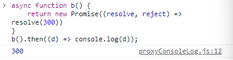

# Async & Await

Promise 객체를 조금 더 편하게 사용할 수 있는 방법이다.


### Async 함수

`async` 함수는 `Promise`를 리턴하는 함수이다.  return된 값이 Promise가 이행되었을 때의 값으로 들어간다.

어떻게 사용하는 것인지 알아보자.

```javascript
async function f() {
  return 1;
} 
// new Promise((resolve, reject) => {
//	resolve(1);
// })

f().then(d => console.log(d)); // 1
```

- `async` 키워드는 function 앞에 작성한다.

- async 함수는 리턴 값에 따라 달리 처리된다.

  - 값이 리턴된다면, 그 값으로 이행된 Promise 객체를 반환한다.

  - Promise 객체가 리턴된다면, 그 Promise의 결과값을 가진 Promise 객체를 반환한다.

    

위의 예시와 같이 Promise 객체를 비동기 함수처럼 사용할 수 있게 한다.


### Await

`await`는 async 함수 내부에 작성할 수 있는 키워드이다. Promise 객체 앞에 작성되어 이행될 때까지 기다리고, 그 resolve 함수를 통해 반환한 값을 반환한다.

```javascript
let promise = () =>
    new Promise(
        (resolve, reject) => {
          try {
              setTimeout(() => resolve(300), 3000);
          }  catch(err) {
              reject(err);
          }
    });
async function a(){
    let result = await promise();
    console.log(result);
}
a(); // 일정 시간이 지난 뒤 300을 출력한다.
```

`await` 는 Promise 객체가 처리될 때까지 기다린다. 일정 시간이 지난 뒤, `resolve`된 결과값이 `result`에 담기고 300이 출력된다. (만약 `reject`된다면 Error가 발생될 수 있기 때문에, `catch`로 적절하게 처리해야 한다.)


이처럼 await를 통해 비동기 처리를 동기적으로 처리할 수 있게되며, 그 결과값을 특정 변수로 받을 수 있게 되어 가독성도 좋아지고 쓰기도 쉽다.


### 한 가지 참고!

과거에는 최상위 레벨 코드에서 `await`를 사용할 경우 error가 발생했다. 

그러나 ES2022부터 최상위 레벨에서 `await`를 사용할 수 있다!

```javascript
let res = await fetch('');
console.log(res);
```


**참고 자료**

https://ko.javascript.info/async-await

https://developer.mozilla.org/ko/docs/Web/JavaScript/Reference/Statements/async_function