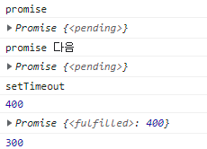

# Promise

`Promise`란 **비동기 처리**를 위해 사용되는 `객체`이다! 

그렇기 때문에 **생성자 함수를 통해 Promise 객체를 만들어 낼 수 있다**. 


### Promise 객체 생성

예시를 통해 살펴보자.

````javascript
const promise = new Promise((resolve, reject) => {
    try {
		// 비동기적으로 처리되는 함수가 이곳에 정의된다.
    	setTimeout(() => resolve(res), 3000); // 정상적으로 처리가 되었을 경우 resolve 함수 실행	
    } catch (err) { // error 발생시 reject 실행
		reject(err);        
    }
});
````

- `Promise`는 **객체**이기 때문에 `new`를 통해 생성할 수 있으며, `Promise()`라는 생성자 함수로 만들 수 있다.

- 생성자 함수의 첫 번째 인자로 "콜백 함수"를 넘겨야 한다. 
  - 안 넘기면 다음과 같은 에러가 발생한다.


- 콜백 함수의 인자로는 `resolve`와 `reject`라는 두 개의 인자를 넘겨야 한다.
  - **resolve**는 콜백함수 내부에서 내부 연산(비동기 처리)이 `성공`했을 때 실행시킬 함수이다.
  - **reject** 는 콜백 함수 내부에서 내부 연산(비동기 처리)이 `실패`했을 때 실행시킬 함수이다.


### Promise 상태


`Promise`의 상태는 총 세 가지이다. 

1. 대기(*pending)*: 이행하지도, 거부하지도 않은 초기 상태.
2. 이행(*fulfilled)*: 연산이 성공적으로 완료됨.
3. 거부(*rejected)*: 연산이 실패함.

>  Promise의 내부 연산이 성공했을 때(`fulfilled`), 그 결과를 `resolve`함수를 통해 받을 수 있다. 
>
> 반대로 Promise의 내부 연산이 실패했을 때(`rejected`), 그 실패의 원인이 되는 에러를 `reject` 함수를 통해 받을 수 있다. 


### Promise 처리기

Promise의 내부적으로 (비동기) 처리된 결과 값들을 받아 별도로 처리하기 위해선, `.then`, `.catch` 처리기를 사용해야 한다. 

- `Promise.prototype.then(fulfilledCallback [, rejectedCallback])`

  ```javascript
  // promise는 프로미스 객체
  promise.then(
  	() => {}, // fulfilled 되었을 때 실행될 콜백 
      () => {}  // rejected 되었을 때 실행될 콜백
  );
  ```

  - Promise에 이행 또는 거부 콜백을 추가한다.
    - 콜백이 호출되는 경우
      - `이행`: 첫번째 인자로 전달된 콜백이 실행된다. resolve의 인자가 콜백의 인자로 넘겨진다.
      - `거부`: 두번째 인자로 전달된 콜백이 실행된다. reject의 인자가 콜백의 인자로 넘겨진다.
    - 콜백이 호출되지 않는 경우(넘겨진 콜백이 상수이거나 하는 상황)
      - 처리된 값과 상태 그대로 처리되는 새로운 프로미스를 반환한다.

  - `.then`은 **새로운 Promise 객체**이기 때문에 `.then`이나 `.catch`를 붙일 수 있다.

    - 콜백함수가 값을 반환할 경우, 그 반환 값을 자신의 결과 값으로 한 이행된 Promise 객체가 반환된다. 

      

    - 콜백함수가 값을 반환하지 않을 경우, `undefined` 를 결과 값으로 하여 이행된 Promise 객체가 반환된다.

      

    - 오류가 발생한 경우, 그 오류를 자신의 결과 값으로 하여 거부된 Promise 객체가 반환된다.

      

    - **대기 중인** Promise 객체를 반환할 경우, 그 Promise의 이행 여부와 결과값을 따른 프로미스를 반환한다.

    - 이미 이행한 Promise 객체를 반환할 경우, 그 프로미스의 결과값을 자신의 결과값으로 하여 이행한 프로미스를 반환한다.

    - 이미 거부된 Promise 객체를 반환할 경우, 그 프로미스의 결과값을 자신의 결과값으로 하여 거부한 프로미스를 반환한다.

- `Promise.prototype.catch(rejectedCallback)` 

  ```javascript
  // promise는 Promise 객체
  promise.catch(
      () => {}  // rejected 되었을 때 실행될 콜백
  );
  ```

  - Promise에 거부 콜백을 추가한다.

    - 이전 프로미스가 거부되었을 때, 그 반환값으로 이행된다.(거부되는 것이 아니다.) reject의 인자가 콜백의 인자로 넘겨진다.

      

    - 이전 프로미스가  이행되는 경우, 이행한 값을 그대로 사용해 새로운 프로미스를 반환한다.


### Promise의 동작 예시

 다음과 같은 예시를 살펴보자.

```javascript
const promise = new Promise((resolve, reject) => { // 1
    console.log("promise"); // 2
    try {
        setTimeout(() => { // 3
            console.log("setTimeout"); // 7
            resolve(400); // 8
        }, 3000)
    } catch (err) {
        reject(err);
    }
}); // 4
console.log(promise); // 5
console.log("promise 다음"); // 6
promise
    .then(data => {
        console.log(data);
        console.log(promise);
        return 300;
    }) // 8
    .catch(err => console.log(err)) // 9
    .then((data) => console.log(data));  // 10
```



위 그림의 실행순서는 다음과 같다.(실행 컨텍스트까지 들어가지는 않겠다.)

1. Promise 객체가 생성된다. 객체가 생성됨과 동시에 Promise에 전달된 콜백함수가 실행된다. 
2. "promise"가 출력된다.
3. setTimeout 함수(비동기 함수)가 실행된다.
4. 만들어진 Promise 객체가 `promise` 변수에 담긴다.
5. `promise`가 콘솔창에 출력된다.
   - Promise의 상태가 `pending`으로 나오는 것을 확인할 수 있다.
6. "promise 다음" 이 출력된다.
7. 일정 시간이 지난 뒤 "setTimeout" 이 출력된다.
8. promise의 첫번째 then의 콜백으로 전해졌던 함수가 실행된다.
   - resolve 함수의 인자로 전달된 값이 `data`로 넘겨진다.
   - `promise`가 콘솔 창에 출력되는데, Promise의 상태가 `fulfilled`로 나오는 것을 확인할 수 있다.
   - 300을 반환한다.
9. 이전 프로미스가 fulfilled 되었기 때문에 내부 콜백이 실행되지 않는다.
   - 이전 프로미스에서 받은 결과값을 그대로 Promise 객체로 만들어 이행한다.
10. 넘겨받은 결과값을 출력한다.

이 예시로 알 수 있는 것은 다음과 같다.

1. Promise 객체가 생성되었을 때 전달된 콜백함수를 바로 실행시킨다.
2. 해당 Promise 객체 내부 연산이 처리될 때까지는 `pending`(대기) 상태를 유지하다가 처리되면 `fulfilled` 상태로 변한다.
3. `.then`의 콜백이 `resolve` 함수처럼 처리된다.
4. `.catch`의 이전 프로미스가 `fulfilled`되기 때문에 내부 콜백이 실행되지 않고 이전 프로미스의 결과값을 이어받아 Promise 객체를 반환한다.


### Promise의 사용

보통의 Promise 객체는 변수에 바로 할당되기 보다는 return 값으로 전달된다. 이는 Promise 객체는 생성될 때 바로 해당 Promise 내부 콜백을 실행시키기 때문이다. 아래의 예시를 확인해보자.


Promise 객체를 return 하는 함수 `promise`는 호출될 때마다 프로미스 객체가 생성하고 내부 콜백이 실행된다. 이를 통해 원하는 시점에 비동기 함수를 실행할 수 있도록 하는 것이다.

>  `fetch`, `axios` 등 백엔드에 API 요청을 날리는 함수들은 이러한 Promise 객체를 리턴한다.
>
> 


**참고 자료**

https://yoo11052.tistory.com/155

https://developer.mozilla.org/ko/docs/Web/JavaScript/Reference/Global_Objects/Promise/then

https://developer.mozilla.org/ko/docs/Web/JavaScript/Reference/Global_Objects/Promise