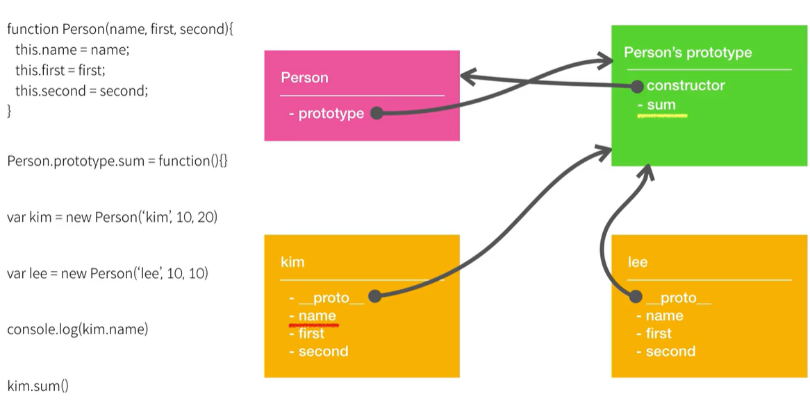

# new의 동작방식

객체 리터럴 `{...}`을 사용하면 객체를 쉽게 만들 수 있지만, 여러 객체를 만들고자 할 때 어려움을 겪을 수 있다. 이 때, `new` 연산자와 생성자 함수를 사용하면 객체를 여러 개 만들 수 있다.

**생성자 함수(constructor function)**는 일반 함수와 기술적인 차이는 없지만, 다음과 같은 두 가지 관례를 따른다.

1.  함수 이름의 첫 글자는 대문자로 시작한다
2. 반드시 `new` 연산자를 붙여 실행한다.

```javascript
function User(name) {
  // this = {};  (빈 객체가 암시적으로 만들어짐)
  this.name = name;
  this.isAdmin = false;
  // return this;  (this가 암시적으로 반환됨)
}

let user = new User("보라");

alert(user.name); // 보라
alert(user.isAdmin); // false
```

new User()를 써서 함수를 실행하면 다음과 같이 동작한다.

1. 빈 객체를 만들어 `this`에 할당한다.
2. 함수 본문을 실행한다. `this`에 새로운 프로퍼티를 추가해 `this`를 수정한다.
3. `this`를 반환한다.

만들어진 user는 다음과 동일하게 작동된다. 

```javascript
let user = {
  name: "보라",
  isAdmin: false
};
```


이러한 내용을 prototype 속성과 함께 다시 한번 살펴보자.

아래의 코드에선 `Person`이라는 새로운 생성자 함수를 정의하고 있고 이를 활용해 새로운 객체를 만들고 있다.

```javascript
function Person(name, first, second) {
  	this.name = name;
  	this.first = first;
    this.second = second;
};

Person.prototype.sum = function(){};

const kim = new Person('kim', 10, 20);
console.log(kim);
```


위의 코드에서 `new Person(...)`이 작동하는 방식은 다음과 같다.

(이미 Person 객체와 Person.prototype이 만들어졌다는 가정 하에 설명한다.)

1. 빈 객체를 생성한다.
2. `[[Prototype]]` 속성을 Person.prototype으로 지정한다.
3. 객체(`kim`)를 생성하고 이 객체를 `this`로 지정한다.
4. 함수를 호출하고 해당 함수의 `this`로 위에서 지정한 객체를 사용한다.
5. 함수의 리턴값이 원시값이라면 새로 만들어진 객체가 리턴되고 리턴값이 객체라면 해당 객체가 리턴된다.
   - 위의 예시에선 원시값인 `undefined` 가 리턴되기 때문에 새로 만들어진 객체가 리턴된다.





**참고자료**

https://ko.javascript.info/constructor-new

https://www.youtube.com/watch?v=wT1Bl5uV27Y

https://github.com/baeharam/Must-Know-About-Frontend/blob/main/Notes/javascript/new.md