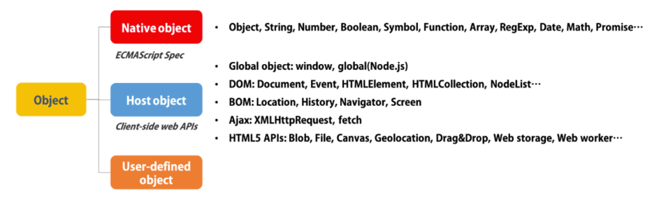
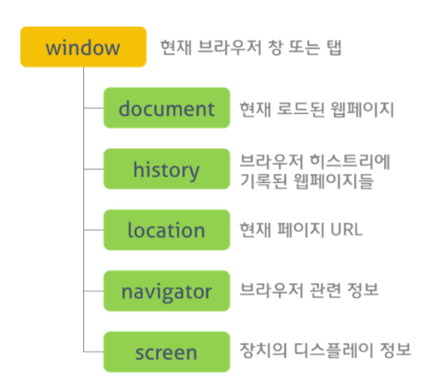
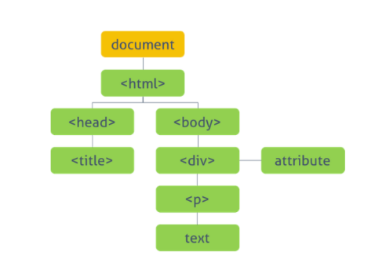

#### 네이티브 객체 (Native Object)

✅ 자바스크립트 언어 규약(ECMAScript)으로 정의되어진 객체. 애플리케이션 전역의 공통 기능을 제공한다. 네이티브 객체는 *애플리케이션의 환경과 관계없이 언제나 사용*할 수 있다.

##### 네이티브 객체 종류

Object, String, Number, Function, Array, RegExp, Date, Math, Boolean, Error(+기타 에러관련 obj), Symbol(ES6), JSON, Promise, Proxy, Map, Set...

- **값 속성** 
  - 간단한 값을 반환하며 속성이나 메서드를 가지고 있지  않다
  - NaN, Null, undefined, globalThis
- **함수 속성**
  - 객체에 붙지 않고 전역으로 호출하는 함수로, 반환 값을 호출자에게 바로 반환한다
  - eval(), parseInt(), isNaN() - 객체에 붙지 않고 전역으로 호출하는 함수
- **기초 객체** 
  - 다른 모든 객체의 기반이 되는 기초이자 기본 객체.
  - Object, Boolean, Function, Symbol - 모든 객체의 기본 객체
  - 오류 객체 : Error, SyntaxError
  - 숫자/날짜 객체 : Number, Math, Date
- **텍스트 처리 객체** : String, RegExp
- **인덱스 콜렉션** : 인덱스값으로 정렬된 콜렉션. Array 포함
- ... ETC

#### 호스트 객체 (Host Object)

✅ 자바스크립트를 실행하는 환경에 종속된 객체로 그 환경에서만 찾아볼 수 있다.

- 전역 객체(Global object) : 모든 객체의 유일한 최상위 객체(브라우저의 window, 서버의 global 객체)

- BOM(Browser Object Model) : 브라우저 탭 또는 브라우저 창의 모델을 생성. BOM의 최상위 객체는 window 객체(현재 브라우저 창 또는 탭을 표현)

  

- DOM(Document Object Model) : 현재 웹페이지의 모델을 생성. DOM의 최상위 객체는 document 객체로 전체 문서를 표현

  