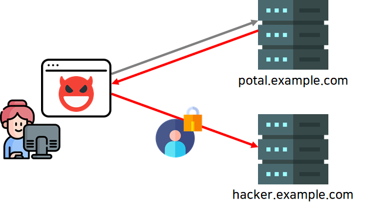
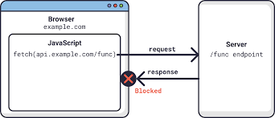

# 동일 출처 정책(Same Origin Policy)

: 한 `Origin`에서 로드된 문서 또는 스크립트가 다른 `Origin`의 리소스와 상호 작용할 수 있는 방법을 제한하는 중요한 보안 메커니즘

❓여기서 말하는 `Same Origin`은 무엇을 의미할까❓

> 💡**Same Origin**
>
> : 두 개의 URL이 존재할 때 `프로토콜`, `포트(지정된 경우)`, `호스트`가 동일한 경우 두 URL의 `Origin`이 같다.


위의 예시처럼 1) **protocol이 다르거나**, 2) **port번호가 다르거나**, 3) **host가 다르다면** 두 개의 URL은 "서로 다른 Origin"이라고 보는 것이다.


❓왜 이런 정책이 등장하게 된걸까❓

SOP 없는 상황에서의 문제를 방지하기 위해 등장했다.



예를 들어 사용자가 이전에 `portal.example.com`에 로그인을 했다고 가정해보자. 그러면, 브라우저 상에 로그인 정보가 저장되어 있을 것이다. 해커는 이러한 로그인 정보를 통해 `portal.example.com`에 요청을 보내는 코드를 `hacker.example.com`에 작성을 해둔 상황이다. 이때 사용자가 해당 악성페이지에 접속하게 되면, 사용자도 모르게 `portal.example.com`에 요청을 날리게 되고 그 응답을 해커의 서버로 보내 사용자의 개인정보가 탈취되는 등 로그인 정보를 이용해 많은 작업을 할 수 있게 된다.

그러나, SOP가 있다면 다른 사이트 간의 리소스 공유를 제한하게 되어 이러한 민감한 정보가 타 사이트에 새어나가는 것을 방지할 수 있다.


**⭐동일 출처 정책 범위**

동일 출처 정책은 스크립트에만 적용된다. 이미지, CSS나 동적으로 로딩된 스크립트들은 그에 대응하는 HTML태그, 이를테면 `img`, `video`, `embed`, `iframe` 등을 사용함으로써 교차 출처가 허용된다.

- 교차 출처 쓰기는 보통 허용한다. 일부 HTTP 요청은 Preflight를 요청한다.
  - 링크, 리다이렉트, 양식 제출 등
- 교차 출처 삽입은 보통 허용한다
  - ``, `<video>`, `<iframe>`, `<script src="...">`, `<link rel="stylesheet" href="...">` 
- 교차 출처 읽기는 보통 불허하지만, 종종 교차 출처 삽입 과정에서 읽기 권한이 누출된다.

> CSRF 공격은 이런 점을 악용한 공격이다. 동일 출처 정책은 *cross-site 읽기만 방어할 뿐, 쓰기를 예방하지 못한다*. 동적으로 로딩된 스크립트가 어떤 요청을 보내는 것을 막을 수는 없다. 만약 cross-site 가 사용자의 인증 정보가 담긴 쿠키를 채가서 서버에 있는 정보를 탈취하려고 한다면, 서버에서는 SameSite 쿠키 설정을 통해 이를 예방할 수 있다.


❓그렇다면 서버와 클라이언트 오리진이 다를 때는 어떻게 처리할 수 있을까❓



1. **프록시를 이용하는 방법**

   - 동일 출처 정책의 문제는 `API` 서버와 자바 스크립트가 호스팅 되는 서버의 URL이 달라서 문제가 발생하게 된다. 이를 앞단에 `Reverse Proxy`를 넣어서 전체 URL이 같게 만들어주면 된다.
   - 이러한 구조가 되면, 자바 스크립트가 로딩된 사이트도 `mysite.com`이 되고 자바스크립트에서 호출하고자 하는 `API` URL도 `mysite.com`이 되기 때문에 동일 출처 정책에 위배되지 않는다.
   - 이 방식은 간단하지만, 자사의 웹 사이트를 서비스하는 경우에만 가능하다. 그래서 자사의 서비스용 `API`를 만드는 경우에는 괜찮지만, 파트너사나 일반 개발자에게 자바스크립트용 `REST API`를 공개하는 경우에는 적절하지 않다.

2. **CORS(Cross Origin Resource Sharing)**

   - 추가 HTTP 헤더(`Access-Control-Allow-Origin`)를 사용하여, 한 출처에서 실행 중인 웹 애플리케이션이 **다른 출처의 리소스에 접근할 수 있는 권한을 부여**하도록 브라우저에 알려주는 체제이다.

     - 웹 브라우저에서 해당 정보를 읽는 것이 허용된 출처를 서버에서 설명할 수 있는 새로운 [HTTP 헤더](https://developer.mozilla.org/ko/docs/Web/HTTP/Headers)를 추가함으로써 동작한다.
     - 서버 데이터에 부수 효과(side effect)를 일으킬 수 있는 HTTP 요청 메서드([`GET`](https://developer.mozilla.org/ko/docs/Web/HTTP/Methods/GET)을 제외한 HTTP 메서드)에 대해, CORS 명세는 브라우저가 요청을 [`OPTIONS`](https://developer.mozilla.org/ko/docs/Web/HTTP/Methods/OPTIONS) 메서드로 "프리플라이트"(preflight, 사전 전달)하여 지원하는 메서드를 요청하고, 서버의 "허가"가 떨어지면 실제 요청을 보내도록 요구

   - ✅**단순 요청(Simple requests)**

     - 다음 조건을 만족하는 요청은 CORS preflight를 트리거 하지 않는다. 
       1. 메서드: `GET`, `POST`, `HEAD` 중 하나
       2. 수동으로 설정된 헤더: `Accept`, `Accept-Language`, `Content-Language`,`Content-Type`
       3. Content-Type:  `application/x-www-form-urlencoded`, `multipart/form-data`, `text/plain`
       4. 요청에서 이벤트 리스너가 사용되지 않아야 함
       5. 요청에서 `ReadableStream`이 사용되지 않아야  함

   - ✅**사전 요청(Preflight request)**

     - 요청 전, `OPTIONS` 메서드로 Preflight 요청을 보내 해당 출처 리소스에 접근 권한 여부부터 확인하는 것

     - 응답 헤더의 Access-Control-Allow-Origin으로 요청을 보낸 출처가 돌아오면 실제 요청을 보낸다.

     - 응답 헤더에 접근 권한이 없다면 브라우저에서 CORS 에러를 띄우게 되고, 실제 요청은 전달되지 않는다.

       > 💡사전 요청을 하는 이유
       >
       > - 실제 요청 전 미리 권환 확인이 가능하고 실제 요청을 처음부터 전부 보내는 것보다 리소스 측면에서 효율적이다
       >
       > - CORS 대비가 안된 서버를 보호할 수 있다.
       >
       > - 요청을 보내면 응답을 보내기 전에 요청을 먼저 처리하는데, 브라우저는 응답을 받고 나서야 CORS 에러를 출력한다. 그러나 이미 요청이 수행된 후이기 때문에 `DELETE`, `PUT` 처럼 데이터를 변경하는 요청이었다면 문제가 될 수 있다.

   - ✅인증 정보를 포함한 요청(Credentialed Request)

     - 요청 헤더에 인증 정보를 담아 보내는 요청
     - 출처가 다를 경우에는 별도의 설정을 하지 않으면 쿠키를 보낼 수 없다. 이 경우 프론트 서버 양측 모두 CORS 설정이 필요하다
       - 프론트: 요청 헤더에 `withCredentials:true` 넣기
       - 서버: 응답 헤더에 `Access-Control-Allow-Credentials: true` 넣기
       - `Access-Control-Allow-Origin`을 `*`가 아닌 정확한 오리진으로 설정해야 한다.

3. **JSONP(JSON with Padding)**

   -  HTML의 `<script>` 요소로부터 요청되는 호출에는 보안상 정책(SOP)이 적용되지 않는다는 점을 이용한 우회 방법

     - 당장 스크립트부터 CORS가 적용된다고 한다면 인터넷에 있는 제이쿼리를 비롯한 수많은 CDN들은 무용지물이 되기 때문..

     ```html
     <script src="http://company.com/example.json?callback=callbackFunction"></script>
     ```

     - 데이터를 가공하는 콜백함수를 넘겨 해당 데이터를 사용할 수 있도록 함.


참고 자료

https://dongwooklee96.github.io/post/2021/03/23/sopsame-origin-policy-%EB%9E%80-%EB%AC%B4%EC%97%87%EC%9D%BC%EA%B9%8C.html

https://velog.io/@xmun74/CORS-SOP

https://core-research-team.github.io/2021-04-01/Easy-to-understand-Web-security-model-story-1(SOP,-CORS)

https://developer.mozilla.org/ko/docs/Web/Security/Same-origin_policy

https://velog.io/@minjae-mj/Cross-Origin-Resource-SharingCORS

https://developer.mozilla.org/ko/docs/Web/HTTP/CORS#preflighted_requests