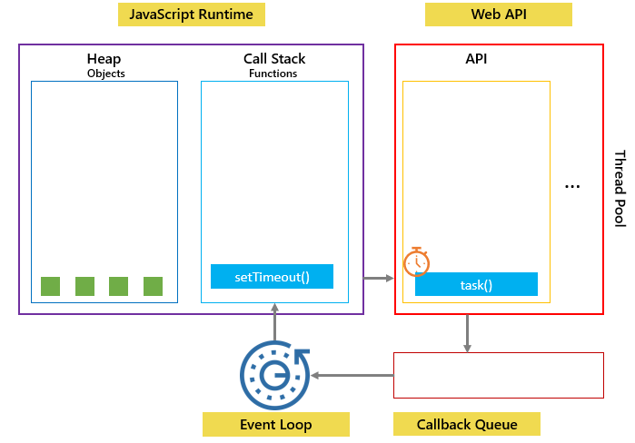

## 비동기와 콜백, 그리고 Promise

자바스크립트는 싱글 스레드 언어로, 코드가 동기적으로(순서대로) 실행된다. 

```javascript
function task1() {
  console.log("작업 끝");
}

task1();
console.log("코드 끝");
```

위와 같은 코드가 있을 때, task1()이 모두 처리되어 "작업 끝"을 출력한 후, "코드 끝"이 출력된다. 이렇게 하나의 작업이 실행될 때 다른 작업이 실행되지 못하는 것을 `blocking(블로킹)`이라 한다.

그러나 이렇게 이전의 코드가 다 해결되기 까지 기다리는 것이 효율이 떨어질 수 있다. 이를 해결하기 위해, Web API의 도움을 받아 비동기적으로 해결할 수 있다. (동작 방식은 eventloop의 글을 참고하자.) 이렇게 하나의 작업이 수행되는 동안 다른 작업도 실행되는 것을 `non-blocking(논블로킹)` 방식이라고 부르며 `setTimeout`, `Promise`, `async/await`가 이에 해당한다.

그러면 먼저 `setTimeout`을 통해 비동기 방식이란 무엇 인가에 대해 좀 더 살펴보자.

```javascript
function task1() {
  setTimeout(() => {
  	console.log("작업 끝");
  }, 3000);
}

task1();
console.log("코드 끝");
```

`setTimeout` 함수의 인자로는 "특정 시간이 지났을 때 실행될 함수(콜백)"와 "기다릴 시간(ms)"이 있다. 위의 코드를 실행시키면 다음과 같은 순서로 실행된다.



1. 먼저 `task1()`이 실행된다. (Call stack에 쌓인다.)
2. `setTimeout()`가 실행된다.(Call stack에 쌓인다.)
3. setTimeout 함수는 곧바로 Web API에 "실행될 함수(콜백)"와 "지연 시간"을 설정해둔다.
   - 넣어둔 즉시 3초(3000ms) 동안 Web API에 머문다.
4. setTimeout 함수와 task1은 차례로 종료된다.(Call stack에서 빠진다.)
5. "코드 끝"이 출력된다.
6. 원래 코드가 종료되고 Web API에 있던 3초 타이머가 종료되어 해당 콜백 함수가 `Callback Queue`에 담기게 된다.
7. `event loop`가 call stack이 비어있는 지 확인하고 비어있다면 해당 콜백을 다시 콜스택에 넣는다.
8. "작업 끝"이 출력되고 종료된다.

처음 동기 방식과는 다르게 "코드 끝"이 먼저 출력되고 "작업 끝"이 나중에 출력되는 것을 확인할 수 있다. 이렇게 요청과 결과가 동시에 일어나지 않는 것을 `비동기`라 한다. 

❓만약 비동기로 처리된 결과 값을 사용해야 할 경우에는 어떻게 하면 좋을까❓

이는 `콜백함수`를 통해 해결할 수 있다. 

> 💡콜백 함수(`callback function`)
>
> ​	: 다른 함수의 인수로서 넘겨지는 함수

```javascript
function taskA(a, b, cb) {
  setTimeout(() => {
    const res = a + b;
    cb(res);
  }, 3000);
}


taskA(3, 4, (res) => {
  console.log("A task result: ", res);
});
console.log("코드 끝");
```

위의 예시처럼 콜백 함수를 넘겨주어, setTimeout의 콜백이 실행되었을 때, 결과인 res를 콜백함수 cb에 인자로 넘겨줄 수 있다.


❓그렇다면 이러한 인자를 계속 연이어 받게 된다면 어떻게 될까❓

```javascript
function taskA(a, b, cb) {
  setTimeout(() => {
    const res = a + b;
    cb(res);
  }, 3000);
}

function taskB(a, cb) {
  setTimeout(() => {
    const result = a * 2;
    cb(result);
  }, 1000);
}

function taskC(a, cb) {
  setTimeout(() => {
    const res = a * -1;
    cb(res);
  }, 2000);
}

taskA(4, 5, (a_res) => {
  console.log("A result :", a_res); // A result : 9
  taskB(a_res, (b_res) => {
    console.log("B result:", b_res); // B result: 18
    taskC(b_res, (c_res) => {
      console.log("C result:", c_res); // C result: -18
    });
  });
});
```

위의 코드처럼 taskA의 콜백의 결과로 얻은 `a_res`의 값을 다시 taskB에 넣고, 또 그 콜백의 결과로 얻은 `b_res`의 값을 taskC에 넣어 마지막 콜백의 결과 `c_res`를 출력한다 했을 때, 콜백 함수가 연이어 작성되는 바람에 코드의 들여쓰기 수준이 깊어지는 것을 의미한다. 이는 가독성을 해치는데 이를 해결한 방법은 없을까?

이는 `Promise`나 `Async/Await`로 해결할 수 있다.

