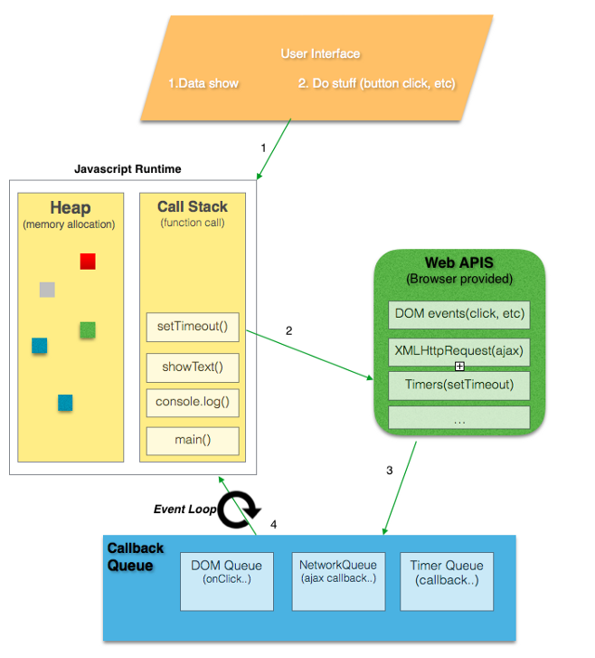

### 이벤트 루프(Event loop)

자바스크립트는 단일 스레드(Single-threaded) 기반 언어로, 자바스크립트 엔진이 단일 콜스택을 갖는다. 이 말은 요청이 동기적으로 처리된다(한 번에 한 가지 일만 처리할 수 있다!)는 것을 의미한다.

❓ 그럼 비동기 요청은 어떻게 처리될 수 있을까? 그것은 바로 자바스크립트를 실행하는 환경인 브라우저나 Node.js가 담당한다. 여기서 ***자바스크립트 엔진과 그 실행 환경을 상호 연동시켜주는 장치***가 바로 ***이벤트 루프***이다. 따라서, 이벤트 루프는 자바스크립트 엔진에 있지 않고 그 환경에 속한다.



- **자바스크립트 엔진**
  - `Heap` : 객체들은 힙 메모리에 할당된다. 크기가 동적으로 변하는 값들의 참조 값을 갖고 있다.
  - `Call stack` : 함수 호출 시, 실행 컨텍스트가 생성되며 이러한 실행 컨텍스트들이 콜 스택을 구성한다.
- **Wep API or Browser API**
  - 웹 브라우저에 구현된 API다
  - DOM event, AJAX, Timer 등이 있다
- **이벤트 루프**
  - 콜 스택이 비었다면, 태스크 큐에 있는 콜백 함수를 처리한다
- **태스크 큐**
  - 이벤트 루프는 하나 이상의 태스크 큐를 갖는다
  - 태스크 큐는 태스크의 set이다
  - 이벤트 루프가 큐의 첫 번째 태스크를 가져오는 것이 아니라, 태스크 큐에서 실행 가능한(runnable) 첫 번째 태스크를 가져오는 것이다. 태스크 중에서 가장 오래된 태스크를 가져온다


#### 매크로 태스크 큐(Macrotask queue)와 마이크로태스크 큐(Microtask queue)


자바스크립트의 실행 환경은 2가지 큐를 갖고 있으며 각각 스크립트 실행, 이벤트 핸들러, 콜백함수 등의 태스크(Task) 담기는 공간이다. 태스크가 콜백 함수라면 그 종류에 따라 다른 큐에 담기며 대표적인 예로는 다음과 같은 것들이 있다.

- **매크로 태스크 큐**
  - `setTimeout()`, `setInterval()`, `UI rendering`, `requestAnimationFrame()`
  - 이와 같이 비동기 함수의 콜백 함수, 이벤트 핸들러가 일시적으로 보관되는 영역
- **마이크로 태스크 큐**
  - Promise, MutationObserver

이벤트 루프는 2개의 큐를 감시하고 있다가 콜 스택이 비게 되면, 콜백함수를 꺼내와서 실행한다. 이 때 ***마이크로 태스크 큐의 콜백함수가 우선순위를 가지기 때문에*** 마이크로 태스크 큐의 콜백함수를 전부 실행하고 나서 매크로 태스크 큐의 콜백함수를 실행한다.


```javascript
console.log('script start'); // A

setTimeout(function () { // B
  console.log('setTimeout');
}, 0);

Promise.resolve() 
  .then(function () { // C
    console.log('promise1');
  })
  .then(function () { // D
    console.log('promise2');
  });

console.log('script end'); // E


// 결과!!
script start
script end
promise1
promise2
setTimeout
```

https://jakearchibald.com/2015/tasks-microtasks-queues-and-schedules/

1. 콜 스택에는 전역 실행 객체가 있고, '스크립트 실행'이라는 태스크가 매크로 태스크 큐에 들어있다.
2. 이벤트 루프는 매크로 태스크 큐에 있는 '스크립트 실행' 태스크를 실행한다.
3. A에 도달하면, 'script start'가 출력된다.
4. B에 도달하면, setTimeout web api가 타이머를 실행시키고, 타이머가 종료되면 콜백 함수가 매크로 태스크 큐에 들어간다.
5. C에 도달하면, 콜백 함수가 마이크로 태스크 큐에 들어간다.
6. E에 도달하면, 'script end'가 출력된다.
7. 콜 스택이 비었으므로, 이벤트 루프는 마이크로 태스크 큐에 있는 프라미스 콜백 함수를 실행시킨다.
8. 'promise 1'이 출력된다.
9. Promise.then 메서드는 D 콜백 함수를 마이크로 태스크 큐에 등록한다.
10. 이벤트 루프는 다음 마이크로 태스크인 D 콜백 함수가 실행시킨다.
11. 'promise 2'가 출력된다.
12. 렌더링할 것이 있으면, 브라우저는 렌더링을 한다.
13. 매크로 태스크 큐에 있는 setTimeout 콜백함수를 실행시킨다.
14. 'setTimeout'이 출력된다.