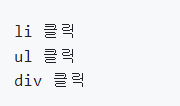
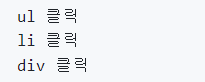

💡 이벤트 위임을 알기 위해선 먼저 `이벤트 버블링`과 `이벤트 캡처링`의 동작방식을 알아야 한다.

💡 JavaScript의 대부분 이벤트의 이벤트 흐름(Event flow)의 `이벤트 버블링`, `이벤트 캡처링` 단계를 거친다.


**이벤트 버블링** : 하위 엘리먼트에 이벤트가 발생할 때 그 엘리먼트부터 시작해서 상위요소까지 이벤트가 전달되는 방식

**이벤트 캡쳐링** : 하위 엘리먼트에 이벤트 핸들러가 있을 때 상위 엘리먼트부터 이벤트가 발생하기 시작해서 하위 엘리먼트까지 이벤트가 전달되는 방식


```html
<div>
  <ul>
    <li>예시</li>
  </ul>
</div>
```

```javascript
document.querySelector('li').addEventListener('click', () => console.log('li 클릭'));
document.querySelector('ul').addEventListener('click', () => console.log('ul 클릭'));
document.querySelector('div').addEventListener('click', () => console.log('div 클릭'));
```

> 위와 같이 코드를 작성하고 `li` 태그를 클릭해보면 콘솔에는 아래와 같이 찍히게 된다.




즉, 기본적으로는 동작 방식이 `이벤트 버블링`인 것이다. 이 방식을 `이벤트 캡처링`으로 바꾸기 위해선 `addEventListener()`의 마지막 인자로 `{capture : true}`를 전달해주면 된다. 이렇게 하면, 클릭한 엘리먼트의 상위요소 중 이벤트 캡처링이 적용된 엘리먼트부터 콘솔에 찍히고 그 다음부터는 다시 `이벤트 버블링` 방식을 동작한다. `ul` 의 이벤트 핸들러에 캡처링을 적용해보자.


```javascript
document.querySelector('ul').addEventListener('click', () => console.log('ul 클릭'), { capture: true });
```



> `li` 부터는 다시 이벤트 버블링이 동작해서 `div`에 이벤트가 발생하는 것이다.


---


#### 이벤트 위임 (Event delegation)

✅ 하위 엘리먼트들이 여러개 있을 때, 하위 엘리먼트들에 각각 이벤트 핸들러를 달지 않고 상위 엘리먼트에 이벤트 핸들러를 달아 하위 엘리먼트들을 제어하는 방식

- 동적으로 엘리먼트를 추가할 때마다 핸들러를 고려할 필요가 없다.
- 상위 엘리먼트에 하나의 이벤트 핸들러만 추가하면 되기 때문에 코드가 훨씬 깔끔해진다.
- 메모리에 있게 되는 이벤트 핸들러가 적어지기 때문에 퍼포먼스 측면에서 이점이 있다.

```htm
<ul onclick="alert(event.type + '!')">
    <li>첫번째</li>
    <li>두번째</li>
    <li>세번째</li>
</ul>
```

> `li`에 각각 핸들러를 달지 않고 상위 엘리먼트인 `ul`에만 달았다. 그렇다고 무조건 이벤트 위임이 좋은 것은 아니기 때문에 상황에 맞게 잘 사용하도록 하자!


```html
<div id="div-content">
  <span id="span-content">
    <button id="btn">버튼</button>
  </span>
</div>
```

> 이벤트 위임 사용 전

```javascript
// 개별 요소를 접근해야함
const divNode = document.getElementById("div-content");
const spanNode = document.getElementById("span-content");
const btnNode = document.getElementById("btn");

// 개별 요소마다 이벤트 리스너를 등록해야함
divNode.addEventListener("click", function () {
  console.log("divNode Click");
});

spanNode.addEventListener("click", function () {
  console.log("spanNode Click");
});

btnNode.addEventListener("click", function () {
  console.log("btnNode Click");
});
```

> 이벤트 위임 적용 후

```javascript
// 상위 요소인 id가 "div-content"인 div 노드만 접근함
const divNode = document.getElementById("div-content");

// div 노드에만 이벤트 리스너를 설정
divNode.addEventListener("click", function (e) {
  const id = e.target.id;
  
  // 이벤트 객체의 target.id로 조건문을 설정
  if (id === "div-content") {
    console.log("div-content id Click");
  } else if (id === "span-content") {
    console.log("span-content id Click");
  } else if (id === "btn") {
    console.log("btn id Click");
  }
});
```

이벤트 위임을 적용하면 최상위 요소만 접근하면 되므로 spanNode, btnNode라는 변수는 필요가 없어진다. 그리고 addEventListener() 메서드를 한 번만 호출하면 되므로 이벤트 핸들러 함수도 하나만 존재하면 된다.

