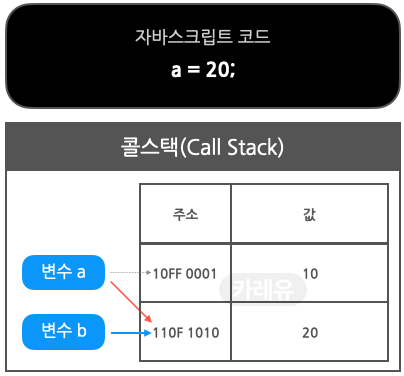

# 콜 스택(Call stack)과 힙(Heap)

자바스크립트 엔진은 `Memory Heap`과 `Call Stack`으로 구성되어 있다. 가장 유명한 것이 구글의 V8 Engine이다. 자바스크립트는 단일 스레드(`single thread`) 프로그래밍 언어인데, 이 의미는 Call stack이 하나다. 즉 *멀티가 되지 않고 하나씩 처리한다*는 의미.


## 콜 스택(Call Stack)

**원시 타입(숫자 등)** 데이터가 저장된다.

실행 콘텍스트(Execution Context)를 통해

1) 변수 식별자(이름) 저장
2) 스코프 체인 및 this 관리
3) 코드 실행 순서 관리 등을 수행한다.


## 메모리 힙(Memory Heap)

**참조 타입(객체 등)** 데이터가 저장된다

메모리 할당이 일어나는 곳.


## 콜스택, 메모리힙의 데이터 구조


- 원시 타입 데이터(파란색 변수 a)
  - 10이라는 값 자체는 원시 타입이므로 콜 스택에 저장된다.
  - 변수 a에는 10이 저장된 콜 스택 메모리의 주소값이 저장된다.
  - 변수 식별자 a 자체는 콜스택 상의 실행 컨텍스트의 렉시컬 환경이라는 곳에 저장된다.
- 참조 타입 데이터(핑크색 변수 b, c, d)
  - 배열, 객체, 함수 등은 참조 타입이므로 메모리 힙에 저장된다
  - 참조타입 데이터가 저장된 메모리 힙의 주소값은 콜스택에 각각 저장된다
  - 메모리힙의 주소값이 저장된 콜 스택의 주소값은 각각 변수 b, c, d에 저장된다.
  - 변수 식별자 b, c, d 이름 자체는 콜스택 상의 실행 컨텍스트의 렉시컬 환경에 저장된다.


❓원시타입/ 참조 타입 데이터가 콜 스택과 메모리 힙에서 어떻게 관리되는가❓


### 원시 타입의 변수 선언

1. **원시타입 변수 생성**

   > 원시타이브이 데이터 값은 `콜스택`에 저장되고, 데이터 값이 저장된 `콜스택`의 주소 값은 변수 a, b에 각각 저장된다.

   

2. **원시 타입 재할당1**

   > 변수 a에 20을 재할당하면, 본인 메모리에 있는 값을 변경하는 게 아니라 기존에 20을 저장하고 있는 메모리의 주소 값으로 교체한다. a에 저장된 주소 값은 20을 가리키고 있던 b에 저장된 주소 값과 동일해진다

   

3. **원시 타입 재할당2**

   변수 b에 30을 재할당하면 변수 b의 주소 값이 가리키는 메모리에 저장된 20을 30으로 교체하는 것이 아니라, 새로운 메모리를 확보하여 30을 저장하고, 변수 b에 저장된 주소 값을 해당 주소 값으로 교체한다

   

4. **가비지 컬렉터**

   더 이상 참조되지 않는 데이터는 `가비지 컬렉터`에 의해 적절한 시점에 메모리에서 해제된다

   


### 참조 타입의 변수 선언과 할당

```javascript
let myArray = [];
```

`myArray` 변수를 선언하고 `[]` 같은 참조 타입을 할당했을 때,

1. 변수의 고유 식별자를 생성한다
2. 콜 스택의 메모리에 주소를 할당한다
3. 힙에 할당된 메모리 주소를 콜 스택의 값(value)으로 저장한다(런타임)
4. 힙의 메모리 주소에 할당된 값(빈 배열[])을 저장한다


- `push`, `pop` 메소드 사용

```javascript
myArray.push("first");
myArray.push("second");
myArray.push("third");
myArray.push("fourth");
myArray.pop();
```


### let과 const

변수의 값이 변경되지 않는 이상 `const`로 변수를 선언하고, 변경될 여지가 있다면 `let`으로 선언하는 것이 일반적이다.

❓여기서 **변경**은 어떤 상황을 의미하는 것일까❓

```javascript
let numbers = [];
numbers.push(1);
numbers.push(2);
numbers.push(3);
numbers.push(4);
numbers.push(5);
```

위의 예시로 살펴보면, `numbers` 배열에 값이 추가되기 때문에 `let`으로 선언되었다. 그러나 이는 잘못된 코드이다.

**변경** 이란, <u>메모리 주소의 변경</u>을 의미한다. 

`let`은 메모리 주소의 변경을 허락하지만, `const`는 메모리 주소를 변경할 수 없다.

그래서 다음과 같은 코드로 작성하는 것이 맞다.

```javascript
const myArray = [];
myArray.push(1);
myArray.push(2);
myArray.push(3);
myArray.push(4);
myArray.push(5);
```


위의 예시를 실제 그림으로 나타낸 것이다.

`push` 메소드는 힙에 존재하는 배열에 숫자를 넣지만, 변수 `myArray`의 주소는 변경되지 않는다. 그렇기 때문에 `const`로 선언되었지만 에러가 발생되지 않는다.  `myArray`는 여전히 `0458AFCZX91`라는 메모리 주소와 같으며, `0458AFCZX91`는 힙의 배열을 값(value)으로 가지는 `22VVCX011`를 값(value)으로 가지고 있다.

그러나 다음과 같이 작성하면 에러가 발생한다.

```javascript
myArray = 3;
```

숫자 3은 원시 타입이기 때문에 콜 스택의 메모리 주소가 할당되고, 3이라는 값이 저장되며, 그러고 나서 이렇게 생긴 새로운 메모리 주소를 `myArray` 에 할당하려 한다. 그러나 `myArray` 는 `const` 로 선언되었기 때문에 이러한 과정은 허용되지 않는다. 


참고 자료

https://charming-kyu.tistory.com/19