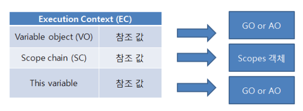

# 클로저(closure)

: 내부함수가 유효한 상태에서 외부함수가 종료하여 외부함수의 실행 컨텍스트가 반환되어도, 외부함수 실행 컨텍스트 내의 **활성 객체(Activation object)**(변수, 함수 선언 등의 정보를 가지고 있다)는 **내부함수에 의해 참조되는 한 유효**하여 내부함수가 **스코프 체인**을 통해 참조할 수 있는 것


## **사전 지식**

💡**Execution context**

​	: JS 코드가 실행 평가되는 환경의 추상적 개념

- 어떤 코드가 JS로 실행 될 때마다 Execution Context 내에서 실행

- Execution context의 세 가지 타입

  1. Global Execution Context
  2. Functional Execution Context
  3. Eval Function Execution Context

- 구성

  


💡**Execution stack**

​	: 코드 실행 중에 생성된 모든 Execution Context를 저장하는 데 사용

- 실행 순서

  1. JS엔진이 첫 번째 스크립트를 만날 때, Global Execution Context를 생성하고 Excution Stack에 push 함

  2. 함수 호출을 엔진에서 발견할 때마다 Excution Stack에 push

  3. JS엔진은 Excution Stack top에 있는 Excution context의 함수를 실행함

  4. 함수가 완료되면 pop


💡**Execution Context가 생성되는 단계**

1. The Creation Phase
   - Execution Context 생성
   - LexicalEnvironment component 생성
   - VariableEnvironment component 생성
2. Excution Phase
   - 모든 변수에 대한 할당이 완료되고 코드가 최종적으로 실행됨


💡**Lexical Environment**

​	: let, const 변수 바인딩과 함수 선언을 저장하는데 사용

- 구성

  1. Environment Record

     : Lexical Environment 내부에 저장된 변수와 함수 선언이 있는 공간

  2. Reference to the outer environment

     : 외부 Lexical Environment를 접근할 수 있다는 것을 의미함

  3. This binding

     : 여기서 this의 값이 결정됨


💡**Variable Environment**

​	: var 변수 바인딩을 저장하는 데만 사용

- 구성은 동일


▶️**Lexical Environment에 대한 깊은 이해**

`lexical`: 사전적으로는 `어휘`라는 의미를 가지고 있으며 프로그램이 구현된 `코드`와 관련되어 있음을 의미한다

=> 변수를 검색할 때 함수가 실행되는 환경을 근거로 판단하는 것이 아니라 **함수를 정의한 코드의 문맥을 근거로 판단한다**는 것이다.

```javascript
var func1 = function(){
	var a = 1;
	func2();
};
var func2 = function(){
	return a;
};
func1();
```

위의 코드를 실제로 실행시켜보면  "a is not defined" 예외가 발생한다. 그 이유는 lexical environment(렉시컬 환경) 때문이다.

fucn2를 실행시킬 때의 렉시컬 환경에서 살펴보자면, 내부에 a 변수가 정의된 것이 없고, outer인 global에도 a 변수가 정의된 것이 없다. 그렇기 때문에 a를 불러올 수 없어 예외가 발생하는 것이다.

이처럼, 함수가 실행되고 있는 환경(func1)에서 검색하는 것이 아니라, **각 문장이 정의된** 함수(func2) 내에서 검색한다는 것이다. 

```javascript
var x = "global";

var func = function(){
	console.log("x: " + x);
	var x = "local";
	console.log("x: " + x);
};
func();
```

결과 값은

```
x: undefined
x: local
```

로 나오게 된다. 

이또한 렉시컬 환경 때문임을 알 수 있다.

결론, 자바스크립트 엔진은 렉시컬 환경에서 해당 변수를 검색한다.

그리고 이렇게 함수가 어디에서 선언되었는가에 따라 스코프를 결정하는 것을 렉시컬 스코핑(lexical scoping)이라 부른다.


## Closure란 도대체 뭘까?

```javascript
function outerFunc() {
  var x = 10;
  var innerFunc = function () { console.log(x); };
  return innerFunc;
}

/**
 *  함수 outerFunc를 호출하면 내부 함수 innerFunc가 반환된다.
 *  그리고 함수 outerFunc의 실행 컨텍스트는 소멸한다.
 */
var inner = outerFunc();
inner(); // 10
```

함수 outerFunc는 실행된 이후 실행 컨텍스트 스택에서 제거되었으므로 함수 outerFunc는 더 이상 유효하지 않게 되어 변수 x에 접근할 방법이 없어 보이지만, 위 코드를 실제로 실행시키면 10을 출력하는 것을 알 수 있다.

이처럼, <u>자신을 포함하고 있는 외부함수보다 내부함수가 더 오래 유지되는 경우, 외부 함수 밖에서 내부함수가 호출되더라도 외부함수의 지역 변수에 접근할 수 있는데 이러한 함수</u>를 **클로저(Closure)** 라고 부른다.

이는 렉시컬 환경 때문에 가능한 일인데, innerFunc가 본인이 선언되었을 때의 환경(lexical environment)인 스코프를 기억하여 자신이 선언되었을 때의 환경(스코프) 밖에서 호출되어도 그 환경(스코프)에 접근할 수 있기 때문이다. 

innerFunc 함수가 생성될 때, `[[Environment]]`라 불리는 숨김 프로퍼티에 외부 렉시컬 환경에 대한 참조가 저장되고 해당 `[[Environment]]` 프로퍼티로 `x`에 접근할 수 있는 것이다. 이 때, 클로저에 의해 참조되는 변수 x를 **자유변수(free variable)** 이라고 부른다. 


**참고 자료**

https://poiemaweb.com/js-closure

https://hyesunie.tistory.com/14

https://m.cafe.daum.net/ITVillage/Q3Wg/5

https://solt.tistory.com/47

https://ko.javascript.info/closure#ref-2139
