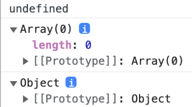

### 프로토타입 (Prototype)

✅ 자바스크립트의 모든 객체(배열, 객체, 함수 등)는 자신의 "원형(Prototype)"이 되는 객체를 가지며(상위 객체를 참조한다) 이를 **프로토타입**이라고 한다. 

```javascript
const array = [];
console.dir(array)

// console.dir은 주어진 JavaScript 객체의 모든 속성을 콘솔에서 볼 수 있는 방법이다
```


> 실행 결과에 존재하는 [[Prototype]] 프로퍼티가 바로 프로토타입이다. 프로토타입 체이닝에 의해 array는 Array의 함수 및 프로퍼티를 사용할 수 있다.


```javascript
let arr;  // 초기값 없음
console.dir(arr);

arr = []; // 배열 할당
console.dir(arr);

arr = {}; // 객체 할당
console.dir(arr);
```



> 실행 결과에서 알 수 있듯이 초기값이 없으면 undefined로 출력되고, 값을 할당하면 할당된 값에 따라 프로토타입이 변경된다.


---


#### .prototype과 [[Prototype]]

프로토타입이 헷갈리는 이유는 그 명명법과 연결방식에 있는데, 모든 객체는 은닉 속성인 `[[Prototype]]`을 갖는데 특별히 함수 객체는 접근할 수 있는 속성인 `.prototype`을 갖는다.

- `[[Prototype]]` : 자신의 프로토타입 객체를 참조하는 속성
- `.prototype` : new 연산자로 자신을 생성자 함수로 사용한 경우, 그걸로 만들어진 새로운 객체의 `[[Prototype]]` 이 참조하는 값이다. 유전자와 같은 개념이라고 생각하자!

```javascript
function Func() {}
var a = new Func(); 
```


- `constructor` : 모든 `.prototype` 객체의 속성에 있는 것으로 실제 객체를 참조하는 값

- 위 그림 설명
  - `new` 연산자로 새로운 객체 `a` 를 생성하면, `a` 의 프로토타입 객체는 생성자 함수로 사용한 `Func` 의 속성인 `Func.prototype` 이 된다.
  - `Func.prototype` 은 `constructor` 속성을 가지며 이는 실제 객체 `Func` 을 가리킨다.
  - `Func.prototype` 또한 객체이므로 `[[Prototype]]` 을 가지고 이는 모든 객체의 원형이 되는 객체인 `Object.prototype` 을 가리킨다.


```javascript
function 기계() {
    this.q = 'strike'
    this.w = 'snowball'
}

기계.prototype.name = 'kim'

var nunu = new 기계()

console.log(nunu.name)
```

> prototype chain을 통해 nunu의 name을 찾기 위해 유전자를 찾아 부모의 부모.. 까지 타고 올라가 찾는다.


----


#### 프로토타입 체인

✅ 어떤 객체의 프로퍼티를 참조하거나 값을 할당할 때 해당 객체에 프로퍼티가 없을 경우, 그 객체의 프로토타입 객체를 연쇄적으로 보면서 프로퍼티를 찾는 방식

- 프로퍼티를 참조할 때
  - 찾고자 하는 프로퍼티가 객체에 존재하면 사용한다.
  - 없으면 `[[Prototype]]` 링크를 타고 끝까지 올라가면서 해당 프로퍼티를 찾는다.
  - 찾으면 그 값을 사용하고 없으면 `undefined`를 반환한다.
- 프로퍼티에 값을 할당할 때
  - 찾고자 하는 프로퍼티가 객체에 존재하면 값을 바꾼다.
  - 프로퍼티가 없고 `[[Prototype]]`링크를 타고 올라가서 해당 프로퍼티를 찾았을 경우
    - 그 프로퍼티가 변경가능한 값, 즉 `writable: true` 라면 새로운 직속 프로퍼티를 할당해서 상위 프로퍼티가 가려지는 현상이 발생한다.
    - 그 프로퍼티가 변경불가능한 값, 즉 `writable: false` 라면 비엄격 모드에선 무시되고 엄격 모드에선 에러가 발생한다.
    - 해당 프로퍼티가 세터(setter) 일 경우, 이 세터가 호출되고 가려짐이 발생하지 않는다.

```javascript
function Func() {}
Func.prototype.num = 2;
var a = new Func();
a.num = 1;
console.log(a.num); // 1
```

> 해당 코드의 경우 객체 `a`의 프로토타입 객체인 `Func.prototype`에 `num`이 있지만 `a.num = 1`로 인해 가려짐 현상이 발생해서 1을 출력한다.
>
> ❓가려짐 : 상위 프로토타입 객체에 동일한 이름의 프로퍼티가 있는 경우, 하위 객체의 프로퍼티에 의해 가려지는 현상

```javascript
function Func() {}
Object.defineProperty(Func.prototype, "num", {
  value: 2,
  writable: false
})
var a = new Func();
a.num = 1; // 무시됨
console.log(a.num); // 2
```

> 그러나 `defineProperty()`를 사용해서 변경불가능한 프로퍼티로 만들면, 비엄격모드에서 무시돼서 2를 출력한다.


----


#### 관련 함수 및 연산자

**Object.create()** : 프로토타입 객체를 받아 연결시켜서 새 객체를 만드는 함수로, 프로토타입 객체를 바꾸기 때문에 원래의 `constructor`를 잃어버린다.

```javascript
function Func1() {}
function Func2() {}

Func2.prototype = Object.create(Func1.prototype);
console.log(Func2.prototype.constructor); // Func1
```

기대하는 결과는 `Func2` 이겠지만 프로토타입 객체가 `Func1.prototype` 으로 바뀌었고 이에 따라 `constructor` 값을 잃어버렸다. 따라서, 프토토타입 체인을 통해서 `Func1.prototype` 의 `constructor` 인 `Func1` 을 출력하게 된다.


**instanceof** : 2개의 피연산자를 받는 연산자

**isPrototypeOf** : `Object.prototype` 에 있는 함수

둘 다 특정 객체의 프로토타입 체인에 찾고자 하는 객체가 있는지 검사할 때 사용된다.

```javascript
function A() {}
function B() {}
B.prototype = new A();
B.prototype.constructor = B;
function C() {}
C.prototype = new B();
C.prototype.constructor = C;
var c = new C();
console.log(c instanceof A, A.prototype.isPrototypeOf(c)); // true
console.log(c instanceof B, B.prototype.isPrototypeOf(c)); // true
console.log(c instanceof C, C.prototype.isPrototypeOf(c)); // true
```


**getPrototypeOf, setPrototypeOf**

각각 특정 객체의 프로토타입 객체를 가져오고 할당하는 함수이다.

```javascript
function A() {}
function B() {}
var a = new A();
console.log(Object.getPrototypeOf(a)); // A.prototype
Object.setPrototypeOf(a, B.prototype);
console.log(Object.getPrototypeOf(a)); // B.prototype
```

