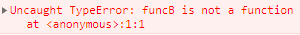

# 호이스팅(Hoisting)

> 변수 및 함수의 선언문이 스코프 내의 최상단으로 끌어올려진 것 같은 현상


## Var

아래의 코드를 실행시키면,

```javascript
console.log(word);

var word = "hello";

console.log(word);
```

다음과 같은 결과가 출력된다.

```
undefined
hello
```

`word`라는 변수가 선언되기 이전에 호출되었음에도 불구하고 에러가 나지 않는 기이한 현상을 볼 수 있는데, 이는 자바스크립트의 호이스팅때문에 발생되었다. *호이스팅은, 해당 변수가 선언문이 최상단에 이미 있는 것과 같이 작동하는 현상이다.*


❓**그렇다면 이러한 현상은 어떻게 일어나는 것일까**❓

이는 자바스크립트 엔진이 실행 컨텍스트에 변수를 저장하는 방식 때문인데 위의 코드를 예시로 살펴보자.

1. 자바스크립트 엔진은 해당 코드를 실행시키기 전,  `GEC`의 `Lexical Environment`와 `Variable Environtment`를 생성한다.

   >  Lexical Environment와 Variable Environment에는 `Environment Record`와 `outer 참조`가 생기게 되는데, 이때 **var 변수**는 Variable Environment에 `undefined`로 초기화된다.

2. 이후 해당 코드의 첫번째 줄인 `console.log(word)`가 실행되면 word 의 값을 현재 scope에서 찾게되는데 GEC의 variable environment에 선언되어 있기 때문에 해당 변수를 참조할 수 있게 된다.

3. 해당 값을 받아와 `undefined`를 출력한다.

4. 이후 word의 값을 `hello`로 저장하고 다시 `console.log(word)`가 실행되면, word의 값을 다시 variable environment에서 불러와 `hello`를 출력하게 된다.

이처럼 자바스크립트 엔진이 해당 코드를 실행하기 전 먼저 `execution context`를 만들기 때문에 해당 변수의 값을 참조할 수 있는 것이다.


## Const와 Let

❗그러나, **해당 변수가 `const`나 `let`으로 선언되었다면 상황은 달라진다**❗

```javascript
console.log(word);

const word = "hello";

console.log(word);
```

위의 코드을 실제로 실행시켜보면 


이러한 ReferenceError를 만날 수 있게 된다. 

❓**왜 `const`는 `var`와 동일하게 작동하지 않는 것일까**❓

그 답도 역시나 자바스크립트 엔진이 execution context에서 해당 변수를 찾는 과정을 살펴보면 확인할 수 있다.

1. 자바스크립트 엔진은 해당 코드를 실행시키기 전,  `GEC`의 `Lexical Environment`와 `Variable Environtment`를 생성한다.

   >  Lexical Environment와 Variable Environment에는 `Environment Record`와 `outer 참조`가 생기게 되는데, 이때 `const` 와 `let`은 Lexical Environment에 변수명을 넣어두긴 하지만 **초기화되지 않는다**.

2. 이후 해당 코드의 첫번째 줄인 `console.log(word)`가 실행되면 GEC의 variable environment에서 참조된 `word`값이 있는지 살펴보지만, 해당 값이 현재 초기화되어있지 않기 때문에 바로 `ReferenceError`를 보여준다.

`let`도 이와 동일하게 작동하기 때문에, **const와 let은 호이스팅이 되지 않는다**.


## 함수

❓**그렇다면 함수는 호이스팅이 될까**❓

▶️**함수 선언식** => 호이스팅 가능

```javascript
funcA();
function funcA() {
    console.log("hello")
};
```

함수 선언식의 경우, 해당 코드를 실행하기 전 자바스크립트 엔진이 `funcA`를 variable environment에 함수 자체를 저장해두기 때문에 실행되었을때 해당 함수를 불러올 수 있다.


▶️**함수 표현식** => 호이스팅 불가능

`var`로 함수를 작성한다면,

```javascript
funcB();
var funcB = function () {
    console.log("hello")
};
```



해당 코드를 실행하기 전 자바스크립트 엔진이 `funcB`를 variable environment에 `undefined`로 저장해두어서, 해당 함수를 실행할 수 없다. 그래서 `ReferenceError`가 아닌, `TypeError`가 발생한다.


`const`로 함수를 작성한다면

```javascript
funcC();
const funcC = function () {
    console.log("hello")
};
```


해당 코드를 실행하기전 자바스크립트 엔진이 lexical environment에 funcC의 변수명은 설정해두지만 해당 값은 초기화시키지 않기 때문에 해당 변수를 참조할 수 없어 `ReferenceError`가 발생한다.

