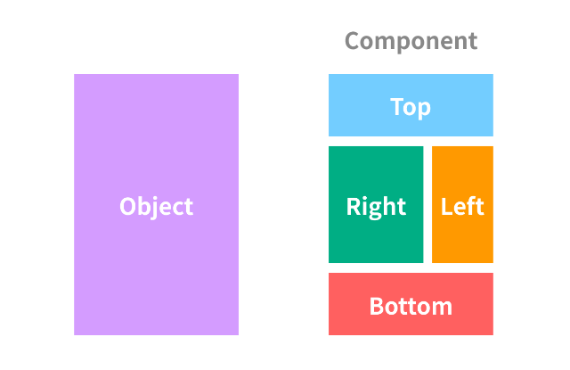
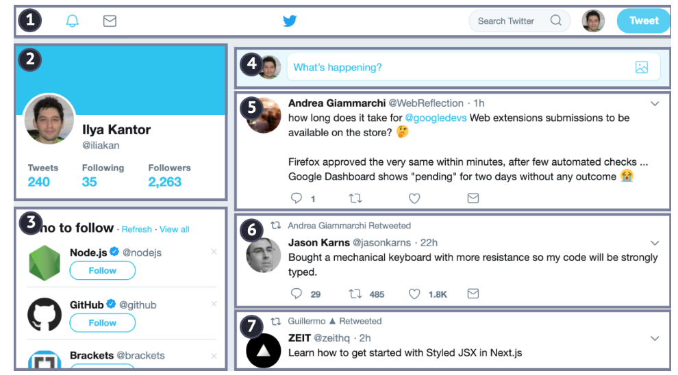
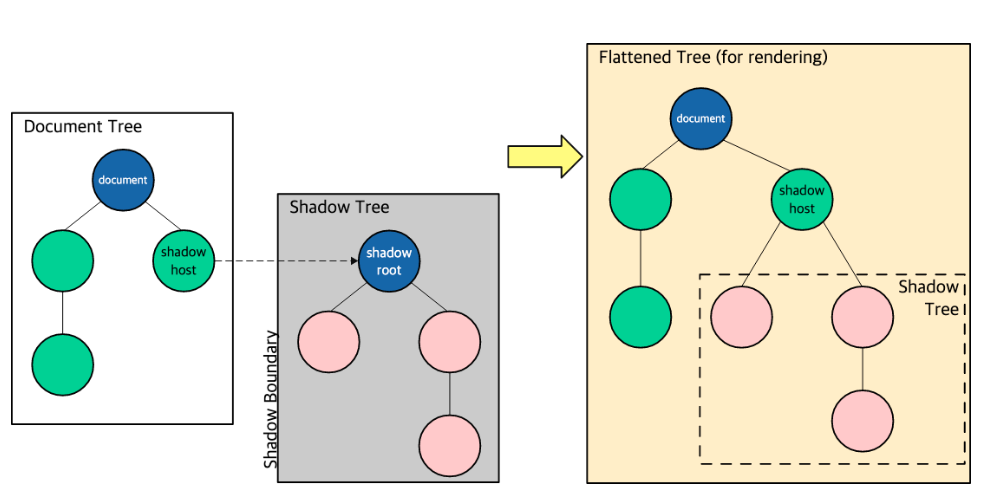

### 컴포넌트(Component)



✅ **컴포넌트(Component)** : 프로그래밍에 있어 재사용이 가능한 각각의 독립된 모듈




> 트위터는 다음과 같은 컴포넌트들로 구성되어 있다. 트위터라는 큰 어플리케이션을 이렇게 컴포넌트 단위로 나누어 개발한다면 개발 과정이 더 수월해진다.
>
> 1. 상단 네비게이션
> 2. 사용자 정보
> 3. 추천 팔로우
> 4. 글쓰기 양식
> 5. 메시지들(5~7)


***💡이런 관점에서 봤을 때 컴포넌트가 갖추어야 할 것들은?***

- 고유한 자바스크립트 클래스
- 외부코드가 접근할 수 없으며 해당 클래스에서만 관리되는 DOM 구조(`캡슐화` 원칙)
- 구성요소에 적용되는 CSS 스타일
- 다른 구성요소와 상호작용하기 위한 이벤트, 클래스, 메서드 등을 일컫는 API


✅ **웹 컴포넌트(Web Component)** :  캡슐화하여 재사용 가능한 커스텀 엘리먼트를 생성하고 웹 앱에서 활용할 수 있도록 해주는 다양한 기술들의 모음

웹 컴포넌트는 이러한 컴포넌트 기반 프로그래밍을 웹에서도 적용할 수 있도록 W3C에서 새로 정한 규격이다. 웹 표준을 기반으로 구축되었으며, 최신 브라우저 및 모든 JavaScript 라이브러리, 프레임워크에서도 사용할 수 있다.

***❓웹 컴포넌트를 사용하는 이유?***

- *관심사별로 컴포넌트를 관리하고 싶을 때*

  - 원래는 HTML/CSS/JavaScript 코드를 각각 따로 만들고 관리하지만, 거대한 애플리케이션을 만들 때 조그마한 기능별로 웹 컴포넌트를 분리하여 기능별 HTML/CSS/JavaScript를 작성, 관리할 수 있다.

- *Shadow DOM을 통한 다른 컴포넌트와 스타일 충돌을 피하고 싶을때*

  - Shadow DOM : 웹 컴포넌트의 캡슐화부분을 담당
  - 이를 통해 컴포넌트는 자체적인 공간(Shadow Tree)을 갖게 되어 페이지안의 다른 코드들로부터 분리하여 충돌을 피할 수 있다.

  

- *Vendor lock-in을 피하고 싶을때*

  - Vendor lock-in : 특정 기술에 크게 의존하여, 다른 시스템으로 갈아타기 어려운 상황
  - 현재 프론트엔드 개발은 React를 통한 개발이 주를 이루고 있는데, 언제든 새로운 기술에 의해 대체될 가능성이 높다. 그러한 순간이 온다면 현재 React로 작성된 코드를 다른 라이브러리 및 프레임워크로 마이그레이션하는 작업이 불가피하다.
  - 이러한 상황을 피하기 위해서 웹 컴포넌트로 작성하게 된다면 유연한 대처가 가능하다!


----


#### 리액트 컴포넌트 (React Component)

✅리액트로 만들어진 앱을 이루는 최소한의 단위

- **함수형 컴포넌트(Stateless Functional Component)**
  - 자바스크립트로 함수를 작성하는 컴포넌트
  - 리액트를 사용하면 주로 이용하게 되는 컴포넌트 단위

```javascript
import React from 'react';

function MyComponent(props) {
    
	return <div>Hello, {props.name}</div>;
}

export default MyComponent; //다른 JS파일에서 불러올 수 있도록 내보내주기
```

- **클래스형 컴포넌트(Class Component)**
  - 컴포넌트 구성 요소, 리액트 생명주기를 모두 포함하고 있다.
  - 프로퍼티, state, 생명주기 함수가 필요한 구조의 컴포넌트를 만들 때 사용한다.
  - 사실상 잘 사용되지 않는 컴포넌트 단위

```javascript
import React from 'react';

class MyComponent extends React.Component {
	constructor(props) { // 생성함수
		super(props);
	}
	
	componentDidMount() { // 상속받은 생명주기 함수
	}
	
	render() { // 상속받은 화면 출력 함수, 클래스형 컴포넌트는 render() 필수
		return <div>Hello, {this.props.name}</div>;
	}
}

export default MyComponent; //다른 JS파일에서 불러올 수 있도록 내보내주기
```


---


#### 뷰 컴포넌트 (Vue Component)

- **전역 컴포넌트**
  - 뷰 라이브러리를 로딩하고 나면 접근 가능한 Vue 변수를 이용하여 등록한다.
  - 특정 인스턴스에서만 유효범위를 가진다 = 특정 범위에서만 사용 가능하다.
  - 컴포넌트 이름 : template 속성에서 사용할 HTML 사용자 정의 태그 이름을 의미
  - 컴포넌트 내용 : 컴포넌트 태그가 실제 화면의 HTML 요소로 변환될 때 표시될 속성들을 작성. template, data, methods 등 인스턴스 옵션 속성을 정의할 수 있음

```javascript
Vue.component('컴포넌트 이름', {
	//컴포넌트 내용
    });
```

- **지역 컴포넌트**
  - 여러 인스턴스에서 공통으로 사용할 수 있다 = 뷰로 접근이 가능한 모든 범위 내에서 사용 가능하다.
  - 컴포넌트 이름 : 전역 컴포넌트와 마찬가지로 HTML에 등록할 사용자 정의 태그
  - 컴포넌트 내용 : 컴포넌트 태그가 실제 화면 요소로 변환될 때의 내용을 의미

```javascript
<body>
    <div id="app">
    <button>컴포넌트 등록</button>
    <my-local-component></my-local-component>
    </div>
    <script src="https://cdn.jsdelivr.net/npm/vue@2.5.2/dist/vue.js"></script>
    <script>
       var cmp ={
           //컴포넌트 내용
           template: '<div>지역 컴포넌트가 등록되었습니다.</div>'
       };

       new Vue({
           el: '#app',
           components: {
               'my-local-component' : cmp
           }
       });
    </script>
</body>
```


*❗지역 컴포넌트와 전역 컴포넌트의 차이*

전역 컴포넌트는 인스턴스를 새로 생성할 때마다 인스턴스에 components 속성으로 등록할 필요 없이 한 번 등록하면 어느 인스턴스에서든지 사용이 가능하지만, 지역 컴포넌트는 새 인스턴스를 생성할 때마다 등록해줘야 한다.

