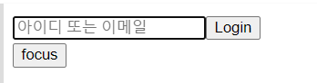
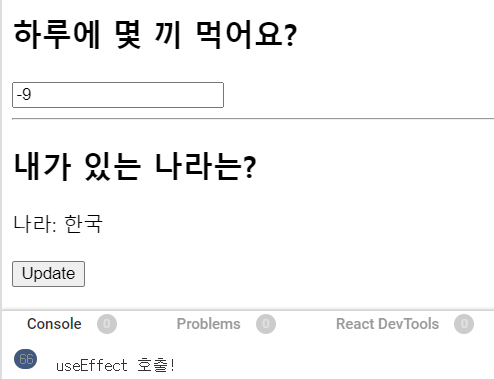

### React hooks

✅ 리액트 클래스형 컴포넌트에서 이용하던 코드를 작성할 필요 없이 함수형 컴포넌트에서 다양한 기능을 사용할 수 있게 만들어준 라이브러리


❗**hooks의 장점**

- 컴포넌트로부터 상태 관련 로직을 추상화할 수 있다
  - 이를 이용해 독립적인 재사용이 가능하다
  - 코드의 재사용은 가독성을 높이고 유지보수를 용이하게 한다
  - 이는 클래스형 컴포넌트의 단점을 보완한 특징이라고 볼 수 있다
- 생명주기 메서드를 기반으로 쪼개는 것보다는, 훅을 통해 작은 함수의 묶음으로 컴포넌트를 나누는 방법을 사용할 수 있다


❗**규칙**

- 최상위에서만 Hook을 호출해야 한다.
  - 반복문이나 조건문 혹은 중첩된 함수 내에서 Hook을 호출하면 안된다.
  - 리액트 훅은 호출되는 순서에 의존하기 때문에 조건문이나 반복문 안에서 실행하게 될 경우 해당 부분을 건너뛰는 일이 발생할 수도 있기 때문에 순서가 꼬여 버그가 발생할 수 있다.
  - 이 규칙을 따르면 useState나 useEffect가 여러번 호출되는 경우에도 형태를 올바르게 유지할 수 있게 된다.
- 리액트 함수 내에서만 Hook을 호출해야 한다.
  - Hook은 일반적인 js 함수에서는 호출하면 안된다.
  - 함수형 컴포넌트나 custom hook에서는 호출 가능하다.


---


#### 📌useState

- 함수형 컴포넌트 안에 state를 추가하여 사용한다.
- 현재 상태를 나타내는 state값과 이 상태를 변경하는 setState 값을 한 쌍으로 제공한다.
  - 여기서 state는 현재 상태, 두 번째 원소인 setState는 Setter 함수이다.
- state는 초기값을 설정할 수 있으며, 초기값은 첫 렌더링 때 한 번 사용된다.
- state는 객체일 필요 없이 문자열, 숫자, boolean, 배열, null, 객체 등의 여러가지 다양한 값을 넣을 수 있다.

```javascript
import React, { useState } from 'react';

const Test =() => {
    
    const [<상태 값 저장 변수>, <상태 값 갱신 함수>] = useState(<상태 초기 값>);
    
    const [count, setCount] = useState(0);
    return (
        <>
        	<button onClick={()=>setCount(count+1)}>Click me</button>    
        </>)
}
```

```javascript
import React, { useState } from 'react';

const Test =() => {
    const [count, setCount] = useState(0);
    const clickCount = () => {
        setCount(count+1)
    }
    return (
        <>
        	<button onClick={clickCount}>Click me</button>    
        </>)
}
```


---


#### 📌 useEffect

✅ useEffect는 기존 클래스형 컴포넌트에서 사용했던 `componentDidMount` , `componentDidUpdate` , `componentWillUnmount` 를 하나의 API로 통합한 것으로 다음과 같은 특징을 가진다.

- `useEffect` 는 기본적으로 `useEffect(function, deps)` 의 형태를 사용한다.
- function에는 실행시킬 함수를 넣고 deps에는 의존성 배열을 담는다.
- 의존성 배열에 어떤 것이 담기느냐에 따라 부수적인 효과 함수가 실행된다.
- 가장 먼저 의존성 배열 없이 `useEffect` 를 실행시키게 되면 페이지가 렌더링될 때마다 데이터를 불러온다.

```javascript
import React, { useState } from 'react';

const Test =() => {
    useEffect(()=> {
        console.log('마운트 될 때만 실행된다')
    },[])
}

export default Test;
```

> 1. Component가 mount 됐을 때(처음 나타났을 때)
>
> 컴포넌트가 화면에 가장 처음 렌더링 될 때 한 번만 실행하고 싶을 때는 deps 위치에 빈 배열을 넣는다.
>
> 만약 배열을 생략한다면 리렌더링될 때마다 실행된다.


```javascript
import React, { useState } from 'react';

const Test =() => {
    const [count, setCount] = useState(0);
    
    useEffect(()=> {
        console.log('count 값이 변경되고 있다!')
        console.log('deps 안에 있는 count 값이 변경될 때만 이 console.log가 나오도록 수행해줘')
    },[count])
    
    return (
        <>
        	<button onClick={()=>setCount(count+1)}>Click me</button>    
        </>)
}
```

> 2. Component가 update될 때(특정 props, state가 바뀔 때)
>
> 특정값이 업데이트될 때 실행하고 싶을 때는 deps위치의 배열 안에 검사하고 싶은 값을 넣는다.


----


#### 📌 useRef

useRef는 저장공간 또는 DOM 요소에 접근하기 위해 사용되는 React Hook이다. 여기서 Ref는 reference, 즉 참조를 의미한다.

**1) 변수를 관리할 때**

```javascript
function App() {
  const [count, setCount] = useState(1);
  const [renderingCount, setRedneringCount] = useState(1);
 
  useEffect(() => {
    console.log("rendering Count : ", renderingCount);
    setRedneringCount(renderingCount + 1);
  });

  return (
    <div>
      <div>Count : {count}</div>
      <button onClick={() => setCount(count + 1)}> count up </button>
    </div>
  );
}
```

> 위와 같이 코드를 작성하게 되면 useEffect 안에 있는 setRenderingCount()가 계속해서 컴포넌트를 리렌더링해서 무한 루프에 빠지게 된다.

```javascript
function App() {
  const [count, setCount] = useState(1);
  const renderingCount = useRef(1);

  useEffect(() => {
    console.log("renderingCount : ", renderingCount.current);
    ++renderingCount.current;
  });

  return (
    <div>
      <div>Count : {count}</div>
      <button onClick={() => setCount(count + 1)}> count up </button>
    </div>
  );
}
```

> useRef를 사용해서 리렌더링없이 state를 관리할 수 있다.

실험 코드 : https://youngble.tistory.com/178


**2) DOM 요소 선택할 때**

useRef는 특정 DOM에 접근하여 DOM 조작을 가능하게 하는 훅이다. 리액트 프로젝트에서도 특정 요소를 선택해야 하는 상황이 생길 수 있는데 이러한 상황에서 useRef 함수를 사용할 수 있게 된다. 예시는 다음과 같다.

- 특정 엘리먼트의 크기를 가져와야 하는 상황

- 스크롤바 위치를 가져오거나 설정하는 상황

- 포커스를 설정해줘야 하는 상황

- Video.js, JWPlayer 같은 HTML5 Video 관련 라이브러리, D3, chart.js 같은 그래프 관련 라이브러리 등의 외부 라이브러리를 사용할 때도 특정 DOM에다 적용하게 되는 상황

  

```javascript
import { useRef, useEffect } from "react";
import "./styles.css";

function App() {
  const inputRef = useRef();

  function focus() {
    inputRef.current.focus();
    console.log(inputRef.current);
  }

  return (
    <div>
      <input ref={inputRef} type="text" placeholder="아이디 또는 이메일" />
      <button>Login</button>
      <br />
      <button onClick={focus}>focus</button>
    </div>
  );
}

export default App;
```

> 위와 같이 코드를 작성하면 useRef가 적용된 DOM 요소에 focus된 효과를 확인할 수 있다.


---


#### 📌 useMemo

useMemo는 컴포넌트의 성능을 최적화시킬 수 있는 hooks 중 하나이다. Memo는 Memoization을 뜻하며, 이는 기존에 수행한 연산의 결괏값을 어딘가에 저장해 두고 동일한 입력이 들어오면 재활용하는 프로그래밍 기법을 의미한다.



```javascript
import { useMemo, useEffect, useState } from "react";

function App() {
  const [number, setNumber] = useState(1);
    
  const [isKorea, setIsKorea] = useState(true);

  // 1번 location
  const location = {
    country: isKorea ? "한국" : "일본"
  };

  // 2번 location
  // const location = useMemo(() => {
  //   return {
  //     country: isKorea ? '한국' : '일본'
  //   }
  // }, [isKorea])

  useEffect(() => {
    console.log("useEffect 호출!");
  }, [location]);

  return (
    <header className="App-header">
      
      <h2>하루에 몇 끼 먹어요?</h2>
      <input
        type="number"
        value={number}
        onChange={(e) => setNumber(e.target.value)}
      />
      <hr />
          
      <h2>내가 있는 나라는?</h2>
      <p>나라: {location.country}</p>
      <button onClick={() => setIsKorea(!isKorea)}>Update</button>

    </header>
  );
}

export default App;

```

- 1번 useMemo를 사용하지 않았을 때
  - "하루에 몇 끼 먹어요?"의 숫자를 바꿀 때도 useEffect가 호출된다
- 2번 useMemo를 사용했을 때
  - location 값이 바뀔 때만 useEffect가 호출된다

`useEffect`의 의존성 배열(deps)에 location을 넣었는데 number state가 변경돼도 useEffect가 실행되는 이상한 현상이 발생한다(1번의 경우). 그 이유는 JavaScript에서 객체는 원시 타입과는 다르게 값이 저장될 때 주소 값으로 저장되기 때문이다. 그렇기 때문에 리액트에선 number state가 바뀌면 App 컴포넌트가 재호출되면서 location의 주소값이 변경이 되었기 때문에 location이 변경이 되었다고 인식해서 `useEffect`가 호출되는 것! 

=> 그래서 `useMemo`를 통해 기존에 사용된 location 값이 다시 수행되지 않도록 하는 것이다.


----


#### 📌 useCallback

앞선 `useMemo`는 메모이제이션된 값을 반환해서 참 직관적이었는데, 이 `useCallback`은 메모이제이션된 함수를 반환한다는 특징을 가지고 있다.

`useCallback`은 다음과 같은 상황에서 사용한다.


***1) 자식 컴포넌트에 props로 함수를 전달할 경우***

💡먼저, 함수는 값이 아닌 참조로 비교된다!는 점을 알고 있어야 한다.

```javascript
const functionOne = function() {
  return 5;
};
const functionTwo = function() {
  return 5;
};
// 서로의 참조가 다르기 때문에 false
console.log(functionOne === functionTwo);
```

>  이처럼 동일한 값을 반환하지만 참조가 다르기 때문에 각각의 함수는 고유한 함수라고 볼 수 있다.

이러한 고유 함수가 생성될 경우, 부모를 통해 props에 함수를 전달받는 자식 컴포넌트에서는 props가 변경되었다고 판단해 리렌더링이 발생하게 된다.

```javascript
function App() {
  const [name, setName] = useState('');
  const onSave = () => {};

  return (
    <div className="App">
      <input
        type="text"
        value={name}
        onChange={(e) => setName(e.target.value)}
      />
      <Profile onSave={onSave} />
    </div>
  );
}
```

> `useCallback`을 사용하지 않을 경우, name이 변경되어 리렌더링이 발생하면 onSave 함수가 새로 만들어지고 이 함수는 Profile 컴포넌트에 props로 전달될 시 계속해서 새로 전달된다. 이때 Profile 컴포넌트에서 useMemo를 사용해도 참조가 다른 함수로 전달받기 때문에 리렌더링을 피할 수 없게 된다. = 부모 컴포넌트만 수정하려고 했지만 하위 컴포넌트들 모두 렌더링이 일어나게 되는 것!

```javascript
import React, { useCallback, useState } from 'react';
import Profile from './Profile';


function App() {
  const [name, setName] = useState('');
  const onSave = useCallback(() => {
    console.log(name);
  }, [name]);

  return (
    <div className="App">
      <input
        type="text"
        value={name}
        onChange={(e) => setName(e.target.value)}
      />
      <Profile onSave={onSave} />
    </div>
  );
}
```

> 이와 같이 `useCallback`을 사용해서 onSave라는 함수를 재사용하는 것으로 자식 컴포넌트의 리렌더링을 방지할 수 있다!


***2) 외부에서 값을 가져오는 api를 호출하는 경우***

```javascript
import React, { useState, useEffect } from "react";

function Profile({ userId }) {
  const [user, setUser] = useState(null);

  const fetchUser = () =>
    fetch(`https://your-api.com/users/${userId}`)
      .then((response) => response.json())
      .then(({ user }) => user);

  useEffect(() => {
    fetchUser().then((user) => setUser(user));
  }, [fetchUser]);

  // ...
}
```

> 위의 코드 경우 fetchUser 함수가 변경될 때만 외부에서 api를 가져와 `useEffect` 가 실행된다. Profile이라는 컴포넌트가 리렌더링이 발생할 경우 fetchUser 함수에는 새로운 함수가 할당된다. 그러면 `useEffect`가 호출되어 user 상태값이 바뀌고, state가 바뀌었기 때문에 다시 리렌더링이 발생 => 무한루프에 빠진다!

```javascript
import React, { useState, useEffect } from "react";

function Profile({ userId }) {
  const [user, setUser] = useState(null);

  const fetchUser = useCallback(
    () =>
      fetch(`https://your-api.com/users/${userId}`)
        .then((response) => response.json())
        .then(({ user }) => user),
    [userId]
  );

  useEffect(() => {
    fetchUser().then((user) => setUser(user));
  }, [fetchUser]);

  // ...
}
```

> api의 옵션으로 사용되는 userID가 변동될 때만 fetchUser에 새로운 함수가 할당되도록 설정하고, 그것이 아니면 동일한 함수가 실행되게 돼서 무한 루프에 빠지지 않도록 할 수 있다!

