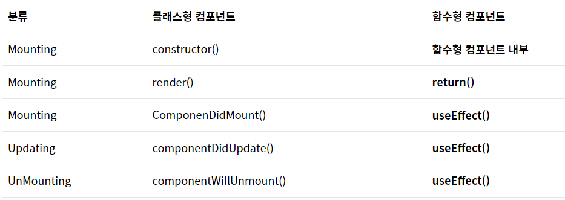
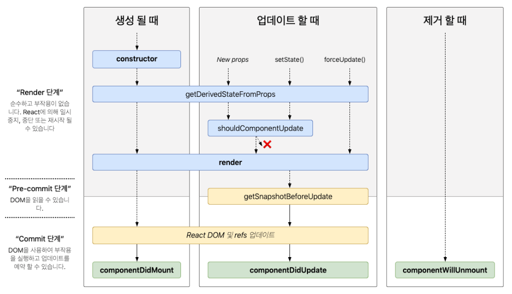

### React lifecycle (리액트 생명주기)

💡**생명주기 메서드** : 컴포넌트가 브라우저상에 나타나고, 업데이트되고, 사라지게 될 때 호출되는 메서드. 리액트에서는 클래스형 컴포넌트에서만 사용할 수 있었고, 함수형 컴포넌트에는 생명주기 메서드가 따로 존재하지 않기 때문에 React hooks를 사용하여 생명주기 메서드와 비슷하게 동작하도록 구현한다.





---


##### 클래스형 컴포넌트 라이프사이클



**Mount(생성)**

- `constructor` : 컴포넌트가 만들어지면 가장 먼저 실행되는 메서드
- `getDerivedStateFromProps` : props로 받아온 것을 state에 넣을 때 사용하는 메서드이며, 컴포넌트가 처음 렌더링 되기 전에 호출되며 리렌더링 되기 전에도 항상 실행된다.
- `render` : 컴포넌트를 렌더링 하는 메서드
- ✔️`componentDidMount` : 컴포넌트의 첫 렌더링을 마친 후 호출되는 메서드이며, 이 메서드가 호출되는 시점에선 이미 컴포넌트가 화면에 출력된 상태이다. 이 단계에선 axios, fetch 등을 사용해 해당 컴포넌트에서 필요하는 데이터를 요청하는 등의 작업을 진행한다.

**Update(갱신)**

- `getDerivedStateFromProps` : 마운트 단계와 동일하며, 컴포넌트의 props나 state가 변경됐을 때도 호출되는 메서드
- `shouldComponentUpdate` : 컴포넌트의 리렌더링 여부를 결정하는 메서드로, React.memo와 역할이 비슷하다.
- `render` : 컴포넌트를 렌더링 하는 메서드
- `getSnapshotBeforeUpdate` : render에서 만들어진 결과가 브라우저에 실제 반영되기 직전에 호출되는 메서드. 컴포넌트에 변화가 일어나기 직전의 DOM 상태를 가져와서 특정 값을 반환하면 그 다음 발생하게 되는 componentDidUpdate 메서드에서 받아와 사용을 할 수 있다. 하나의 예시로 페이지에 새로운 내용이 추가됐을 때 사용자의 스크롤 위치를 새로운 내용이 아닌 기존 위치로 유지하기 위해 사용할 수 있다. 참고로 함수형 컴포넌트 개발 시 훅을 사용하여 getSnapshotBeforeUpdate 메소드를 대체할 수 없다. 
- ✔️`componentDidUpdate` : 리렌더링을 마친 후 브라우저에 모든 변화가 나타난 후 호출되는 메서드. 세 번째 파라미터로 `getSnapshotBeforeUpdate`에서 반환한 값을 불러올 수 있다. `componentDidMount`와 같이 render 메소드가 수행되고 브라우저에 HTML 형태로 렌더링된 시점 이후에 동작하는 점은 같고, state나 props가 업데이트 되었을 때만수행된다는 점에서 차이점이 있다.

**Unmount(제거)**

- ✔️`componentWillUnmount` : 컴포넌트가 브라우저에서 사라지기 직전에 호출되는 메서드. 주로 DOM에 직접 등록했던 이벤트를 제거하는 등의 작업을 한다.


----


**함수형 컴포넌트 라이프사이클**

**Mounting(생성)** 

- `return()` : 미리 구현한 HTML를 화면상에 보여주는 메서드
  - 해당 메서드 안에서는 부모 컴포넌트로 전달받는 props 값의 접근이 가능하다.
  - constructor()에서 정의한 state 값의 접근이 가능하다.
  - 해당 공간에서 setState()를 사용할 순 없다.

- `useEffect()` : 컴포넌트 내에서 렌더링이 수행된 이후에 실행이 되는 메서드
  - deps 파라미터를 빈 배열로 수행하면 렌더링이 수행된 이후 최초 한번 수행이 된다.

```javascript
import React, { useEffect, useState } from "react";
import { LifecycleType } from "./LifecycleType";

/**
 * 함수형 컴포넌트 예시 
 */
const LifecycleFunctionComponent: React.FC = (props: any) => {

    /**
     * 1. 컴포넌트 호출 시 가장 먼저 호출이 되는 공간
     * 컴포넌트에서 사용 될 state나 함수들을 정의 하는 공간입니다.
     */
    console.log("해당 부분이 제일 먼저 호출이 됩니다.");

    const [userInfo, setUserInfo] = useState<LifecycleType>({
        userId: 'adjh54',
        userAge: 50,
        isShowTempComponent: false,
    });

    /**
     * 3. 컴포넌트 내에서 렌더링이 수행된 이후에 실행이 되는 메서드이다.
     * @returns {void}
     */
    useEffect(() => {
        console.log("화면이 렌더링 된 이후에 바로 수행이 됨: componentDidMount()과 동일");
    }, []);

    /**
     * 2. 미리 구현한 HTML(JSX)를 화면상에 보여주는 메서드이다.
     */
    return (
        <>
            {console.log("Renering ...")}
            <div>

                <h1>Main Function Component 입니다.</h1>
                <div>{userInfo.userAge}</div>
            </div>
        </>
    );
};
export default LifecycleFunctionComponent;
```


**Updating(업데이트)**

-  `useEffect()` : 컴포넌트 내에서 변화가 발생하였을 때 실행되는 메서드
  - 변화 : 부모 컴포넌트로부터 전달받은 props 값의 변화가 발생하거나 부모 컴포넌트가 리 렌더링이 발생을 하는 경우 수행
  - 해당 컴포넌트 내에서 state의 값이 변하는 경우 수행

```javascript
import React, { useEffect, useState } from "react";
import { LifecycleType } from "./LifecycleType";

/**
 * 함수형 컴포넌트 예시 
 */
const LifecycleFunctionComponent: React.FC = (props: any) => {

    /**
     * 컴포넌트 호출 시 가장 먼저 호출이 되는 공간
     * 컴포넌트에서 사용 될 state나 함수들을 정의 하는 공간입니다.
     */
    console.log("해당 부분이 제일 먼저 호출이 됩니다.");

    const [userInfo, setUserInfo] = useState<LifecycleType>({
        userId: 'adjh54',
        userAge: 50,
        isShowTempComponent: false,
    });

    /**
     * 컴포넌트 내에서 변화가 발생하였을 경우에 실행되는 메서드이다.
     */
    useEffect(() => {
        console.log("전달 받은 props의 값에 변화가 생겼을 경우 / 사용자 나이의 변화가 발생하였을 경우 수행이 된다. : componentDidUpdate()와 동일");
    }, [props.appState, userInfo.userAge]);

    /**
     * 미리 구현한 HTML(JSX)를 화면상에 보여주는 메서드이다.
     */
    return (
        <>
            {console.log("Renering ...")}
            <div>

                <h1>Main Function Component 입니다.</h1>
                <div>{userInfo.userAge}</div>
            </div>
        </>
    );

};
export default LifecycleFunctionComponent;
```


**Unmounting(제거)**

- `useEffect()` : 컴포넌트 내에서 DOM을 제거할 때에 실행이 되는 메서드
  - 컴포넌트의 DOM이 제거될 때 수행이 된다. 
  - ex) A라는 컴포넌트 내에서 B라는 컴포넌트를 부르고 있을 전제라고 할 때, B 컴포넌트를 조건부에 따라서 소멸을 시킬 경우 해당 라이프사이클 메서드가 수행이 된다.

```javascript
import React, { useEffect, useState } from "react";
import { LifecycleType } from "../../type/lifecycle/LifecycleType";

/**
 * 함수형 컴포넌트 예시 
 */
const LifeCycleFunctionComponent: React.FC = (props: any) => {

    const [isShowTempComp, setIsSHowTempComp] = useState<boolean>(true);

    /**
     * 컴포넌트 호출 시 가장 먼저 호출이 되는 공간
     * 컴포넌트에서 사용 될 state나 함수들을 정의 하는 공간입니다.
     */
    console.log("해당 부분이 제일 먼저 호출이 됩니다.");

    const [userInfo, setUserInfo] = useState<LifecycleType>({
        userId: 'adjh54',
        userAge: 50,
        isShowTempComponent: false,
    });

    /**
     * 임시 컴포넌트 Unmount
     */
    const fn_unmountCompoent = () => {
        setIsSHowTempComp(!isShowTempComp);
    }

    /**
     * 미리 구현한 HTML(JSX)를 화면상에 보여주는 메서드이다.
     */
    return (
        <>
            {console.log("Renering ...")}
            <div>
                <h1>Main Function Component 입니다.</h1>
                <button onClick={fn_unmountCompoent}>컴포넌트 제거</button>
                {
                    isShowTempComp && (
                        <LifeCycleUnmountComponent />
                    )
                }
            </div>
        </>
    );
};
export default LifeCycleFunctionComponent;

const LifeCycleUnmountComponent = () => {

    useEffect(() => {
        return () => {
            console.log("LifeCycleUnmountComponent가 Unmount 되었습니다.")
        }
    }, []);

    return (
        <div>
            <h1> Unmount Component</h1>
        </div>
    )

}
```

