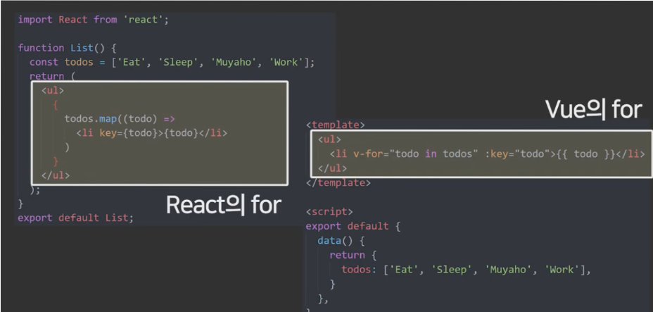

### React vs Vue

#### ✅ UI 라이브러리 VS 프레임워크

**React** :  SPA(Single Page Application)에서 사용자 인터페이스를 만들기 위해 사용되는 `JavaScript 라이브러리`

- 라이브러리의 일부분만 가져와서 사용하는게 편리하다.

- 라이브러리이기 때문에 전역 상태 관리, 라우팅, 빌드 시스템 등을 지원하지 않는다.
- 별도의 라이브러리를 통해 Redux, Recoil, React-router-dom 등을 사용해야 한다.

**Vue** : `JavaScript 프레임워크`

- 부분적인 사용이 불가능하고, 프레임워크가 지원해주는 문법에 따라 작성해주어야 한다.
- 라이브러리와 달리 더 많은 기능을 디폴트로 사용할 수 있다.

#### ✅코드 형태의 차이

**React** : JSX(JavaScript XML) 형태로 코드를 작성하여 JavaScript 문법을 응용하기 때문에 JavaScript만으로 UI 로직과 DOM을 구현할 수 있다.

**Vue** : HTML, JS, CSS 코드 영역을 분리하여 작성한다.

- < template > : HTML 코드 작성
- < script > : JS 코드 작성
- < style > : CSS 코드 작성

*❗패턴 차이로 인한 호불호가 나뉘지만, Vue에서 작성하는 코드가 가시성 및 생산성이 좋다는 평이 많다.*

- React의 경우 함수를 통해 if문 조건을 작성하고 return문으로 표현을 하거나, 삼항연산자를 통해 조건 코드를 작성할 수 있다.
- Vue의 경우 태그 안에 바로 if문 조건 작성이 가능하다. 단, 보이고 안보이고를 제어할 수 있는 방법은 v-if 단 한 가지 방법밖에 없다.

- React는 for 문을 돌기 위해 map, forEach, for in, for of 등 많은 반복문을 사용한다.
- Vue는 HTML문에 v-for를 작성해 바로 for문을 돌아준다.

#### ✅ 컴포넌트 분리와 재사용

💡컴포넌트(Component) : JavaScript와 유사한, UI를 이루는 작은 단위

**React** : 파일별로 컴포넌트를 분리할 수 있으며, 새로운 함수형 컴포넌트를 생산하고 props 형태로 전달하거나 또는 다른 곳에서 재사용하는 것이 매우 용이하다.

**Vue** : 새로운 컴포넌트를 만들어 분리하기 위해서 새로운 파일을 하나 더 만들고, 그에 맞는 template, script, style을 모두 작성해주어야 한다.

*❗컴포넌트를 사용자가 원하는대로 작성하고 분리가 가능하다는 점에서 React가 더 자유롭게 개발할 수 있다는 평이 있다.*

#### ✅ 사용 진입 장벽

❗리액트의 진입 장벽이 더 높다. 달리 말하면 뷰가 리액트에 비해 러닝 커브가 낮다.

- Redux, Recoil 등의 상태 관리 트렌드의 변화를 알아야 한다.
- Redux의 경우 수 많은 미들웨어에 대해 알고 있어야 한다.

Vue의 경우 이러한 React의 어려움을 보고 만들어졌기 때문에 해당 기능들에 대한 구축 및 개발을 빌트인에 가까운 수준으로 설명하고 사용할 수 있다.

#### ✅ 데이터 바인딩의 방향

💡`데이터 바인딩` : 화면에 보이는 데이터와 브라우저 메모리에 있는 데이터를 일치시키는 방법

- **단방향 데이터 바인딩**
  - 데이터가 단방향(부모 -> 자식)으로 흐른다.
  - 추적과 디버깅이 쉽다.
  - 사용자의 입력으로 인해 데이터가 변경되더라도 바로 화면에 업데이트되지 않는다. 따라서 데이터의 변경을 감지하는 코드와 화면을 업데이트하는 코드를 따로 작성해주어야 한다.

- **양방향 데이터 바인딩**
  - 데이터가 양방향(부모<->자식)으로 흐른다.
  - 사용자가 입력하는 대로 화면에 반영된다.
  - 코드량이 줄어들기 때문에 웹 애플리케이션의 복잡도가 높아질수록 코드 관리에 도움을 준다는 장점이 부각된다.
  - 데이터 변화에 따라 DOM 객체 전체를 렌더링해주거나 데이터를 바꿔주므로, 성능 저하의 우려가 있다.

**React** : 단방향 데이터 바인딩을 사용한다.

**Vue** : 단방향, 양방향 데이터 바인딩을 모두 사용한다.

#### ✅ 타입스크립트 지원

💡타입스크립트 : 자바스크립트의 슈퍼셋인 오픈소스 프로그래밍 언어. Type을 추가함으로써 코드가 올바르게 작동하는지 확인할 수 있는 코드 방식.

**React** : 큰 보일러플레이트 없이도 SFC(Stateless Functional Component)와 클래스 기반 컴포넌트 둘 모두의 타입을 정확하게 기술할 수 있고, redux를 비롯한 툴도 대부분 훌륭한 타입스크립트 지원을 제공한다.

- 보일러플레이트 : 변화없이 여러 군데에서 반복되는 코드

**Vue** : 2.5 버전 업데이트 당시 타입스크립트 지원의 큰 개선을 홍보했지만 아직까지 많이 미흡하다. 

#### ✅ 속도 차이

아주 미세한 차이지만 실제로 Vue가 React에 비해 조금 더 빠르다. 그런 의미에서 속도 이슈에 민감한 코인 거래 사이트에서 Vue를 사용하는 경우가 있다고 한다.