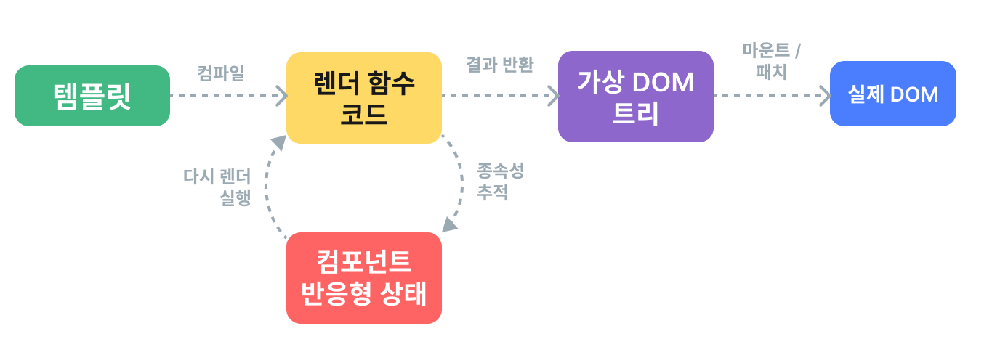

# 렌더링 메커니즘

## 용어 정리

> 💡**Virtual Dom**
>
> UI의 이상적인 또는 "가상" 표현을 메모리에 저장하고, "실제" DOM과 동기화하는 프로그래밍 개념

> 💡**Mount**
>
> 런타임 렌더러가 가상 DOM 트리를 탐색하고, 이 트리에서 실제 DOM 트리를 구성하는 과정

> 💡**Patch** || **Diffing** || **Reconciliation**
>
> 가상 DOM 트리의 복사본이 두 개 있는 경우, 렌더러가 두 트리를 살펴보고 비교하여 차이점을 파악하고 이러한 변경 사항을 실제 DOM 트리에 적용하는 과정

## 렌더 파이프라인

*Vue 컴포넌트*가 *마운트되기까지*의 과정을 살펴보자.

*Vue 템플릿*이 *렌더 함수*<small>가상 DOM 트리를 반환하는 함수</small>로 ✅**컴파일**된다. 이렇게 컴파일된 렌더 함수 코드는 빌드 과정을 통해 미리 실행하거나 런타임 컴파일러를 사용하여 즉석에서 실행할 수 있다. 

이후, *1)런타임 렌더러는 렌더 함수를 호출*하고, *2)반환된 가상 DOM 트리를 탐색*하고, *3)실제 DOM 노드를 생성*하는 과정을 거치게 되는데 이를 ✅**마운트**라고 한다. 이 단계에서는 반응 이펙트가 실행되므로 사용된 *❗모든 반응형 의존성을 추적한다*.

마운트 중에 사용된 *의존성이 변경*되면 이팩트가 다시 실행된다. 이를 바탕으로 *업데이트된 새로운 가상 DOM 트리가 생성*된다. 런타임 렌더러는 *새 트리를 탐색하고 이전 트리와 비교해서 업데이트를 실제 DOM에 적용*하는데 이를 ✅**패치**라고 한다.

> 🙋**Summary**
>
> 1) 템플릿을 `compile` 해서 렌더 함수로 만들고, 이 렌더 함수를 통해 가상 DOM 트리를 만든다. 
> 2) 이렇게 만들어진 가상 DOM 트리를 실제 DOM 트리로 `Mount`한다. 
> 3) 마운트 중에는 모든 반응형 의존성을 추척하게 되는데, 변경사항이 있을 경우 다시 렌더 함수를 실행해 새로운 가상 DOM 트리를 생성하고 이전의 가상 DOM 트리와 비교해 변경된 사항을 실제 DOM 트리에 `patch` 시킨다.