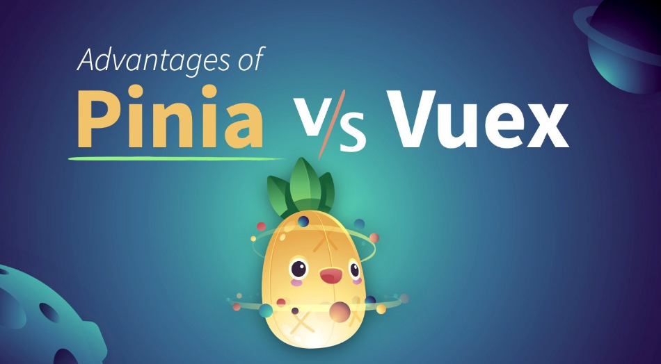
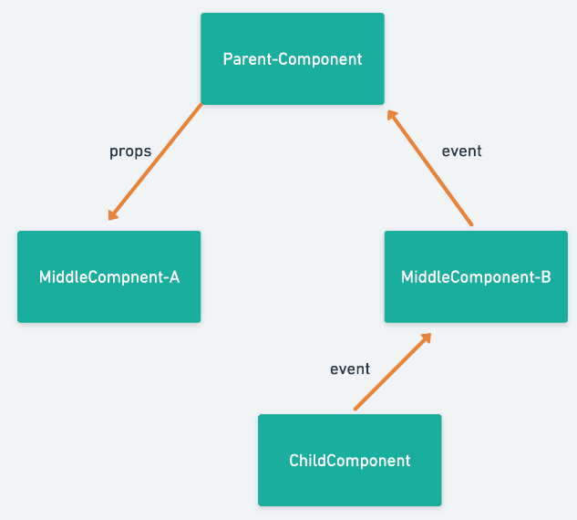
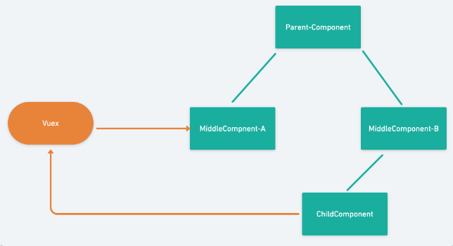
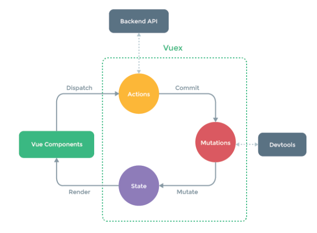

### Vuex vs Pinia



> 참 귀여운 UI 디자인인거 같다..


---


#### Vuex

✅ Vue.js 애플리케이션에 대한 상태 관리 패턴 + 라이브러리. 애플리케이션의 모든 컴포넌트에 대한 중앙 집중식 저장소 역할을 하며 예측 가능한 방식으로 상태를 변경할 수 있다.



>  ❗기본적으로 Vue 생태계에서 컴포넌트 간 여러 정보들을 관리하려면 부모-자식 관계로 데이터들을 넘겨주고 받아야 한다. 하지만 현실적으로 복잡한 컴포넌트 관계속에서 계속 주고 받으려면 여러 컴포넌트 파일에서 data 속성을 관리해주어야 하는 단점이 있다.



> 하지만 Vuex를 사용하게 된다면 위와 같이 더욱 단순하게 작업할 수 있다. Store이라는 일종의 중앙 저장소에서 관리할 수 있게 되기 때문!




> component가 actions를 통해 비동기 작업(서버에서 데이터를 가져오는 작업 등)을 호출하고 mutations을 호출해 state의 변수들을 조작해주고 이것이 component에 적용되게 하는 과정

정리하자면, Vuex는 ***Component -> 비동기 호출(Actions) -> 데이터 조작(Mutations) -> 데이터 저장(State)*** 과정을 가진다.

Vuex를 사용하려면 store 인스턴스를 구성해야 하는데 `state`, `getters`, `mutations`, `actions` 총 4개의 속성으로 구성되어 있다. 각각의 역할이 다르며 여러 컴포넌트에서  사용할 상태 값을 정의하고`(state)` 서버로부터 api 통신을 통해 비동기적으로 받아오거나`(actions)`, 필요에 따라 상태 값들을 변경하고(`mutations`), 필요한 컴포넌트에게 실시간으로 전달해주는(`getters`) 역할을 한다.

**📌 State** : 컴포넌트 간 공유하는 데이터들을 관리하는 역할

```javascript
state: {
    message: 'hello vuex!';
}
```

```javascript
// 정의된 상태 값이 필요한 컴포넌트

<template>
    <h2>{{this.$store.state.message}}</h2>
</template>
```

> state에 'hello vuex'라는 값을 저장하고, 자식 컴포넌트에서 이를 사용할 때 store.state로 꺼내준다.


**📌getters** : 연산된 `state`에 접근해 데이터를 조작하는 역할(일종의 computed 역할)

```javascript
state: {
        counter: 0
    },
    // getCounter 라는 getters를 추가
    getters: {
        getCounter: function(state) {
            return state.counter;
        }
    }
```

> state에 저장된 hitCount라는 값에 접근하여 조작해준다.


**📌mutations** : `state` 값을 변경하는 역할(일종의 methods 역할)

```javascript
state : {
    todoList : []
},

mutations : {
    setBoardList: function(state, item) {
        return state.todoList.push(item);
    },
}
```

> state에 저장된 빈 리스트에 접근하여 아이템을 추가해준다.

```javascript
this.$states.commit('setBoardList', {
    id: 1,
    task: '공부하기'
});
```

> `commit` 메서드로 호출할 수도 있다(첫 인자에 해당 메서드 이름을 넘기고, 두 번째 인자에 데이터를 넘겨준다).


**📌actions** : 비동기 처리를 담당. 여러 컴포넌트에서 `mutations`로 비동기 이벤트가 일어나면 수행 시간 차이로 `state`가 변경될 경우 추적이 어렵기 때문에 `actions`에 비동기 로직들을 선언하면 된다.

- ex) api 요청, ES6 Async 함수(Promise), setTimeout() 등

```javascript
state : {
    menuList : []
},

mutations : {
    //state 데이터에 삽입
    setMenuList: function(state, list) {
        return state.menuList = list;
    }
},

actions : {
    //api 요청
    requestMenuList: function(state) {
        axios.get('/category/list').then(function (response) {
            state.commit('setMenuList', response.data.items);
        });
    }
}
```

```javascript
//vue-component
created() {
    this.$store.dispatch('requestMenuList');
}
```

> `commit` 메서드로 mutation 속성내의 메서드에 접근할 수 있으며, 컴포넌트에서 호출할 때는 `dispatch` 메서드로 접근한다.


----


### Pinia

✅ Composition API를 기반으로 동작하는 상태 관리자. 일반적으로 Vue3와 Composition API 환경에서 사용하기 용이하며, 사실상 Pinia와 Vuex 5.x는 완전 동일한 프로젝트로 생각하면 된다.

```javascript
// stores/counter.js
import { defineStore } from "pinia";

export const useCounterStore = defineStore("counter", {
  state: () => ({ count: 0 }),
  actions: {
    increment() {
      this.count++;
    }
  },
  getters: {
    doubleCount(state) {
      return state.count * 2;
    }
  }
});
```

> 코드 생김새가 Vuex와 비슷해보이지만 차이점은...???

❗`mutations` 이 없다! 더 이상 `mutations` 선언 필요 없이 `actions`에서 값 변화를 줄 수 있다.


**Pinia가 Vuex보다 더 나은 선택이라고 볼 수 있는 이유**

1. **Pinia는 Vuex보다 간단한 API를 가진다**
   - Vuex에서 매번 매번 상태 변경 시에 작성해야 했던 많은 보일러플레이트 코드가 Pinia에서는 제거되었다.
2. **Pinia는 모듈식으로 설계되었다**
   - Vuex는 내부에 여러 개의 모듈을 가질 수 있는 단일 store가 제공된다.
   - 반면 Pinia는 필요한 컴포넌트에서 바로 가져와서 사용할 수 있는 store를 여러 개 생성할 수 있다.
   - 이러한 특징은 번들러의 코드 스플릿과 타입스크립트 추론이 더 나아지도록 한다.
3. **Pinia는 공식 Devtool이 제공된다.**
   - Vuex를 사용할 때 Vue Devtools의 Vuex 탭을 보통 많이 사용한다.
   - Vuex actions와 mutations의 분리는 Vuex에서 상태 변화 추적하기 위해 Devtools와 연결되어 있는 것이 mutations이다.
   - Pinia는 Vuex devtools만큼이나 유용하며, Vue앱에 Pinia를 설치하면 바로 이용 가능하다.
4. **Pinia에는 타입스크립트 지원이 내장되어 있다**
   - Pinia는 완전히 타입화된 상태 관리 라이브러리이다.
   - Pinia에서 재설계된 개발자 경험을 통해 자동 완성(auto-completion)이나 자동 제안(auto-suggestion)과 같은 큰 이점을 얻을 수 있다.


❗그렇다고 무조건 Pinia가 좋은 것은 아니다!!!! 이미 Vuex로 개발한 앱이 잘 사용되고 있다면, 굳이 Pinia로 마이그레이션하는데 더 큰 비용이 들기 때문에 계속 Vuex로 유지보수하는 것을 추천 BUT 프로젝트가 개발 초기라면 Pinia를 추천한다.

