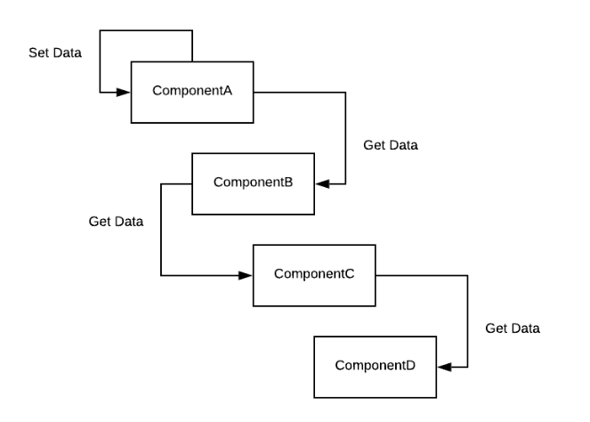
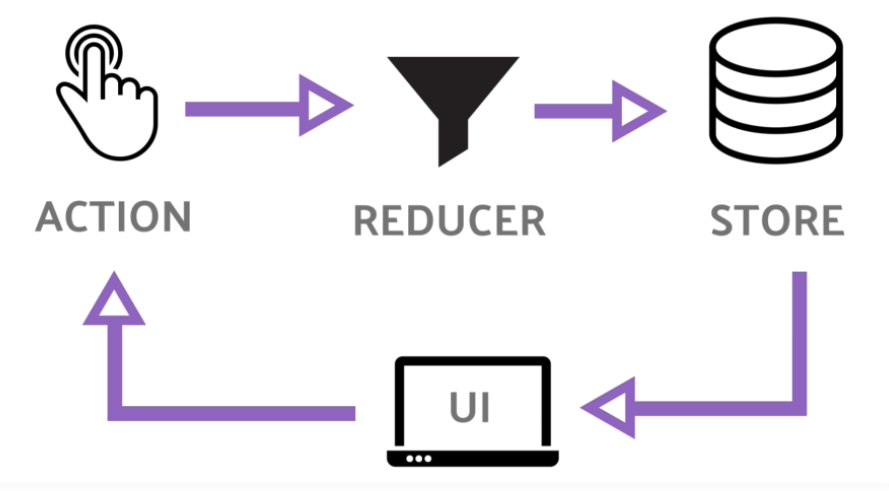
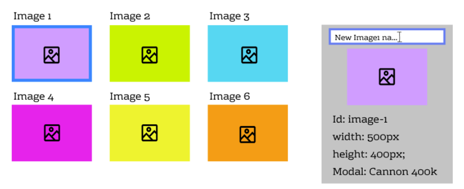
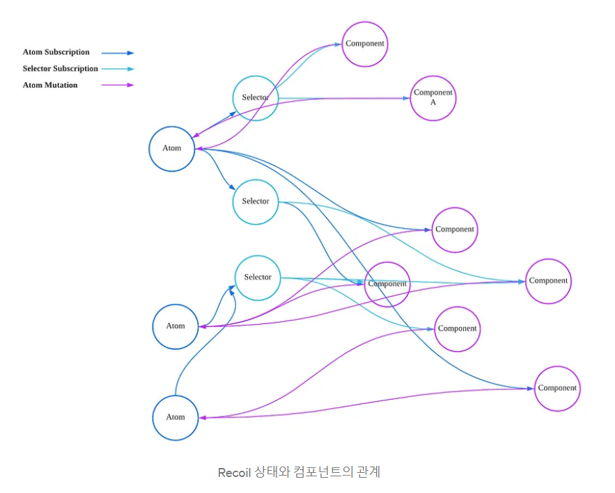
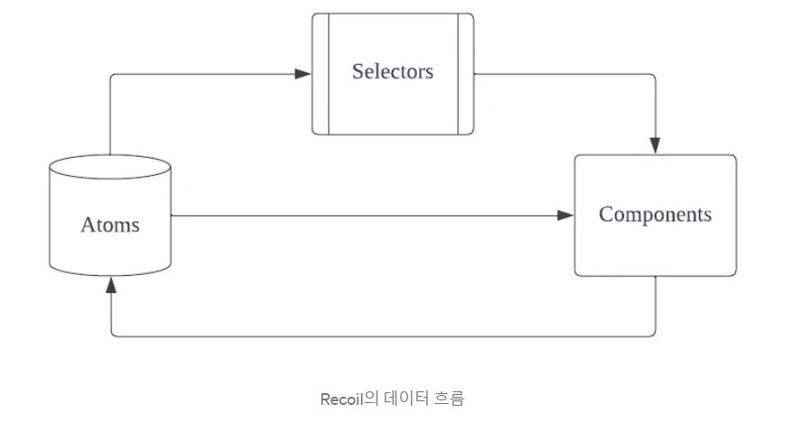

### Context API vs Redux vs Recoil

**💡 상태 관리 라이브러리가 필요한 이유?**



> 예를 들어 게시판 하나 만든다고 했을 때, 게시판의 글 한 줄, 한 줄에 해당하는 컴포넌트를 만들고, 하부 컴포넌트 만들고.. 그 컴포넌트들을 모아 하나의 게시판이 완성된다. 그리고 리액트는 state에 변동이 생기면 re-rendering이 되는데, state는 오로지 자식 컴포넌트에게만 전달되기 때문에 위와 같이 자식 컴포넌트들이 겹겹이 많으면 일일이 props로 전달해줘야 한다 -> 비효율적!!!! 이 현상을 **props Drilling Issue** 라고 한다.

이를 개선하기 위해 나타난 것이 바로 **상태관리 라이브러리**이다!! 이를 통해 어떤 컴포넌트에서든 바로 state에 접근이 가능하게 된다.


#### Context API

- v16.8부터 제공되는 React 내장 API
- 외부 라이브러리없이 상태 관리를 할 수 있다(소규모 프로젝트에서 적절)
- context를 이용하면 단계마다 일일이 props를 넘겨주지 않고도 컴포넌트 트리 전체에 데이터를 제공할 수 있다.
- `useReducer`를 함께 사용하여 redux와 비슷한 형태로 관리할 수 있지만 이 역시 비동기 처리가 어렵다는 문제가 있다.
  - `useReducer` : `useState` 처럼 state를 관리하고 업데이트할 수 있는 Hooks. state를 업데이트하는(setState) 로직 부분을 그 컴포넌트로 분리시키는 것을 가능하게 해준다.
  - => 로직을 분리해서 외부에 작성하는 것을 가능하게 함으로써, 코드의 최적화를 이루게 해준다.
- 상태값을 변경하면 Provider로 감싼 모든 컴포넌트가 리렌더링되는 문제가 발생하여 성능 최적화가 별도로 필요하다.
- `useMemo`를 통해 Provider의 value props를 메모이제이션하거나 독립적인 context를 만들면 리렌더링을 줄일 수 있다.

```javascript
class App extends React.Component {
  render() {
    return <Toolbar theme="dark" />;
  }
}

function Toolbar(props) {
  // Toolbar 컴포넌트는 불필요한 테마 prop를 받아서
  // ThemeButton에 전달해야 합니다.
  // 앱 안의 모든 버튼이 테마를 알아야 한다면
  // 이 정보를 일일이 넘기는 과정은 매우 곤혹스러울 수 있습니다.
  return (
    <div>
      <ThemedButton theme={props.theme} />
    </div>
  );
}

class ThemedButton extends React.Component {
  render() {
    return <Button theme={this.props.theme} />;
  }
}
```

> Context를 쓰지 않으면 props로 전해주는 데이터를 일일이 다 알아야 하고 자식 컴포넌트로 넘어가는 과정에서 props를 계속 작성해줘야 하는 단점이 있다!

```javascript
// context를 사용하면 모든 컴포넌트를 일일이 통하지 않고도
// 원하는 값을 컴포넌트 트리 깊숙한 곳까지 보낼 수 있습니다.
// light를 기본값으로 하는 테마 context를 만들어 봅시다.
const ThemeContext = React.createContext('light');

class App extends React.Component {
  render() {
    // Provider를 이용해 하위 트리에 테마 값을 보내줍니다.
    // 아무리 깊숙히 있어도, 모든 컴포넌트가 이 값을 읽을 수 있습니다.
    // 아래 예시에서는 dark를 현재 선택된 테마 값으로 보내고 있습니다.
    return (
      <ThemeContext.Provider value="dark">
        <Toolbar />
      </ThemeContext.Provider>
    );
  }
}

// 이젠 중간에 있는 컴포넌트가 일일이 테마를 넘겨줄 필요가 없습니다.
function Toolbar() {
  return (
    <div>
      <ThemedButton />
    </div>
  );
}

class ThemedButton extends React.Component {
  // 현재 선택된 테마 값을 읽기 위해 contextType을 지정합니다.
  // React는 가장 가까이 있는 테마 Provider를 찾아 그 값을 사용할 것입니다.
  // 이 예시에서 현재 선택된 테마는 dark입니다.
  static contextType = ThemeContext;
  render() {
    return <Button theme={this.context} />;
  }
}
```

> 위와 같이 Context를 사용해준다면, 자식 컴포넌트가 아무리 깊숙이 층층이 있어도 일일이 props로 데이터를 넘겨줄 필요 없이 한 번에 데이터를 보내줄 수 있다!


---


#### Redux

✅ 여러 컴포넌트에 사용되는 state를 분리 통합하여 관리할 수 있게 하고 애플리케이션의 안정성을 높일 수 있는 라이브러리



- **Store**
  - 스토어는 상태가 관리되는 오직 하나의 공간이다 == 중앙저장소
  - 컴포넌트와는 별개로 스토어라는 공간이 있어서 그 스토어 안에 앱에서 필요한 상태를 담는다.
  - 컴포넌트에서 상태 정보가 필요할 때 스토어에 접근한다.
  - 상태를 읽을 때는 `getState()` , 상태를 바꿀 때는 `dispatch()`를 호출한다.
- **Action**
  - 액션은 앱에서 스토어에 운반할 데이터를 말한다(주문서) == 상태값이 어떻게 변할지 행동을 적어놓은 객체이다!
  - 나중에 리듀서가 액션을 전달받으면 액션의 값에 따라서 다른 작업을 한다.
  - 액션은 자바스크립트 객체 형식으로 되어 있다.
  
- **Reducer**
  - 전달받은 액션의 type에 따라 변화를 일으키는 함수
  - 즉, 스토어에 상태값이 들어가기 전 액션값에서 전달된 type의 종류에 따라 어떤 상태값으로 스토어에 리턴될지 정하는 수
  - 리듀서가 주문을 보고 스토어의 상태를 업데이트하는 것이다.
  - 액션을 리듀서에 전달하기 위해서는 dispatch() 메소드를 사용해야 한다.

- **Dispatch**
  - 스토어의 메서드이고, 상태값 업데이트를 실행하는 함수
  - 디스패치가 실행되면 파라미터로 전달받는 액션값이 리듀서의 두번째 파라미터 객체로 전달된다.


**📌 Redux의 특징**

- 상태를 전역적으로 관리하기 때문에 어느 컴포넌트에 상태를 둬야할지 고민 안해도 된다.
- 단방향 데이터 흐름을 가지고 있다.
- 여러 라이브러리를 함께 사용하는 경우가 있기 때문에 러닝커브가 높은 편이다.
- 액션 하나를 추가하는데 작성이 필요한 부분이 많고, 컴포넌트와 스토어를 연결하는 필수적인 부분들이 있어 코드량이 많아질 수 있다.


----


#### Recoil

**💡 탄생 배경 - Redux와 비교했을 때**

Redux는 기본적인 store 구성을 위해 많은 보일러 플레이트와 장황한 코드를 작성해야 한다. 또한 비동기 데이터 처리 또는 계산된 값 캐시와 같은 중요 기능은 라이브러리의 기능이 아니며, 이를 해결하기 위해 또 다른 라이브러리를 사용해야 한다.


**💡 탄생 배경 - Context API와 비교했을 때**



이미지를 보여주는 리스트와 선택된 이미지의 정보를 보여주는 란이 있을 때, 이 두개만 렌더링해주면 좋겠지만 Context API는 데이터 서브셋을 대상으로 변경을 감지하고 업데이트할 수 없다는 단점이 있다 == 이미지 하나 이름 변경하면 모든 것이 싹 다 렌더링됨


✅ 2020년에 Facebook에서 발표하였으며, **React의 Concurrent Renderer를 공식 지원하는 유일한 상태 관리 라이브러리** . 손쉽고 빠르게 전역 상태를 관리할 수 있는 웹사이트로 대두되고 있다.



> 노드가 하나인 그래프로 시작해서, Atom의 상태를 구독하여 업데이트되는 Selector, 혹은 또 다른 Atom을 자식으로 점점 붙여나갈 수 있다. 또한 Recoil도 Redux처럼 단방향 데이터 흐름을 가진다.



**Atoms**

- Recoil에서 상태의 단위를 의미한다.
- atom이 업데이트되면 각각의 구독된 컴포넌트는 새로운 값을 반영해서 리렌더링된다.
- 컴포넌트에서 atom을 읽고 쓸 때는 `useRecoilState`라는 훅을 사용해야 한다. 리액트의 `useState`와 비슷하나, 상태가 컴포넌트간에 공유될 수 있다는 점에서 차이가 있다.

**Selectors**

- atoms나 다른 selectors를 입력으로 받는 순수 함수(pure function)이다.
- Selectors는 상태를 기반으로 데이터를 계산하고 최소한의 상태 집합만 atoms에 저장하고, 파생 데이터는 selector에서 계산하면서 불필요한 상태를 만들어내지 않는다.
- 컴포넌트 관점에서 atoms와 selectors는 동일한 인터페이스이므로 대체 가능하다.


**📌 Recoil의 특징**

- 비동기 처리를 기반으로 작성되어 동시성 모드를 제공하기 때문에, Redux와 같이 다른 비동기 처리 라이브러리에 의존할 필요가 없다.
- Concurrent Mode : 흐름이 여러 개가 존재하는 경우. 리액트에서 렌더링의 동작 우선순위를 정하여 적절할 때에 렌더링해준다.
- atom -> selector를 거쳐 컴포넌트에 전달되는 하나의 data-flow를 가지고 있어, 복잡하지 않은 상태 구조
- atom과 selector만 알고도 어느정도 구현이 가능하기 때문에 러닝커브가 비교적 낮다고 할 수 있다.
- store와 같은 외부 요인이 아닌 React 내부의 상태를 활용하고 context API를 통해 구현되어 있기 때문에 더 리액트에 가까운 라이브러리라고 할 수 있다.