# XSS와 CSRF

## XSS(Cross Site Scripting, 사이트 간 스크립팅)

*게시판이나 웹 메일 등에 자바스크립트와 같은 스크립트 코드를 삽입해 개발자가 고려하지 않는 기능이 작동하게 하는 공격*을 말한다. XSS는 웹 애플리케이션이 사용자로부터 입력 받은 값을 제대로 검사하지 않고 사용할 경우 나타난다. 해커가 공격에 성공하 피해자의 브라우저에서 스크립트를 실행해 사용자의 세션을 가로채거나(Session Hijacking), 웹사이트를 변조하거나, 악의적인 컨텐츠를 삽입하거나, 피싱 공격 등을 시도할 수 있게 된다.

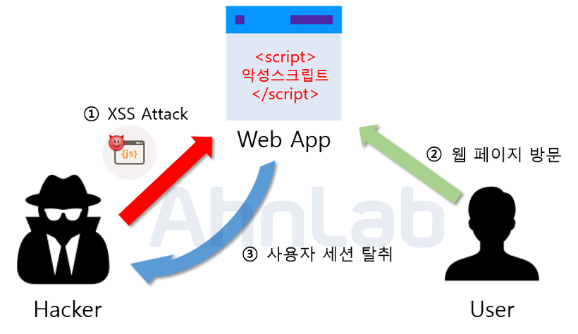

- **Reflected XSS**

  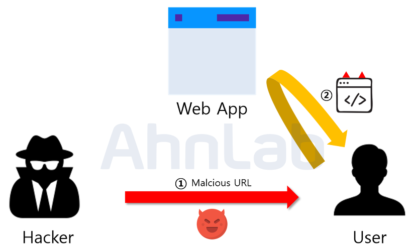

  - 사용자에게 입력 받은 값을 서버에서 되돌려주는 곳에서 발생한다

  -  피해자에게 입력 받은 검색어를 그대로 표시하는 곳이나 피해자가 입력한 값을 오류 메시지와 함께 보여주는 곳에 악성 스크립트를 삽입하며, 스크립트는 서버가 피해자의 입력 값을 포함해 응답을 전송할 때 실행된다.

  - 피해자가 직접 스크립트를 실행하도록 유도하기 때문에 1회성 공격이다.

  - 예시

    - GET 방식으로 URL을 입력해서 서버에 요청을 보냈을 때, 응답을 받을 때, alert 메시지를 받는 것을 볼 수 있다. 
    - 이처럼 해커가 특정 스크립트를 심어두고, 누군가가 해당 URL을 입력했을 때, 해커가 심어둔 스크립트가 실행되면서 사용자의 쿠키 값이 전송되도록 설정할 수 있다. 
    - URL 링크를 통해 서버에 요청을 보낸 사용자는 해커한테 본인의 의도와는 상관없이 자신의 쿠키 값을 전송하게 다.

    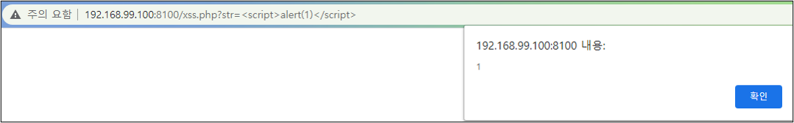

    

- **Stored XSS(Persistent XSS)**

  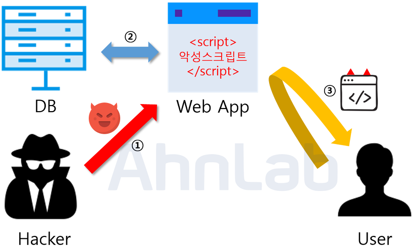

  - 응용 프로그램이나 웹사이트의 모든 HTTP 응답을 감염시키는 공격

  - 반사형 XSS 공격과 달리 지속적으로 피해를 입히는 공격 유형이기 때문에 영구적 XSS라고도 불린다.

  - 해커는 웹 애플리케이션에서 XSS 취약점을 파악하여 악성 스크립트를 삽입하면 그 스크립트는 데이터베이스에 저장이 되고, 악성 스크립트가 존재하는 게시글 등을 열람한 사용자들은 쿠키를 탈취당하거나 다른 사이트로 리디렉션되는 공격을 받게 된다.

  - 가장 많이 공격이 되는 곳은 게시판이며, 굳이 게시판이 아니더라도 사용자가 입력한 값이 데이터베이스에 저장이 되고, 저장된 값이 그대로 프론트엔드 단에 보여주는 곳에 공격이 성공할 가능성이 크다.

    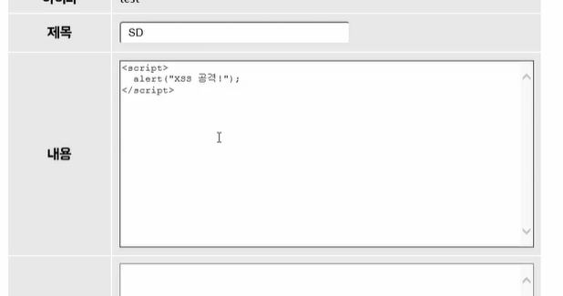

    

- **DOM Based XSS**

  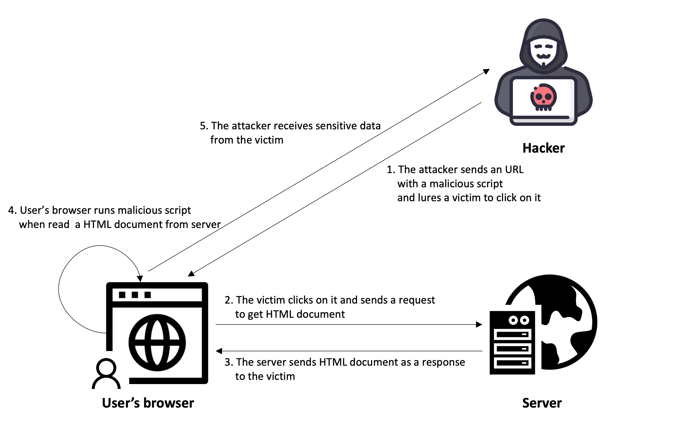

  - DOM 환경에서 악성 URL을 통해 사용자의 브라우저를 공격하는것

  - 피해자의 브라우저가 HTML 페이지를 구문 분석할 때마다 공격 스크립트가 DOM 생성의 일부로 실행되면서 공격한다. 페이지 자체는 변하지 않으나, 페이지에 포함되어 있는 브라우저 측 코드가 DOM 환경에서 악성코드로 실행된다. 

  - 예

    - 보안이 취약한 웹 페이지에서 악성 스크립트가 실행되도록 URL 주소를 만들어 일반 사용자에게 전달한다.

    - 일반 사용자는 메일 등을 통해 전달받은 URL 링크를 클릭합니다. 서버로부터 HTML 문서를 전달받는다.

    - 사용자의 브라우저가 응답 받은 HTML 문서를 읽으면서 필요한 스크립트를 실행하는 중에 악성 스크립트가 동작한다.

    - 악성 스크립트를 통해 사용자 정보가 악의적으로 전달된다.

      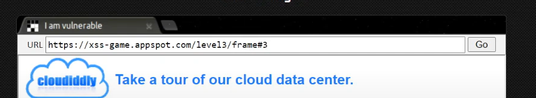

    - `#` 태그를 통해 해당 이미지를 불러오는 URL이 있다고 가정해보자. 위의 예시에선 3.jpg와 같은 이미지를 불러올 것이다.

      

    - 해당 링크에 `onerror`를 넣어 특정 자바스크립트 코드가 실행될 수 있도록 유도하면 아래와 같이 `alert()`가 실행되는 것을 볼 수 있다.

    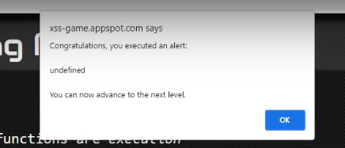

    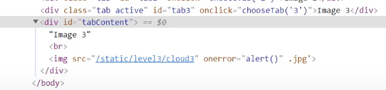

- 대응 방안
  - **입/출력 값 검증 및 무효화** : 스크립트를 실행할 때는 기본적으로 `<script>` 태그를 사용하니 `<` 를 `&lt;` 로 바꾼다거나 하는 방법으로 무효화시킬 수 있다.
  - **보안 라이브러리 사용** : 입/출력이 스크립트를 실행하는지에 대한 필터를 구현한 기존 라이브러리를 사용할 수 있다.

## CSRF(Cross Site Request Forgery, 사이트 간 요청변조)

*인터넷 사용자(희생자)가 자신의 의지와는 무관하게 **공격자가 의도한 행위**(수정, 삭제, 등록 등)**를 특정 웹사이트에 요청**하게 만드는 공격*이다.

- 해커는 희생자의 권한을 도용하여 중요 기능을 실행하는 것이 가능

- CSRF 공격은 컴퓨터를 감염시키거나 서버를 해킹하는 것이 아니기 때문에 다음 조건이 만족되어야 한다.
  - 위조 요청을 전송하는 서비스에 희생자가 로그인 상태
  - 희생자가 해커가 만든 피싱 사이트에 접속
  
- 예
  1. 공격자가 특정 은행의 계좌에서 공격자의 계좌로 천만 원을 송금하라는 요청을 위조한다.
  2. 위조한 요청은 하이퍼링크에 삽입해 이메일로 전송하거나 웹사이트 자체에 삽입한다.
  3. 사용자가 공격자가 생성한 이메일 하이퍼링크나 웹사이트 링크를 클릭하면 은행에 천만 원을 송금하라는 요청이 전송된다.
  4. 요청을 받은 은행 서버는 사용자의 요청대로 송금을 진행한다.
  
- 대응 방안

  - **`referrer` 검증** : 요청 헤더에 있는 `referrer` 속성을 검증하여 신뢰할 수 있는 도메인에서 들어오는 요청인지 검증한다.

    > 💡**referrer**
    >
    > 현재 표시하는 웹페이지가 어떤 웹페이지에서 요청되었는지 알 수 있음
    >
    > 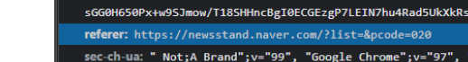

  - **CSRF 토큰** : 난수(Random Number)를 서버쪽 사용자의 세션에 저장하고 요청할 때 난수를 CSRF 토큰으로 지정하여 사용자게 전송한다. 이후 요청부터 토큰이 일치하는지 확인하여 검증한다.

    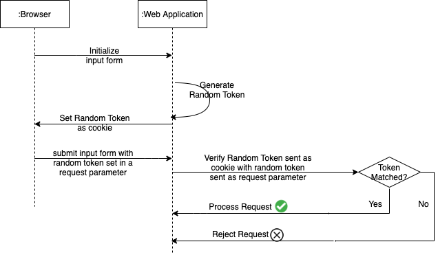

  - **캡챠(Captcha) 사용** : 사용자와의 상호작용을 통해서 숫자/문자를 입력하여 검증한다.

    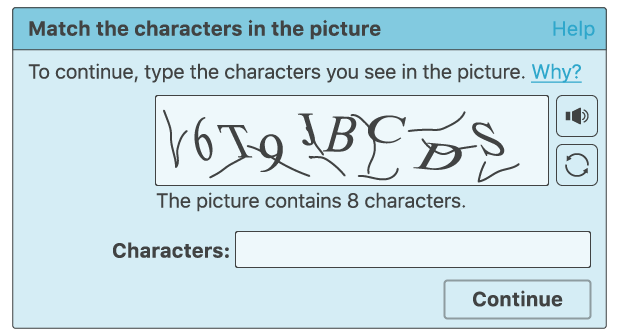

## XSS와 CSRF의 차이

크로스 사이트 스크립팅([XSS](https://nordvpn.com/ko/blog/xss-attack/))과 크로스 사이트 요청 위조는 사용자의 브라우저를 대상으로 한다는 공통점이 있다. 하지만 다음과 같은 차이가 있다.

-  세션 악용 여부
  - XSS: 인증된 세션 없이도 공격 가능
  - CSRF: 사용자의 인증된 세션을 악용하는 공격 방식

- 사용자 신뢰의 허점
  - XSS: 사용자가 특정 사이트를 신뢰한다는 사실을 이용
  - CSRF: 웹 애플리케이션이 인증된 사용자의 요청을 신뢰한다는 사실을 이용
- 실행 위치
  - XSS: 사용자에서 스크립트가 실행
  - CSRF: 서버에서 스크립트가 실행
- 요청 위조의 목적
  - XSS: 사용자 PC에서 스크립트를 실행해 사용자의 정보를 탈취하는 것
  - CSRF: 요청을 위조함으로써 사용자 몰래 송금과 제품 구입 등 특정 행위를 수행하는 것

**참고자료**

https://nordvpn.com/ko/blog/xss-attack/

https://www.easymedia.net/Culture/EasyStory/index.asp?no=170&mode=view&IDX=1165&p=1

https://overcome-the-limits.tistory.com/510

https://www.youtube.com/watch?v=_3Wgx1FabIo

https://itstory.tk/entry/CSRF-%EA%B3%B5%EA%B2%A9%EC%9D%B4%EB%9E%80-%EA%B7%B8%EB%A6%AC%EA%B3%A0-CSRF-%EB%B0%A9%EC%96%B4-%EB%B0%A9%EB%B2%95

https://nordvpn.com/ko/blog/csrf/

https://github.com/baeharam/Must-Know-About-Frontend/blob/main/Notes/security/xss-csrf.md

https://inpa.tistory.com/entry/WEB-%F0%9F%93%9A-HTTP-referer-%EB%9E%80