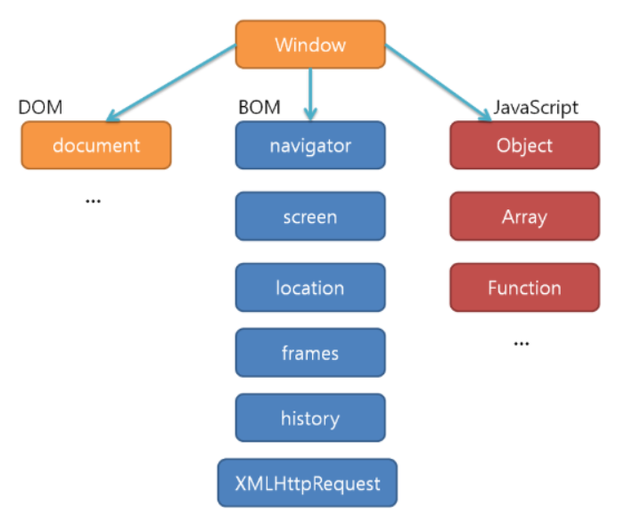
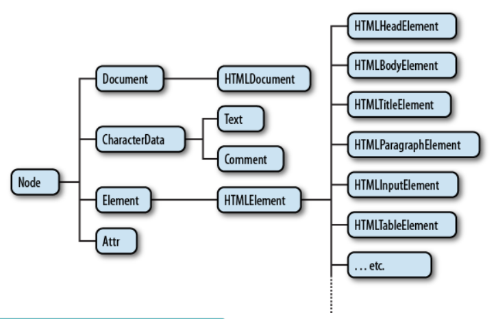
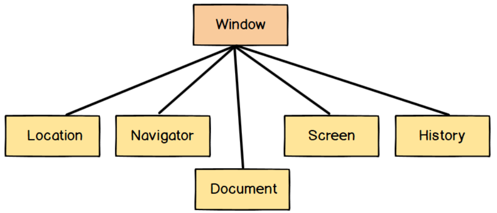

### BOM과 DOM

💡먼저 `window 객체`란?

- 자바스크립트의 최상위 객체이자 전역객체이면서 모든 객체가 소속된 객체
- BOM과 DOM은 이 구조를 구성하고 있는 가장 큰 틀의 분류

#### DOM (Document Object Model)

✅ *웹페이지*를 프로그래밍적으로 제어할 수 있게 해주는 객체모델. ***구조화된 문서를 표현하는 형식*** => 모든 요소들과의 관계를 부자 관계로 표현할 수 있는 트리 구조로 구성한 것이 DOM 이다!

돔 트리구조에서 노드는 9 종류로 나뉘는데 주로 쓰이는 노드는 4종류이다.

- **문서노드(Document Node)** : 트리위 최상위에 존재하며 각각의 하위요소들(엘리먼트, 어트리뷰트, 텍스트 노드)에 접근하려면 문서노드를 통해야 한다. 즉, 시작점이다.
- **요소노드(Element Node)** : 쉽게 말해 태그이다. < p >, < div >, < span > 등...

- **어트리뷰트노드 (Attribute Node)** : < input > 태그 안에는 name, value 등의 속성을 사용할 수 있는데 이러한 속성들을 가리키는 노드이다.
- **텍스트 노드(Text Node)** : 태그 내 텍스트를 표현한다. 텍스트 노드는 엘리먼드 노드의 자식이며 자신의 자식 노드를 가질 수 없기 때문에 돔 트리의 최종단이다.
  - ex) < span > 안녕 < /span >의 경우 '안녕'

#### BOM(Browser Object Model)

✅ *브라우저의 창이나 프레임*을 프로그래밍적으로 제어할 수 있게 해주는 객체모델

이를 통해서 브라우저의 새 창을 열거나 다른 문서로 이동하는 등의 기능을 실행시킬 수 있다. 전역객체로 `window`가 있으며 하위 객체들로 `location`, `navigator`, `document`, `screen`, `history`가 포함되어 있다.

- `navigator` : 브라우저명과 버전정보를 속성으로 가짐
- `window` : 최상위 객체로, 각 프레임별로 하나씩 존재
- `document` : 현재문서에 대한 정보&웹문서에서 < body >태그를 만나면 만들어지는 객체 HTML문서 정보
- `location` : 현재 URL에 대한 정보 / 브라우저에서 사용자가 요청하는 URL
- `history` : 현재의 브라우저가 접근했던 URL history
- `screen` : 브라우저의 외부 환경에 대한 정보를 제공