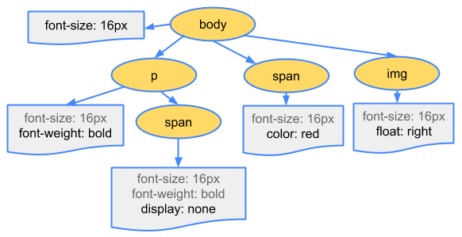

# 브라우저 렌더링 과정

## 브라우저의 기본 구조

1. **사용자 인터페이스** - *주소 표시줄, 이전/다음 버튼, 북마크 메뉴 등*. 요청한 페이지를 보여주는 창을 제외한 나머지 모든 부분이다.
2. **브라우저 엔진** - *사용자 인터페이스와 렌더링 엔진 사이의 동작*을 제어.
3. **렌더링 엔진** - *요청한 콘텐츠*를 표시. 예를 들어 HTML을 요청하면 HTML과 CSS를 파싱하여 화면에 표시함.
4. **통신** - HTTP 요청과 같은 *네트워크 호출*에 사용됨. 이것은 플랫폼 독립적인 인터페이스이고 각 플랫폼 하부에서 실행됨.
5. **UI 백엔드** - 콤보 박스와 창 같은 기본적인 장치를 그림. 플랫폼에서 명시하지 않은 일반적인 인터페이스로서, OS 사용자 인터페이스 체계를 사용.
6. **자바스크립트 해석기** - *자바스크립트 코드를 해석하고 실행*.
7. **자료 저장소** - 이 부분은 *자료를 저장하는 계층*이다. 쿠키를 저장하는 것과 같이 모든 종류의 자원을 하드 디스크에 저장할 필요가 있다. HTML5 명세에는 브라우저가 지원하는 '[웹](http://www.html5rocks.com/en/features/storage)[데이터](http://www.html5rocks.com/en/features/storage)[베이스](http://www.html5rocks.com/en/features/storage)'가 정의되어 있다.

크롬은 대부분의 브라우저와 달리 각 탭마다 별도의 렌더링 엔진 인스턴스를 유지하며 독립된 프로세스로 처리된다.

## 렌더링 엔진

렌더링 엔진은 요청받은 내용을 화면에 출력하는 일을 한다.

브라우저마다 다른 렌더링엔진을 가지고 있다. 파이어폭스는 모질라에서 직접 만든 게코(Gecko) 엔진을 사용하고 사파리은 웹킷(Webkit) 엔진을 사용한다. 크롬은 애플의 사파리에서 사용 중인 웹킷 엔진을 구글이 복제하여 만든 *블링크 엔진*을 채용하고 있다.

렌더링 엔진은 통신으로부터 요청한 문서의 내용을 얻는 것으로 시작하는데, 문서의 내용은 보통 8KB 로 전송된다.

### 렌더링 엔진의 동작 과정

렌더링 엔진은 다음 단계를 거쳐 화면에 렌더링하게 된다.

1. HTML 파일과 CSS 파일을 파싱해서 각각 Tree를 만든다. (Parsing)
2. 두 Tree를 결합하여 Rendering Tree를 만든다. (Attachment)
3. Rendering Tree에서 각 노드의 위치와 크기를 계산한다. (Layout/reflow)
4. 계산된 값을 이용해 각 노드를 화면상의 실제 픽셀로 변환하고, 레이어를 만든다. (Paint)
5. 레이어를 합성하여 실제 화면에 나타낸다. (Composite)

**웹킷의 동작과정**

**모질라의 게코 렌더링 엔진 동작 과정**

### 파싱과 DOM 트리 구축

#### 파싱

`문서 파싱`이란, *브라우저가 코드를 이해하고 사용할 수 있는 구조로 변환하는 것*을 의미한다. 즉, 노드 트리인 파싱 트리(parse tree) 또는 문법 트리(syntax tree)를 만들어 내는 것을 의미한다.

노드 트리를 만들어 내기 위해 파싱은 두 가지 단계인 `어휘 분석`과 `구문 분석`을 거친다. 어휘 분석은, 어휘분석기를 통해 공백과 같은 줄바꿈 문자를 제거하고 유효한 토큰으로 분해하는 과정을 의미한다. 구문 분석은 파서를 통해 언어 구문 규칙에 따라 문서 구조를 분석함으로써 파싱 트리를 생성하는 과정을 의미한다.

컴파일러는 이렇게 만들어진 파서트리를 다시 기계 코드 문서로 변환한다.

브라우저가 페이지를 렌더링 하려면 **먼저 HTML 코드는 DOM, CSS는 CSSOM 트리를 생성해야한다**.

#### 1.1 DOM 트리 생성

다음은 HTML 코드가 `DOM 트리`로 변환되는 과정이다.

1. **변환** : HTML의 원시 바이트를 읽어와서, HTML에 정의된 인코딩(예: UTF-8)에 따라 개별 문자로 변환

2. **토큰화** : 문자열을 W3C 표준에 지정된 고유 토큰으로 변환

   > 💡**토큰화**
   >
   >  : 대부분의 프로그래밍 언어에서 일반적인 파싱 프로세스로, 이해하기 쉽도록 코드를 여러 토큰으로 분할하는 것
   >
   > 💡**토큰**
   >
   > : 구문적으로 의미를 갖는 최소의 단위이며 우리가 작성하는 프로그램은 모두 이러한 토큰으로 이루어진다.
   >
   > *HTML 토큰에는 시작태그와 마침태그가 포함되며, 속성이름과 값도 포함된다*

   

3. **렉싱** : 방출된 토큰을 해당 속성 및 규칙을 정의하는 “객체(Node)”로 변환

   > 💡**렉싱**
   >
   > : 토큰 처리과정에서 토큰을 분석하여 생성된 토큰에 의미를 부여하는 것

4. **DOM 생성** : HTML 마크업에 정의된 여러 태그 간의 관계를 해석 후 트리 구조(DOM Tree)로 연결

브라우저는 HTML 마크업을 처리 할 때 마다 위의 모든 단계를 수행

#### 1.2 CSSOM 트리 생성

HTML과 마찬가지로 외부(external) css 파일에 정의된 스타일과 style 태그에 작성된 스타일을 브라우저가 이해하고 처리할 수 있는 형식으로 변환되는데, 이를 `CSSOM 트리`라 부르며 DOM 트리와 동일한 방식으로 생성된다.

다 만들어진 CSSOM 트리의 구조는 다음과 같이 생겼다.

**스크립트와 스타일 시트의 진행 순서**

- **스크립트**

  웹은 파싱과 실행이 동시에 수행되는 동기성(synchronous) 모델이다. 파서가 `<script>`를 만나면, 즉시 파싱하고 실행하기를 기대한다. *스크립트가 실행되는 동안 문서의 파싱을 중단*되는데, 외부에 있는 스크립트인 경우 해당 자원을 네트워크로 받아올 때까지 기다린다. 스크립트를 "지연(defer)"으로 표시할 수 있는데 지연으로 표시하게 되면 문서 파싱은 중단되지 않고 문서 파싱이 완료된 이후에 스크립트가 실행된다.

- **예측 파싱**

  예측 파서를 통해 외부 스크립트, 외부 스타일 시트와 외부 이미지와 같이 참조된 외부 자원을 파싱하는 것을 의미한다. 자원을 병렬로 연결하여 받을 수 있고 전체적인 속도를 개선한다.

- **스타일 시트**

  이론적으로 스타일 시트는 DOM 트리를 변경하지 않기 때문에 문서 파싱을 기다리거나 중단할 이유가 없다. 그러나 *스크립트가 문서를 파싱하는 동안 스타일 정보를 요청하는 경우*라면 문제가 된다. 파이어폭스는 아직 로드 중이거나 파싱 중인 스타일 시트가 있는 경우 모든 스크립트의 실행을 중단한다. 한편 웹킷은 로드되지 않은 스타일 시트 가운데 문제가 될만한 속성이 있을 때에만 스크립트를 중단한다.

### 2. 렌더링 트리(**Rendering Tree**) 생성

DOM 트리와 CSSOM 트리가 다 만들어지면, 이를 결합해 `렌더링 트리(Rendering Tree)`를 완성한다. 

렌더 트리를 생성하려면 브라우저는 대략 3가지 작업을 수행한다.

1. DOM 트리의 루트에서 시작하여 화면에 표시되는 노드 각각을 탐색.

   - 화면에 표시되지 않는 일부 노드들(`script`, `meta`태그 등..)은 렌더 트리에 반영되지 않음.

   - CSS에 의해 화면에서 숨겨지는 노드들은 렌더 트리에 반영되지 않음. 위의 예시에서 `span` 노드의 경우 `display:none`이 설정되기 때문에 렌더 트리에 반영되지 않음.(`visibility:hidden`은 렌더 트리에 포함)

2. 화면에 표시되는 각 노드에 대해 적절하게 일치하는 CSSOM 규칙을 찾아 적용.

3. 화면에 표시되는 노드를 콘텐츠 및 계산된 스타일과 함께 내보냄.

### 3. 레이아웃(Layout/Reflow) 단계

: 렌더 트리가 생성되고, 기기의 뷰포트 내에서 렌더 트리의 노드가 *정확한 위치와 크기를 계산*하는 과정

모든 상대적인 측정값은 화면에서 절대적인 픽셀로 변환된다. 즉 CSS에 상대적인 값인 %로 할당된 값들은 절대적인 값은 px 단위로 변환된다.

### 4. Painting

Paint 단계에서는 Layout 단계에서 계산된 값을 이용해 Render Tree의 *각 노드를 화면상의 실제 픽셀로 변환*한다. 이때 픽셀로 변환된 결과는 하나의 레이어가 아니라 여러 개의 레이어로 관리된다.

### 5.Composite

Composite 단계에서는 Paint 단계에서 생성된 레이어를 합성하여 실제 화면에 나타낸다. 우리는 화면에서 웹 페이지를 볼 수 있다.

### 리플로우(Reflow), 리페인트(Repaint)

- **리플로우**
  - 처음 접속 후 사용자의 액션으로 인해 발생된 이벤트로 새로운 HTML 요소가 추가되거나, 기존 요소의 스타일이 바뀌거나 하는 변경사항을 반영하기 위해 렌더링 트리 생성과 레이아웃 과정을 다시 수행.
  - 대표 속성: position, width, height, margin, padding, border, border-width, font-size, font-weight, line-height, text-align, overflow
- **리페인트**
  - 실제 변경된 결과를 화면에 그려지기 위해서는 다시 수행되는 페인팅 단계
  - 레이아웃에 영향이 미치지 않는 단순한 색상 변경 같은 변경사항은 리플로우(Reflow) 수행 없이 바로 리페인트(Repaint)만 수행. (리플로우가 일어나면 반드시 리페인트가 일어남)
  - 대표 속성: background, color, text-decoration, border-style, border-radius

**참고 자료**

https://d2.naver.com/helloworld/59361

https://na27.tistory.com/230

https://solog4something.tistory.com/13

https://medium.com/%EA%B0%9C%EB%B0%9C%EC%9E%90%EC%9D%98%ED%92%88%EA%B2%A9/%EB%B8%8C%EB%9D%BC%EC%9A%B0%EC%A0%80%EC%9D%98-%EB%A0%8C%EB%8D%94%EB%A7%81-%EA%B3%BC%EC%A0%95-5c01c4158ce

https://beomy.github.io/tech/browser/browser-rendering/

https://nykim.work/79?category=692679

